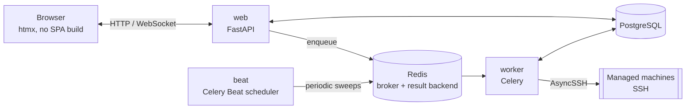

# 🏗️ Architecture

*The deep-dive reference — every "why", including the ones learned the hard way. Start at [Home](Home.md) if you just want the map.*

## 🧱 Stack

| Layer | Choice | Notes |
|---|---|---|
| Language | Python 3.14.7 | |
| Web framework | FastAPI | async, OpenAPI schema for free |
| Templates / UI | Jinja2 + [htmx](https://htmx.org) (vendored locally) | no SPA build, no CDN |
| Database | PostgreSQL 18.6 | via `asyncpg` + SQLAlchemy 2.0 (async); image pinned to an exact patch |
| Migrations | Alembic | async engine |
| Task queue / broker | Redis 8.10.1 | **broker _and_ result backend** for [Celery](https://docs.celeryq.dev/); also backs the login rate limiter; image pinned to an exact patch |
| Background tasks | [Celery](https://docs.celeryq.dev/) + Celery Beat | one `worker` process pool, exactly one `beat` scheduler — see [Background tasks](#background-tasks-celery-and-celery-beat) |
| SSH client | [AsyncSSH](https://asyncssh.readthedocs.io/) | async, strict host key verification, modern algorithms (Ed25519) |
| Cron scheduling | [`croniter`](https://github.com/kiorky/croniter) | parses standard 5-field cron expressions for Scheduling |
| Auth: passwords | [`argon2-cffi`](https://github.com/hynek/argon2-cffi) | argon2id hashing for local accounts |
| Auth: LDAP | [`ldap3`](https://github.com/cannatag/ldap3) | pure Python, no system libldap headers needed |
| Auth: OIDC | [`Authlib`](https://authlib.org/) | discovery, authorization-code flow, ID token validation |
| Auth: TOTP | [`pyotp`](https://github.com/pyauth/pyotp) + [`qrcode`](https://github.com/lincolnloop/python-qrcode) | RFC 6238 two-factor codes; QR rendered as inline SVG |
| Auth: WebAuthn/passkeys | [`webauthn`](https://github.com/duo-labs/py_webauthn) (py_webauthn) | registration/authentication ceremony verification (attestation/assertion signatures) |
| Reverse proxy (optional) | [Caddy](https://caddyproxy.com/) | automatic HTTPS, TLS 1.3 only, HTTP/3 |
| Packaging / lockfile | [`uv`](https://docs.astral.sh/uv/) | `uv.lock` is committed |
| Containers | Docker (multi-stage build) + Docker Compose | |



One request/reply web tier, one Celery worker pool, one Beat scheduler —
see [Background tasks](#background-tasks-celery-and-celery-beat) for what
Beat actually schedules and why `web` never talks to a managed machine
directly (only `worker` does).

**On this page:** [Stack](#-stack) · [Server-rendered UI](#server-rendered--htmx-not-a-spa)
· [Background tasks](#background-tasks-celery-and-celery-beat) ·
[Project structure](#-project-structure) ·
[Auth & RBAC](#authentication--rbac) ·
[Security model](#-security-model) (host key pinning, secrets at rest,
system updates, facts/packages/services, monitoring, logs, readiness
check, terminal, scheduling, audit log, CSRF/headers) ·
[Deliberately out of scope](#deliberately-out-of-scope)

### Dependency version notes

- **`redis-py` carries no upper pin** in `pyproject.toml` — just a lower
  bound (`redis[hiredis]>=5.3.1`). The effective ceiling comes from
  `kombu[redis]` (Celery's transport layer), which declares
  `redis >=4.5.2,!=4.5.5,!=5.0.2,<6.5`; the resolver currently lands on
  **redis-py 6.4.0**.
  > [!NOTE]
  > The client library version and the Redis **server** version are
  > independent. redis-py 5.x and 6.x both talk to a Redis 8.x server —
  > do not try to "match" them.
- Versions in `pyproject.toml` are lower bounds (`>=`); exact, reproducible
  versions come from the committed `uv.lock`.
- Docker images for stateful services (`postgres:18.6`, `redis:8.10.1`,
  `caddy:2.11.4`) are pinned to an exact patch version, bumped deliberately
  — see [Installation](Installation.md#updating).

### Server-rendered + htmx, not a SPA

- Server-rendered Jinja2: no frontend build/deploy pipeline, no
  client-side API tokens, no JS framework supply chain.
- htmx only for host-key discovery and connection testing, vendored
  locally, not CDN.
- One shared stylesheet, a small utility-class set (`.button`, `.panel`,
  `.data-table`, `.badge`, `.alert`, `.form`, `.page-header`, ...).
- Collapsible mobile nav is a checkbox-driven CSS toggle, not JS — works
  under the strict CSP (no inline scripts), stays keyboard-operable
  (visually hidden via clip/absolute positioning, not `display: none`).
- Active nav link computed from `request.url.path` in `base.html`.
- `.alert`'s icon is an absolutely-positioned CSS `::before`, not a flex
  sibling, so several stacked `<p>` validation errors still work.
- A machine/group page's tabs (Overview/Monitoring/Updates/Terminal/
  Logs/Power/Settings — Terminal/Logs gated behind `action.terminal`)
  share a sub-nav row (`partials/_tabnav.html`) — plain links, no JS
  tabs. Each route builds its own `tabs`/`active_tab` context so the set
  and order stay identical everywhere; a tab a user lacks permission for
  is left out entirely, never shown disabled.
- Settings uses the same tabnav macro but stays one route
  (`GET /settings?tab=general|security|integrations|ai`) rather than one
  per tab — nine sections' worth of POST handlers all redirect back to
  *some* tab regardless of which one they belong to, so each just needs
  to know its own (`update_ldap_settings` always → `?tab=integrations`);
  an unrecognized/missing tab falls back to General.
- A few fragments a Beat sweep can change with no browser request —
  online/offline badge, Facts panel, packages summary, update
  availability — self-poll every 20-30s against a plain, SSH-free
  "current DB state" GET route. Each poll target's content lives in an
  inner partial, not the id'd wrapper itself — the wrapper keeps the id/
  `hx-trigger`, the poll response swaps in as `innerHTML` (returning the
  wrapper itself would nest a duplicate inside itself every tick). The
  update-run page's own poll predates this convention and self-replaces
  (`outerHTML`) instead, since it also needs to *stop* polling at a
  terminal state by dropping its own `hx-trigger` — only works if the
  whole polling element gets replaced.

### Background tasks: Celery and Celery Beat

All background work runs on **Celery**, with the existing Redis instance
(`REDIS_URL`) as **both** the broker and the result backend:

| Kind | Examples | Triggered by |
|---|---|---|
| **Periodic sweeps** | reachability ping, facts refresh, package refresh, update-availability check | Celery **Beat**, on `timedelta` schedules read from Settings |
| **Daily housekeeping** | audit-log purge, fleet snapshot, snapshot purge | Celery **Beat**, on `crontab()` schedules |
| **One-off, per machine** | SSH connect test, facts/packages refresh, apt update, update preview, reboot/shutdown | a route or another task calling `some_task.delay(...)` |

Two Compose services back this: **`worker`** (executes tasks; safe to
scale) and **`beat`** (publishes the schedule; **must never be scaled past
one replica** — every replica would publish the same entries, so each daily
purge would fire once per replica).

Every periodic job is a declarative entry in
`celery_app.conf.beat_schedule`; no job re-enqueues itself. Beat owns the
cadence.

#### Async bodies, sync task wrappers

Celery tasks are synchronous; this app's logic (SQLAlchemy async sessions,
`asyncssh`) is not. Every job is written twice over:

```python
async def _refresh_machine_facts(machine_id: str) -> dict[str, Any]:
    ...  # the real work

@celery_app.task(name="app.tasks.jobs.refresh_machine_facts")
def refresh_machine_facts(machine_id: str) -> dict[str, Any]:
    return asyncio.run(_refresh_machine_facts(machine_id))
```

The wrapper is exactly one line so no logic lives on the sync side; tests
call the `_`-prefixed coroutine directly.

Every task is registered with an **explicit `name=`** rather than Celery's
auto-derived dotted path. Beat entries, `.delay()` call sites, and messages
already sitting in Redis all refer to a task by name — moving or renaming a
module must not silently orphan queued messages. The names are a contract.

> [!WARNING]
> **`celery.exceptions.TimeoutError` is not the builtin `TimeoutError`** —
> it does not subclass it. A few routes enqueue a task and block on its
> result inline; every one of them must catch
> `from celery.exceptions import TimeoutError as CeleryTimeoutError`.
> Catching the builtin compiles fine and turns the timeout branch into dead
> code. Related: `AsyncResult.get()` is a **blocking, synchronous** call,
> so those routes wrap it in `asyncio.to_thread(...)` — calling it straight
> from an `async def` handler stalls the entire event loop for the full
> duration.

#### Fork safety: the DB engine is rebuilt in every worker child

> [!IMPORTANT]
> Never shows up in the test suite (in-memory SQLite, single process) —
> only a real Postgres deployment.

Celery's default worker pool is **prefork**: the parent imports the whole
app — including `app/db/session.py`'s module-level async engine — and
*then* forks, so every child would otherwise inherit the same asyncpg
pool and open TCP sockets. Symptoms: sporadic
`InterfaceError`/`InternalClientError`, results for the wrong query, a
wedged worker.

`app/tasks/celery_app.py` connects a **`worker_process_init`** signal
handler that builds a fresh engine and session factory inside each forked
child, after the fork:

```python
@worker_process_init.connect
def _init_worker_process(**kwargs):
    from app.db import session as db_session
    db_session.engine = create_async_engine(...)
    db_session.AsyncSessionLocal = async_sessionmaker(bind=db_session.engine, ...)
    register_builtin_actions()   # idempotent; each child needs its own registry
```

> [!CAUTION]
> The inherited engine is **never** `dispose()`d — that would close sockets
> the parent and every sibling are still using. It is abandoned, not closed.

For that rebind to be visible, **every job body must reach the factory
through the module** — `db_session.AsyncSessionLocal(...)`, never
`from app.db.session import AsyncSessionLocal`. A name bound at import time
keeps pointing at the parent's pool.

> [!IMPORTANT]
> That fresh per-child engine used the default `QueuePool` until v0.7.2 —
> which was its own bug, of a similar "invisible in tests, real in
> production" shape. Every task body is `asyncio.run(...)`ing its own
> coroutine (see above), so each task gets a **brand new event loop**. A
> real connection pool hands a later task, in the same forked child, a
> connection that was opened on an *earlier* task's (by then closed) loop —
> and asyncpg raises `RuntimeError("... attached to a different loop")` the
> moment it's used. `worker_process_init` now builds this engine with
> `poolclass=NullPool`: every checkout opens a fresh connection and every
> checkin closes it, so a connection can never outlive the loop that
> created it. This only applies to the Celery worker's engine — the FastAPI
> web process has one long-lived event loop for its whole life and keeps a
> real pool.

## 📂 Project structure

```
app/
  audit.py      the single audit-log write path (hash chaining, verification)
  auth/         login (local/LDAP/OIDC), sessions, RBAC permissions, TOTP,
                per-IP rate limiting, per-user API tokens — see
                "Authentication & RBAC" below
  core/         config (pydantic-settings), logging, encryption, CSRF,
                editable app settings (app/core/app_settings.py)
  db/           SQLAlchemy models + async session
  schemas/      Pydantic schemas for forms
  scheduling/   cron-scheduled actions: registry, cron parsing, scheduler jobs
  services/     logic shared between manual routes and the scheduler
  ssh/          AsyncSSH client (host key pinning), facts, updates, power
  tasks/        Celery app (beat schedule, fork-safety hook) + task bodies
  web/          FastAPI routers, Jinja2 templates, static files
alembic/        DB migrations
tests/          pytest (async, isolated from real infrastructure)
scripts/        helper scripts (secret generation, first-admin bootstrap,
                console-only account recovery, one-command upgrade)
ansible/        onboarding playbook — see Ansible-Onboarding.md
wiki/           this documentation
```

## Authentication & RBAC

Every page requires a valid session except `/login`, `/login/totp`,
`/login/webauthn/options` + `/login/webauthn/verify`, the
`/auth/oidc/...` endpoints, `/healthz`, and `/api/*` (which has its own
bearer-token auth) — enforced by one ASGI middleware,
`app.auth.middleware.require_auth`, registered in `app/main.py` before the
security-headers middleware so CSP etc. still land on a redirect-to-login
response.

### No accounts are ever auto-created

Every `User` row is created inside debcontrol first, through **Users** —
never by LDAP or OIDC. `auth_provider` (`local`/`ldap`/`oidc`) only
decides *how* an existing account proves who it is:

- **`local`**: a password stored here, argon2id-hashed.
- **`ldap`**: `username` doubles as the LDAP username. `authenticate`
  does search-then-bind: a service account searches for the DN by
  username (filter-escaped), a *second*, independent connection binds as
  that DN with the entered password. Empty password rejected before the
  bind step — many directories treat that as a successful
  "unauthenticated bind". `AppSettings.ldap_tls_verify` (on by default)
  controls cert verification for `ldaps://`/StartTLS — `ldap3.Server`
  defaults to *no* verification without an explicit `Tls` object, so
  `app.auth.ldap` always passes one; turning it off is an explicit
  opt-out for a directory with a known self-signed cert.
- **`oidc`**: redirected to the provider (Authlib, auth-code flow); on
  callback, matched by comparing `username` against a configurable claim
  (`oidc_username_claim`, default `email`). No account created/updated
  from provider claims. Login button reads "Log in with OIDC" unless
  `oidc_provider_name` names the real provider.

`/login` is shared by `local`/`ldap`; `check_password` looks the
username up and branches internally. An `oidc` account hitting the
password form gets the same generic wrong-password message.

**Login is two steps**: `GET /login` collects only the username (+ OIDC
button if enabled), then `/login/password?username=...` offers a
passkey *or* password — a passkey there signs straight in, no password
ever submitted, GitHub/Google-style. `username` travels as a plain query
param, not a secret, trusted for nothing beyond "whose passkeys to
offer" — real auth is the password form (still `POST /login`) or
WebAuthn. The passkey button always shows on step two regardless of
whether the account has one or exists at all — enumeration-resistance
(`_resolve_webauthn_login_user`'s docstring). A passkey used this way
needs no further factor — already *is* one — straight to `_finish_login`,
same endpoint a post-password TOTP/passkey confirmation lands at.

### Sessions are server-side rows, not a signed cookie

`UserSession` is a DB row per login; the cookie carries an opaque random
token, only its SHA-256 is stored — a DB leak alone doesn't hand over a
live session. Revocable immediately: disabling a user, a password reset,
or "log out everywhere" all mark rows revoked. Sessions slide
(`SESSION_IDLE_TIMEOUT`, 12h, extended per request) up to an absolute
cap (`SESSION_ABSOLUTE_MAX`, 30 days).

The middleware runs outside FastAPI's DI, opening a DB session via
`request.app.state.db_session_factory` — same pattern `app/tasks/jobs.py`
uses, so tests can point it at their own SQLite engine.

Two *signed but stateless* values exist, both `itsdangerous.
URLSafeTimedSerializer` keyed by `SECRET_KEY`, 5-minute expiry, neither
granting a session alone: the pending-2FA ticket for the gap between
"password/LDAP passed" and "second factor confirmed" (also read by
WebAuthn login — same mid-login state regardless of which factor), and
the WebAuthn challenge ticket for one ceremony's challenge. `SECRET_KEY`
also signs the OIDC-flow session cookie.

### RBAC: custom roles, a fixed permission set

An admin defines named `Role`s and picks exactly which of 12 fixed
`Permission`s each grants — `machine.view`/`.manage`, `group.view`/
`.manage`, `action.updates`, `action.power`, `scheduling.view`/`.manage`,
`audit.view`, `settings.view`/`.manage`, `user.manage` — then assigns
**one role per user**. Resource-grained, not per-object.

A `MANAGE` permission always also grants the matching `VIEW`
(`_MANAGE_IMPLIES_VIEW`) — otherwise `machine.manage` without
`machine.view` would 403 on every machines page (GETs gate at the *view*
level, state-changing routes add their own). `action.updates`/
`action.power` are independent of `machine.manage` and each other.
`user.manage` covers both users and roles.

> [!IMPORTANT]
> Permissions themselves are resource-grained rather than per-object: a role
> grants `machine.view`, not "view machine X". *Which* machines and groups an
> account may use those permissions on is a separate, orthogonal, opt-in
> layer — see "Machine-group scoping" below. Nothing else is per-object:
> nothing is "private" to whoever created it, and scheduled tasks are not
> owned by their author.

### Time-limited per-user permissions: on top of the role, not instead of it

**Users → edit a user → Temporary permissions** grants one `Permission`
directly to *this account*, expiring after a chosen number of hours
(`TemporaryPermissionGrant`, up to `MAX_GRANT_HOURS` — 30 days) — "this
user gets `action.terminal` for 2 hours," no role edit, no disposable role.

`User.has_permission` checks the *union* of the role's own permissions
and currently-active temporary grants (`active_temporary_permissions`, a
plain in-memory filter — no query, no background job). Like
`Role.permission_grants`, `temporary_permission_grants` is
`lazy="selectin"` on `User`, so every session-resolving request already
has what it needs; an expired grant just stops counting the instant
`expires_at` passes, same as a session's own expiry. `role_has_permission`
(the role-only check `app/web/routes/users.py` uses to simulate "would this
account still have `user.manage` if its role changed?") deliberately
never considers temporary grants — those are per-user, not per-role, so
there is nothing for a role-only check to see.

A grant can also be ended early (`revoked_at`) from the same page. Both
the grant and the revoke are audit-logged
(`user.temporary_permission.grant`/`.revoke`); the REST API mirrors both
at `POST`/`GET /api/v1/users/{id}/temporary-permissions` and `DELETE
.../temporary-permissions/{grant_id}`.

### Machine-group scoping: which machines an account may see

An orthogonal layer on top of the permission matrix — permissions decide
*what* an account may do, this decides *to which machines and groups*.

- **Model**: `UserMachineGroupAccess`, a plain many-to-many join of
  `users` × `machine_groups`. One row = "this account may see this group and its machines".
- **Default, and the whole backward-compatibility story**: **zero rows =
  unrestricted**, sees everything. One or more rows restricts to exactly
  those groups. Machines in no group are never visible to a restricted
  account. No backfill needed.
- **Where it's set**: Users page (`user.manage`), a checkbox list —
  account administration, alongside `api_access_enabled`, not a new
  `Permission`. Audit-logged. An admin can't change **their own** scope, mirroring the self-role-change guard.
- **Enforcement**: one service, `app/services/access_scope.py`, used
  everywhere — machines/groups (lists, detail, search, bulk actions,
  membership, config export), scheduling, Dashboard live counts, the
  REST API, the SSH terminal WebSocket, the AI assistant's tools. Out of
  scope reads as **404, never 403** (a 403 confirms the row exists);
  bulk endpoints drop out-of-scope ids from a client selection rather
  than trusting them.
- **"All machines"**: narrowed on the live page, but **refused outright
  as a scheduling target** for a restricted account (server-side at
  create/edit, not just hidden) — a stored schedule outlives the scope that created it.
- **Not affected**: the **audit log** — `audit.view` stays global, no
  group filtering (a partial security trail would be worse than none).
  Daily fleet-snapshot stays fleet-wide too (no current user); a
  restricted account just doesn't see the trend chart. Scheduled tasks
  are scope-checked when written, never when they fire.

### Guardrails against locking everyone out

- **Self-protection**: can't deactivate, delete, or change the role of your own account.
- **Last-admin protection**: `count_active_users_with_permission` checks,
  before committing, whether a change would leave *nobody* holding
  `user.manage`. The **role**-level check (editing a role to drop
  `user.manage`) is the one that bites in practice.

### Brute-force lockout, shared by password and TOTP

Both the password/LDAP-bind step and the TOTP-code step increment
`failed_login_attempts`/`locked_until`: **5 failures locks the account
for 15 minutes**, reset on any success.

### Generic failure messages, except for lockout

Nonexistent username, wrong password, inactive account, `oidc` account
hitting the password form — all render the identical "Invalid username
or password" (no enumeration). **Locked-out** gets a distinct message.

### TOTP: opt-in, self-service, with recovery codes

`local`/`ldap` only, not `oidc`. Self-service enrollment — only the
owner can scan the QR (confirmed by entering a real code before
anything persists). Rendered as inline SVG, not ``, so no `img-src` CSP exception needed.

Eight one-time recovery codes generated at enrollment (shown once,
argon2-hashed), regenerated wholesale on TOTP disable+re-enable or via
"Regenerate recovery codes" — which needs a fresh *TOTP* code, not a
recovery code, so one leaked code can't relearn the batch.

### WebAuthn/passkeys: a second factor alongside (or instead of) TOTP

`app.auth.webauthn` wraps py_webauthn — derives RP id/origin from the
live `Request`, not a config value (same reasoning as OIDC's redirect
URI: getting either wrong fails the ceremony, no sensible static
default), around one `WebAuthnCredential` row per authenticator
(credential id, public key, signature counter, device type,
`backed_up`). `local`/`ldap` only, same restriction as TOTP.

Both the RP origin and OIDC's redirect URI need `request.url.scheme`
correct — `ProxyHeadersMiddleware` (outermost in `app.main`) must
correct it from `X-Forwarded-Proto` first behind a reverse proxy, or
both derive "http" regardless of what the browser used, and WebAuthn
fails with "Unexpected client data origin". See `TRUSTED_PROXY_IPS`.

Both ceremonies (registration, login second-factor) follow the same
shape: a `GET .../options` route generates a challenge, hands back
browser-ready JSON, stashes it in a short-lived signed cookie (5 min,
`purpose` "register"/"authenticate" so one can't replay as the other);
`webauthn.js` decodes it, drives `navigator.credentials.create()`/
`.get()`, submits as a normal form POST to `.../verify` — no fetch round
trip once the ceremony completes. A non-advancing signature counter is
the spec's clone-detection signal and hard-fails; two authenticators
both stuck at count 0 (common for counter-less platform passkeys) is
accepted — py_webauthn only flags a **decrease or non-increase from a
previously nonzero count**.

A passkey works two ways, both ending at `_finish_login`: **primary**,
from step two of login, before any password check; or **second
factor**, when `POST /login` routes an account with TOTP or a
registered passkey to `/login/totp` instead of finishing directly (that
page shows the TOTP form only if enabled, and a passkey button whenever
one exists). `_resolve_webauthn_login_user` distinguishes the two
contexts for the shared options/verify routes — a `pending_totp` ticket
present means second-factor; its absence + a `username` value means
primary (WebAuthn's own cryptographic proof establishes identity either way).

### Role-enforced TOTP: real-time, not just a login-time redirect

`Role.require_totp` mandates a second factor — TOTP, or a registered
passkey, either satisfies it — for everyone holding a given role.
`app.auth.middleware` checks the *current* session's user's *current* role
and *current* `totp_enabled`/passkey state on **every request** (a cheap
in-memory pre-check, `_needs_second_factor_check`, keeps the extra
passkey-count query off the hot path for accounts that don't need it), so
toggling the flag on takes effect on the next request of every affected
user. A blocked user may reach exactly `GET`/`POST /account/totp/enroll`,
`GET /account/webauthn/register/options` + `POST .../verify`, the account
page they're linked from, and `/logout`; everything else redirects to the
TOTP enrollment page (or, for an `HX-Request`, sends `HX-Redirect` so htmx
navigates the whole page) — registering a passkey there satisfies the
block exactly like enrolling TOTP would.

By contrast `User.must_change_password` only steers `_finish_login`'s
post-login redirect (`app/web/routes/auth.py`), so an already-logged-in
user is unaffected until they log out and back in.

API tokens go through `app.auth.dependencies.get_api_token_user`, with the
same live check but a different outcome: a blocked token gets a flat 403
saying the account needs TOTP enrolled via the web UI first.
(`must_change_password` isn't API-gated today.)

OIDC accounts are unconditionally exempt from `require_totp`, since TOTP
isn't offered to them at all.

### OIDC's "session" is unrelated to the app's own

Authlib's Starlette integration stashes `state`/`nonce` across the redirect
to and from the provider in Starlette's own `SessionMiddleware`
(`app/main.py`, cookie `oidc_flow`, `SameSite=Lax` since `Strict` would
drop it on the provider's redirect back, 10-minute expiry). A completed
OIDC login then creates a real session via the same `create_session` path
local/LDAP logins use.

A fresh OIDC client is registered from current `AppSettings` on every login
attempt rather than once at startup, since issuer/client ID/secret are
editable at runtime; the cost is one extra discovery-document fetch per
login.

### Bootstrapping the first account

`scripts/create_admin.py` is the one way into a fresh deployment: creates
(or reuses) an "Administrator" role with every permission and a `local`
account with a prompted password. A CLI script, not an unauthenticated
"first-run setup" page.

`scripts/reset_account.py` is the same idea for an account already
locked out (forgotten password, lost TOTP device) — console-only, able
to bypass a locked account's second factor precisely because it needs shell access.

### Per-IP login rate limiting, alongside per-account lockout

`check_rate_limit` caps **30 attempts / 5 minutes** per source IP on
both `POST /login` and `POST /login/totp` — a Redis `INCR`+`EXPIRE`
fixed-window counter, same Redis *server* Celery uses but shares nothing
else with the queue. High by design: blunts credential stuffing/
enumeration at scale without locking out a shared office/VPN IP.

### Per-user API tokens: gated by a separate account-level flag, inheriting the role live

`ApiToken` gives each user bearer tokens (`dcpat_...`, only the SHA-256
hash stored) for two things, both under `/api/` and outside the session requirement:

- The REST API, for external scripts/automation, not the web UI itself.
- `POST /api/inform`, a per-user alternative to the shared
  `INFORM_TOKEN` — attributable, individually revocable.

A token authorizes whatever the owning user's role permits *at the
moment of each request* (re-checked, never a creation-time snapshot) —
revoking a permission or deactivating the account takes effect
immediately on every token it ever issued. Created/revoked from "My
account"; raw value shown once at creation.

Whether an account may have API tokens **at all** is separate —
`User.api_access_enabled`, unchecked by default, checked twice: **at
creation** (403 without the flag, form hidden) and **on every use**
(a token whose owner currently has the flag off is refused, same as a
deactivated owner) — unchecking cuts off every token that account ever
issued immediately. Only a `user.manage` admin sets it.

### Per-user UI language (i18n)

Each account has its own UI language (**My account → Language**),
self-service, defaulting to English if never chosen (`User.locale` is
nullable — `NULL` means "use the default," not a stored code).
`app.i18n` deliberately isn't `gettext`/Babel — a flat JSON file per
locale is the lowest-friction format for a translator with no Python
tooling, and there's no other i18n need (dates already render in
`Settings.tz`, not per-locale).

**Adding a language needs no code change** — drop a new
`app/i18n/locales/<code>.json` file:

```json
{
  "meta": { "code": "xx", "label": "Native name" },
  "strings": { "nav.dashboard": "...", "...": "..." }
}
```

`meta.code` must match the filename stem (mismatch skips + logs the
whole file rather than silently registering under the wrong code).
Doesn't need every key: `translate()` falls back key-by-key to English,
then the literal key, so a partial translation degrades to readable
English, never a blank/crash. Picked up on next process restart (parsed
once at first use, per process) — no migration, no Settings toggle.

Wired in three places: `app.auth.middleware` sets `request.state.locale`
on *every* request (anonymous default, or the account's choice once a
session resolves); the Jinja global `t(request, "some.key", **kwargs)`
looks it up (`**kwargs` `str.format`-substituted); `POST /account/locale`
(web) and its REST equivalents let an account change its choice — an
unrecognized code silently falls back to default rather than rejecting.

**Coverage today**: the entire app — every template either calls `t()`
for its strings or has none of its own (a pure macro/wrapper). Both
shipped locales (`en.json`, `cs.json`) translate every key. A new string
needs the same treatment — wrap it, add the key to every locale file,
per CLAUDE.md's i18n-parity rule. One page renders only in English by
design: `auth/totp_challenge.html` (reached before a session resolves to
an account, same reason `login.html` always renders in English) — its
markup is translated the same as anywhere else, it just never sees a
non-default locale in practice. `auth/totp_enroll.html`, reached from
the authenticated Account page, does render in the account's own language.

> [!WARNING]
> A translated string with literal quote marks or other HTML-special
> characters around a `{placeholder}` (e.g. `"No machines match
> \"{query}\"."`) needs `| safe` on the `t(...)` call, and the
> interpolated value pre-escaped with `| e`
> (`t(request, "...", query=q | e) | safe`) — otherwise Jinja's
> autoescape HTML-entity-escapes the *whole* string (the template's own
> literal `"` becomes `&#34;`), since it's now one expression instead of
> quotes as untouched markup around a separately-escaped `{{ q }}`. Bit
> `machines/list.html` this exact way — pre-escaping the interpolated
> value (not skipping `| safe` and losing the literal quotes) is what
> keeps it safe against a free-text search term containing HTML.

### The REST API: read and write, mirroring the web UI

`/api/v1/...` covers essentially everything doable from the web UI:
machines (create/update/delete, trigger updates/checks/power, package
listings, fleet-wide package search, on-demand test-connection/discover-
host-key/trust-host-key/refresh-facts/refresh-packages/refresh-services/
run-onboarding/recheck-readiness/logs, the pending-machines review queue),
machine groups (create/update/delete, membership, group- and "All
machines"-scoped actions), the ad-hoc bulk actions from the machine list,
scheduling (full CRUD plus enable/disable/run-now), users and roles (full
CRUD), the audit log (list/filter/export), a read-only slice of
Settings, and self-service account settings (currently just UI language —
see [Per-user UI language](#per-user-ui-language-i18n)). Split across
router modules under `app/web/routes/` (`api_v1.py` for
machines/groups/bulk, `api_v1_scheduling.py`, `api_v1_users.py`,
`api_v1_roles.py`, `api_v1_audit.py`, `api_v1_settings.py`,
`api_v1_dashboard.py` for the Dashboard's trend-snapshot history and the
scheduled fleet summary's latest output,
`api_v1_account.py` for self-service account settings), all mounted under
`/api/v1` in `app.main`.

- **Same permission, every time** — `require_api_permission(...)` with
  the exact `Permission` its web equivalent requires.
- **Same guardrails, reused** — last-admin/self-protection checks called
  from the same functions the web routes use, not re-derived.
- **Same underlying service calls** — machine/group actions go through
  `app.services.machine_actions`, the same Celery tasks a scheduled task
  or a web click would enqueue.
- **Typed confirmation becomes an explicit field** — an exact name (or
  `ALL MACHINES`) in the web UI becomes `confirm_name`/`confirm`/
  `confirm_username` in the JSON body.
- **No CSRF on `/api/v1/...`** — bearer-token only, consistent with the rest of `/api/`.
- **Audit logging works the same way** — `get_api_token_user` sets
  `request.state.user`, so `log_event` attributes an API action to the token's owner.

Deliberately still web-UI-only: **SSH key rotation** (a multi-step
human-paced process so the app never locks itself out mid-rotation);
**LDAP/OIDC config** and **AI provider credentials** (encrypted
secrets); **syslog forwarding config**. `GET /api/v1/settings` exposes
only version/commit, SSH public key/fingerprint, check intervals, and
audit retention — all read-only. Also excluded: the **SSH terminal** and
**AI chat** (inherently interactive, no REST shape); the "Fix it" flow
submitting a **fresh one-time credential** (vs. `POST /{id}/run-onboarding`,
which reuses the credential on file, and *is* in the API); **CSV bulk
import** (a script already has `POST /machines` or `POST /api/inform`).

#### Interactive docs: Swagger UI at `/api`

The REST API is browsable and callable from
[**Swagger UI**](https://swagger.io/tools/swagger-ui/) at `GET /api`,
generated from the app's own live route definitions (FastAPI's
`openapi()`), so docs and API can't drift apart.

> [!NOTE]
> **This requires being logged in AND `User.api_access_enabled`**, the
> same account-level flag (separate from role permissions) that gates
> actually creating an API token. `/api` and the schema it loads (`GET
> /openapi.json`, a hand-written route too — FastAPI's built-in
> `openapi_url` is disabled in `app.main` specifically so this check can
> gate it) are deliberately *not* on the public, bearer-token-only footing
> of `/api/v1/...` itself — an OpenAPI document is a complete map of every
> endpoint, parameter, and permission this app has, and an account with no
> API access can't do anything with that map anyway (there's no token to
> "Authorize" with). On the page, click **Authorize** and paste one of your
> own API tokens (see
> [Per-user API tokens](#per-user-api-tokens-gated-by-a-separate-account-level-flag-inheriting-the-role-live))
> to send requests — the same bearer-token auth the real API uses.

FastAPI's built-in docs route pulls Swagger UI from a CDN and inlines its
boot `<script>`, both incompatible with this app's CSP. `/api` is
therefore hand-written (`app/web/routes/api_docs.py`): a Jinja template,
`swagger-ui-dist` vendored at a pinned version, boot logic in
`app/web/static/js/swagger-init.js`.

> [!IMPORTANT]
> Swagger UI ships its **topbar/page-chrome layout** ("StandaloneLayout")
> in a *separate* bundle — `swagger-ui-standalone-preset.js` — from the
> main `swagger-ui-bundle.js`. Both must be vendored and loaded, in that
> order, or the page renders as a bare, chrome-less widget (or nothing at
> all, with a console warning).

The generated schema tags every `/api/v1/...` operation with a `bearerAuth`
HTTP security scheme (`app/main.py`'s `_custom_openapi()`), added by
rewriting the OpenAPI document rather than adding a `Security(...)`
dependency to every endpoint, since `get_api_token_user` already reads the
`Authorization` header itself. Web-only routes are left undecorated.

## 🔒 Security model

See "Authentication & RBAC" above for logins, sessions, and permissions;
below is the rest (SSH handling, secrets at rest, audit integrity, HTTP
hardening). See "Deliberately out of scope" for what's missing.

> [!IMPORTANT]
> The **AI assistant** (the `/ai` page, `app/ai/` and
> `app/tasks/ai_jobs.py`) is the highest-risk surface in this application
> by a wide margin: it can propose arbitrary shell commands, derived from a
> third-party model's interpretation of natural language, against real
> machines. Its safeguards — `ai.access` gating the page while every tool
> stays gated by the same permission the equivalent manual button needs,
> the permission being re-checked three separate times, and above all the
> rule that no mutating action ever runs without a CSRF-protected human
> confirmation showing the literal command and every resolved target — are
> documented in full, including the residual prompt-injection risk they
> deliberately do **not** eliminate, in
> [AI Assistant](AI-Assistant.md). Read that page before enabling the
> feature.

### 🔑 SSH host key pinning

Covered in depth in
[SSH Host Key Verification](SSH-Host-Key-Verification.md). Summary: no
connection is ever made to a machine whose host key fingerprint hasn't
been explicitly confirmed by a human, and any later mismatch hard-fails
the connection instead of silently reconnecting.

### Machine/group configuration export & import: structural, not a credentials backup

`app.services.machine_config` (used by both `app/web/routes/machines.py`
and `app/web/routes/api_v1.py`) exports every machine's and group's
*structural* configuration for re-import elsewhere. It never touches
`Machine.secret_encrypted` or `Machine.host_key_fingerprint`:

- A `ssh_key`-auth machine imports cleanly.
- A `password`-auth machine can't be re-created with that method (there's
  no secret to import); it comes back as `ssh_key`, and its name is
  surfaced in the result so an operator knows to revisit its credentials.
- Every imported machine starts with no pinned host key — the normal
  "Discover key fingerprint" + outside-the-app confirmation flow applies
  before anything connects to it.

Conflict handling: an existing machine name is **skipped**, not
overwritten; an existing group name is **reused** for membership. Import
creates directly into `Machine`/`MachineGroup` — unlike CSV bulk-import
(`POST /machines/import`) and self-registration, which land in the
`PendingMachine` review queue because those inputs describe genuinely
unknown hosts.

The same config-as-code convenience — JSON export/import, one service
function behind both web+API — extends to two more resources:

- **Roles** (`app.services.role_config`): lossless round-trip of every
  `Role` and its exact permissions — no credentials involved. Existing
  name **skipped**; an unrecognized permission (a newer-version export)
  is dropped and called out, not a failed import.
- **Scheduling** (`app.services.scheduling_config`): every
  `ScheduledTask`, target resolved to a **name**, portable across
  deployments. Import re-resolves it and **skips** the task (never
  partially) if the name or action isn't found here. Task names aren't
  unique, so always create-only — re-importing twice creates two
  schedules. Every task also checked against the importer's own
  machine-group scope and any `extra_permission` the action needs — same
  as the manual "New scheduled task" form, so import can't plant
  something outside what that account could create by hand.

### Secrets at rest

Machine passwords, the app's own SSH private key, TOTP secrets, and every
third-party API key stored for the [AI assistant](AI-Assistant.md) or
LDAP/OIDC login are encrypted in Postgres with **AES-256-GCM**
(`app.core.security`) — a fresh random nonce per value, keyed by the full
32 raw bytes behind `ENCRYPTION_KEY`. The encryption key lives only in
that environment variable — never in the database or the repo. This does
**not** replace user authentication; it protects these secrets from a
database-only compromise (a leaked backup, a misconfigured read replica).
See "FIPS alignment" below for why AES-256-GCM specifically, and for what
happens to a value still stored in the older Fernet/AES-128 format.

### FIPS alignment

debcontrol does not claim FIPS 140-2/140-3 **certification** — that means
running against a NIST-validated cryptographic module (a CMVP
certificate), which is a build/deployment decision (which OpenSSL build,
which base image) no amount of application code can grant on its own. The
stock `python:3.14-slim` base image, the `cryptography` package's own
vendored (Rust-built) OpenSSL, and Caddy's Go `crypto/tls` are all
**not** FIPS-validated modules as shipped.

What the app *can* control — and does — is never relying on an algorithm
FIPS wouldn't approve, so a deployment needing real certification only
swaps the underlying crypto module (RHEL UBI + validated OpenSSL, or a
FIPS-mode load balancer in front of Caddy), nothing here:

- **Secrets at rest**: AES-256-GCM, not Fernet's AES-128 — both
  FIPS-approved, this is "prefer the stronger modern default," not a
  fixed weakness. `decrypt_secret` still reads the legacy Fernet format
  transparently; `scripts/reencrypt_secrets.py` upgrades the rest in one optional pass.
- **Signed tickets** (pending-TOTP, WebAuthn challenge) — explicit
  `digest_method=hashlib.sha256` over `itsdangerous`'s own HMAC-SHA1
  default. HMAC-SHA1 is itself still FIPS-approved for a MAC — again not
  a fix, just one non-approved-*looking* default removed.
- **Session tokens and the SSH host-key fingerprint** already used
  SHA-256 from the start — nothing to change.
- **SSH connections to managed machines** restrict key exchange/
  encryption/MAC to an approved subset — NIST-curve ECDH (P-256/384/521)
  or ≥2048-bit DH with SHA-2, AES-GCM/AES-CTR, HMAC-SHA-2 — excluding
  AsyncSSH's broader defaults (curve25519/448, chacha20-poly1305, legacy
  ciphers, SHA-1/MD5 MACs). **Not** applied to host-key discovery (must
  stay unrestricted to learn whatever type a machine has) or the
  accepted host-key algorithm (this app pins by exact fingerprint, not
  algorithm — narrowing it could lock out a machine already pinned on an
  Ed25519 key).
- **TOTP** (HMAC-SHA1 per RFC 6238) and **WebAuthn/passkeys**
  (ECDSA P-256/RSA) already only use approved algorithms.

**The one deliberate exception: Argon2id for password hashing.**
FIPS/SP 800-132 only approves PBKDF2 — Argon2id isn't on the list at
all. Kept anyway: memory-hard, meaningfully more GPU/ASIC-resistant than
PBKDF2, exactly what protects an account if the password hash table ever
leaks. Swapping it would trade a real security property for a checkbox —
a considered trade-off, not an oversight: stronger than FIPS where that's
a genuine improvement, not the letter of the standard at a real cost.

### One shared SSH identity, not one key per machine

debcontrol generates a single ed25519 keypair on first use and reuses it
everywhere "SSH key" is the chosen auth method. The private half never
touches disk in plaintext — decrypted in memory only for a connection's
duration. Public half shown on **Settings**; appending it to
`~/.ssh/authorized_keys` is a manual step. Per-machine passwords remain
a fallback, marked not-recommended in the UI.

Rotation ("Generate replacement key") generates a *second* keypair into
`pending_*` columns rather than replacing the active one — switching
immediately would lock the app out of everything at once. The pending
key needs to reach every machine's `authorized_keys` first, by hand or
via **"Push pending key to all machines"**: connects to every
`AuthMethod.SSH_KEY` machine with a pinned host key using its *current*
credential, appends the pending key, idempotently. Password-auth
machines untouched. Once every machine has the new line, "Activate" swaps it in
(`activate_pending_identity`). Before activating, a pending key can also be
thrown away with **"Discard pending key"** (`discard_pending_identity`) —
useful if the push didn't reach every machine and you'd rather start over
than half-activate.

### Self-registration is not the same as trust

`POST /api/inform` lets a machine announce itself (IP, hostname, basic
facts it can read locally) using a shared bearer token (`INFORM_TOKEN`) —
meant for a first-boot/cloud-init script, see
[Machine Requirements](Machine-Requirements.md). It only
ever creates a `PendingMachine` row for a human to look at; it grants no
access and establishes no trust. Turning a pending entry into a real
`Machine` still goes through the ordinary add-machine form and the
mandatory host-key discovery/confirmation flow.

`ansible/debcontrol-onboard.yml` automates everything a machine needs
*before* that POST — the account, its SSH key, the scoped sudoers files —
then makes the same call. It's a single flat playbook meant to be copied
into or `import_playbook`'d from an existing provisioning pipeline. No
secret has a default baked in (public key, URL, and bearer token are all
required vars) — see [Ansible Onboarding](Ansible-Onboarding.md).

### System updates

`apt-get update` / `dist-upgrade` or `full-upgrade` / `autoremove` /
`autoclean` (**Machines → a machine → System updates**, or scoped to a
group / "All machines") needs root on the target and can run long:

- **A dedicated long timeout** — `UPDATE_TIMEOUT_SECONDS` (default 30
  min) via a per-task `time_limit=`, distinct from the 60s default every other job uses.
- **Cleanup always runs, chained by `;` not `&&`** — a failed upgrade
  still runs `autoremove`/`autoclean`; the upgrade step's own exit
  status decides succeeded/failed.
- **`sudo -n` throughout**, never bare `apt-get` — non-interactive, so
  missing passwordless sudo fails fast and clearly instead of hanging on a password prompt.
- **Every run is a row** — `MachineUpdateRun` persists status/output/
  error/timestamps in Postgres (Celery's own result backend has a TTL).
  `batch_id` (a shared UUID, not an FK) links one group/"All machines" trigger's runs.
- **Fan out, don't await** — a group/"all" trigger creates every row and
  enqueues every job in one commit, then returns.
- **Full history** — the Updates tab shows the trigger form and full
  paginated, filterable run history together, same pagination convention as `/audit`.
- **Live output** — `run_system_update` reads stdout incrementally
  instead of buffering it all, writing to the run row every ~2s — what
  makes the page's own 3s poll show progress instead of a static spinner.

### Previewing a manual update before it runs

"Run update" links to a preview first — simulates the *exact* command
sequence via apt's dry-run (`apt-get -s`), shows what would be
installed/upgraded/*removed*. Only the preview's "Confirm" button
triggers the real thing (same permission, fingerprint check, audit code).

- **Scoped to this one entry point** — scheduled and group/bulk updates unchanged.
- **A plain confirm button, not typed-name** — removals called out prominently as a warning.
- **A GET, not a POST** — persists nothing, no CSRF needed.
- **An empty plan still lets you confirm** — clicking still runs the full sequence.
- **The API keeps a direct trigger** — the preview is offered alongside, not forced.
- **Reuses `check_updates`'s parsing conventions** — same marker-delimited
  sections, `parse_apt_simulated_changes` a pure sibling of
  `parse_apt_upgradable_packages`.

### Rolling back an update

Every real update run captures a "before" picture (`dpkg-query -W`)
right before the upgrade step, stored as
`MachineUpdateRun.package_snapshot`. A capture failure is logged and
never fails the update run itself — it just means rollback isn't
offered for that run, same as any run from before this feature existed.

`POST /machines/{id}/updates/{run_id}/rollback` (same `action.updates`
permission — undoing isn't higher trust) creates a **new**
`MachineUpdateRun` with `rollback_of_run_id` pointing at the source, then:

1. Captures a **fresh** snapshot — not a blind replay of the old one.
2. Diffs it against the stored snapshot, keeping only packages that
   actually changed since. Something touched by an unrelated run/manual
   `apt` command is left alone — this only ever undoes what *this* run
   changed, and re-running it is a fast no-op the second time.
3. If anything's left, re-installs those exact `package=version` specs
   via `--allow-downgrades` — needs the old `.deb` still resolvable from
   a configured apt source, or apt fails with its own clear error.

A first-class row in the same history (a "rollback" badge), not an edit
to the original. A rollback of a rollback is refused (`400`) — roll back
to a specific earlier state by rolling back *that* run directly. The API
mirrors the web route.

### Checking for updates without installing them

"Check for updates now" needs root for the apt cache refresh
(`apt-get update`); the enumeration after it (`apt list --upgradable`)
doesn't. Shares `run_system_update`'s long timeout; its periodic sweep
runs on the same cadence as facts refresh. A failed check (usually: sudo
not configured yet) resets counts to "unknown" rather than a stale number.

Reboot-required needs no privileges (`uname -r` vs. the newest installed
`linux-image-*` via `dpkg`), so it rides along in the facts command.

### Which packages, not just how many

`check_updates` returns both counts and the actual list — name, current
version, new version — as `PendingPackage`, stored as a JSON column per
source on `Machine`, same pattern as `disks`. No history table: "what a
check most recently found," overwritten on every
run. A manual click, the periodic sweep, and a **user-created scheduled
task** using the `check_updates` action all write the same columns.
apt's entry gets a real version diff (`apt list --upgradable`'s
`[upgradable from: X]` suffix, parsed with a regex); flatpak/snap only
surface the available version.

### Facts gathered

All in one `FACTS_COMMAND` round trip (`app/ssh/facts.py`), using the same
`echo ===MARKER===`-per-section convention — no extra SSH connection, no
privilege requirement, and chosen for portability over a minimal image.
Besides the periodic sweep (`FACTS_REFRESH_INTERVAL_SECONDS`), Overview's
**Refresh now** button (`POST /machines/{id}/refresh-facts`, `machine.manage`)
runs the same job synchronously and waits for the result inline
(`asyncio.to_thread(async_result.get, timeout=...)`) instead of returning
immediately and relying on the next poll — the packages and services
snapshots below each have their own equivalent button:

- **CPU architecture**: `uname -m`.
- **CPU model**: `lscpu`'s own `Model name:` line, tolerant of the
  leading whitespace modern `util-linux` nests it under in its tree-style
  output. Falls back to `/proc/cpuinfo`'s `model name` field only if
  `lscpu` itself is missing — that field alone is x86-only and reads back
  empty on any ARM machine (a Raspberry Pi, an ARM cloud instance), which
  `lscpu` doesn't have that gap on.
- **Uptime**: `/proc/uptime`'s first field via `awk`, floored to whole
  seconds — no `uptime`/`procps` binary needed.
- **Process count**: `ls -d /proc/[0-9]*/ | wc -l` rather than
  `ps -e | wc -l`, since `procps` isn't in Debian's minimal base system.
- **Filesystem usage**: `df -B1 --output=target,size,used,avail,pcent`,
  excluding `tmpfs`/`devtmpfs`/`squashfs`/`overlay`; `-B1` forces byte
  units. Parsed by taking the *last four* whitespace-separated fields as
  size/used/avail/pcent and joining everything before that as the mount
  point — a mount point containing a space is an accepted, documented edge
  case that breaks this.
- **Network interfaces**: `ip -4 -o addr show scope global`, filtered to
  global-scope (not loopback/link-local) IPv4 addresses. `iproute2` is
  standard on any non-minimal Debian/Ubuntu install; missing entirely just
  yields an empty list, same graceful degradation as every other fact.

### flatpak and snap: optional, guarded, never blocking apt

Updates and the availability check cover apt, flatpak, and snap, but
neither flatpak nor snap is assumed installed — every step is wrapped in
`command -v`, so a machine without one just skips that part, never a failure.

The check-side commands are genuine, side-effect-free dry runs:
**flatpak** has no `--dry-run` for `update`, so `flatpak remote-ls
--updates <remote>` is the read-only equivalent, de-duplicated by app id
(an app tracked from two remotes shouldn't double-count); **snap**:
`snap refresh --list`, snapd's own dry-run listing, no root needed.

Applying updates is different: `flatpak update`/`snap refresh` both run
via `sudo -n` like apt — opt-in (the sudoers example marks those two
lines optional), and without them only those two steps fail (visible in
output); apt is unaffected since the three are `;`-chained.

Counts from all three appear everywhere apt's already did — machine
list, detail page, dashboard tally, REST API — as separate fields
(`flatpak_upgradable_count`, `snap_upgradable_count`), not merged into
`upgradable_count` (which also carries a `security_upgradable_count`
breakdown neither has an equivalent for).

### Installed packages: a snapshot table, not a JSON blob

**Installed packages** stores a `MachinePackage` row per package (not a
JSON column, the pattern `disks` uses), so the list is filterable/
countable with an ordinary SQL query.

One SSH round trip for `dpkg-query`, then flatpak/snap if present — none
need root. A refresh replaces the whole set in one transaction
(delete-then-bulk-insert) — a snapshot, not a history. Same cadence as
facts, plus one extra trigger: a finished update run enqueues both a
package refresh and a fresh update-availability check regardless of outcome.

`held` (`apt-mark showhold`) is a per-row boolean, not a separate list. flatpak/snap always `held=False`.

### Systemd service snapshot

**Show services** — `MachineService`, one row per
`systemctl list-units --type=service --all` unit, same snapshot/replace
pattern and cadence as packages — a full unit listing doesn't need to be
fresher than facts. No root needed — listing unit state is allowed under
systemd's default polkit policy.

### Monitoring: five categories — CPU, Memory, Network, Disk, Availability

**Monitoring** is five always-open categories, each its own `<section>`:
**CPU** (two `/proc/stat` reads a second apart, inside the one round
trip's `sleep 1`, plus 1/5/15-min load average), **Memory** (utilization
+ used/available/total), **Network** (bytes/sec per interface, diffed
from cumulative counters), **Disk** (same diffing, **and** filesystem
usage per mount, historized), **Availability** (a wholly different
table/cadence — see below).

Unlike every table earlier, `MachineMonitoringSample` genuinely is a
history: one row appended per `MONITORING_INTERVAL_SECONDS` tick, purged
against `monitoring_history_retention_days` (or a per-machine override).
Each sample carries CPU/load/RAM, cumulative interface/device counters
(diffed into a rate by `app/services/monitoring_history.py`), and
filesystem usage (same shape the facts snapshot uses, just historized on
this table's shorter cadence — a small addition to an existing round
trip, not a new connection). Graphs downsample raw rows to a target
point count in Python — positional bucket-averaging, since neither
Postgres nor the SQLite test backend has a time-series extension —
rendered as an interactive, dependency-free inline SVG
(`trend_chart`): hover/drag scrubs a cursor showing the exact value and
timestamp, unlike the Dashboard's plain, non-interactive sparklines.

### Availability: historized from the existing reachability sweep, not ICMP

The per-minute reachability sweep already updated `Machine.is_reachable`/
`last_ping_at` every tick; it now *also* appends a
`MachineReachabilitySample` — the exact same check, just kept instead of
only overwriting those two columns. No new connection, no new probe,
still a plain TCP connect to the SSH port rather than ICMP (a host that
blocks ICMP but serves SSH should still read as reachable, and vice versa).

A genuinely separate table from `MachineMonitoringSample`, not a column
on it — different failure semantics: a reachability sample is written
whether the check succeeded *or failed* (the whole point is capturing an
outage), while a monitoring sample is never even attempted when SSH
can't connect. Shares the monitoring retention setting rather than
getting its own — one "how long does history stick around" knob, not
two. `build_availability_history` turns raw samples into an
uptime-percent series (average of 100/0 per check) and a latency series
(successful checks only — a failed check has no connect time to average).

### Logs: no storage, gated behind `action.terminal`

**Logs** is a live SSH round trip on every view — the journal by default,
or one file under a configurable path allowlist. Nothing stored: only
that a view happened is audit-logged, never the content. Gated behind
`action.terminal`, not the plain `machine.view` every read-only tab
above uses — reading logs is a materially different trust level than a
fact, even without root, and an admin who can already open the terminal
could read any of it directly anyway.

### Live updates: a WebSocket doorbell, not a data feed

The Overview, Monitoring, and Updates tabs' status/facts/packages/
services/update-availability panels used to be pure htmx polling —
`hx-trigger="every 20s"` (or 30s), meaning up to that long a wait after a
background job finished before an open tab showed it. Each of those panels
now also carries `live-<kind> from:body` in its `hx-trigger` (e.g.
`live-facts from:body`), and the polling interval itself was stretched to
60s, now just a fallback for a missed push:

- **`app/services/live_updates.py`** — `publish_machine_event(machine_id,
  kind)` publishes `{"kind": "..."}` to a per-machine Redis pub/sub channel
  (`debcontrol:live:machine:<id>`). Called from `app/tasks/jobs.py` right
  after the commit that makes a change visible — reachability sweeps
  (`status`), facts/package/service refreshes (`facts`/`packages`/
  `services`), and update-availability checks (`updates`). Best-effort:
  a publish failure is logged and swallowed, never allowed to fail the job
  itself — a missed push just means that panel's fallback poll catches up
  a little later.
- **`app/web/routes/live_ws.py`** — `GET /machines/{id}/live/ws` (WebSocket),
  one per machine, subscribes to that machine's channel and relays every
  message to the browser verbatim. Pure relay: no DB or SSH access happens
  in this handler at all, so a slow/unreachable machine can never block it.
  Auth follows the same hand-rolled session-cookie + permission pattern
  `terminal_ws.py` uses (`app.auth.middleware` never runs for WebSocket
  requests) — gated behind `MACHINE_VIEW`, not `MACHINE_MANAGE`, since the
  message it relays is only ever a `kind` string naming which
  already-permission-checked htmx panel to re-fetch, never machine data
  itself.
- **`app/web/static/js/live-updates.js`** — opens that socket on any page
  with a `[data-live-machine-id]` element, and turns each `{"kind": "..."}`
  message into a plain `live-<kind>` event dispatched on `document.body`,
  which is what the panels' `hx-trigger` listens for. Reconnects with
  exponential backoff (capped at 30s) on any drop.

This is deliberately a doorbell, not a data channel: the push carries no
machine data, so there's nothing for a stale/duplicate message to get
wrong, and every actual fetch still goes through the exact same
permission/scope-checked htmx endpoint its poll always used.

**Browser notifications** are a pure client-side layer on the same
`live-<kind>` events, in `live-updates.js` itself, not new server
infrastructure: backgrounded tab + opted-in (a "🔔 Enable notifications"
toggle the script injects) → a received event also becomes a
[Notification API](https://developer.mozilla.org/en-US/docs/Web/API/Notification)
popup, click focuses the tab. Deliberately Notification, not Push — no
service worker, no VAPID keys, no server subscription storage, nothing
that fires once the tab/browser is fully closed. Opt-in kept in
`localStorage` (per-browser), and the machine anchor carries
`data-live-machine-name` so the title needs no extra request.

### Post-onboarding readiness check

**Settings** shows a banner if `app.ssh.readiness`'s probes (ncurses-term;
scoped `sudo -n` for apt/shutdown/dmidecode/flatpak+snap) found something
missing — re-run after host-key confirmation, after "Run initial setup",
on demand, **and periodically** for every pinned machine, same cadence
as facts. That periodic sweep is what catches a requirement *un-set*
after onboarding (`ncurses-term` autoremoved, a sudoers grant hand-edited
away), not just a gap at onboarding time. Lives on Settings, not
Overview — a one-time-per-gap config concern, not day-to-day status.

**A `root` connection never has a sudo grant to miss** — every probe
tries `sudo -n` first, falls back to running directly once `id -u` is 0,
so those four always read `ok` for root. Only `ncurses-term` itself can
be missing, and "Install now" installs it with the credential already on
file — no fresh login, no sudoers file, nothing to escalate.

For a **non-root** machine already on the app's own key (no root
credential left to fix a sudo gap with), the banner shows the exact
sudoers line to add by hand — often the only option, since password SSH
to a privileged account is commonly policy-disabled. A "Fix it" form
still offers to do it: collects a one-time root/sudo login, temporarily
puts the machine back in a never-onboarded shape, reuses
`run_machine_onboarding` unchanged — on failure, restores the previous
auth state itself rather than leaving a real password sitting in
`secret_encrypted` (the success-path revert never runs when the script fails).

### Fleet-wide package search

**Package search** answers "which machines have *this*, and what
version" — one query across `MachinePackage`, no new storage. Capped at
500 rows with a "narrow your search" notice past that.

`MachinePackage.machine` is `viewonly=True` with no `back_populates`
(`Machine` has no `packages` collection, to avoid the eager-loading
cost) so results can show which machine each hit belongs to with no per-row round trip.

### Machine runbook: Markdown notes, rendered server-side

A **Runbook** field (multi-line, up to 20,000 chars) separate from the
short, single-line `description` used in the list/search — meant to run
longer: how to deal with this server, who owns it, escalation contact —
rendered as real HTML on Overview, not plain text.

The `markdown` Jinja filter renders it via
[mistune](https://mistune.lepture.com/), a small pure-Python parser, no
transitive deps. Built with **`escape=True` explicitly**
(`mistune.create_markdown(escape=True)`, not the module-level
`mistune.html` convenience, which defaults `escape=False` — raw HTML
passed through unescaped, the opposite of safe here). A `<script>` in
the source renders as inert text; mistune's default link-safety check
neutralizes `javascript:` links. Admin-authored (`machine.manage` only)
but no reason to trust it with markup injection just because of that.

Included in config export/import and the REST API payload, same as
`description`/`tags` — structural, not a credential. Left out of CSV
specifically: its flat-row shape doesn't suit a multi-paragraph field, and JSON already round-trips it in full.

### Machine tags: cross-cutting, independent of the group tree

A free-form **Tags** field (comma-separated) alongside — not instead of —
the single-group membership: `Machine.group_id` stays a strict
one-group-or-none tree, while `Machine.tags` is a plain many-to-many for
labels that don't fit that tree — `prod`, `web`, `praha-dc1`, whatever
— any number per machine. The machine list, "All machines", and each
group's member list gained a **tag** filter (`?tag=...`), and the REST
API accepts the same.

**The machine list's free-text search also matches a tag name** —
typing a tag into the existing search box finds machines carrying it, no
separate picker needed. The old `<select multiple>` tag picker + AND/OR
dropdown are gone in favor of that field doing double duty, but
everything they drove still works by URL: tag badges still link to an
exact `?tag=name`, saved views still capture `tag`/`tag_mode`, the REST
API is unchanged. "All machines"/group pages keep their own single-tag
`<select>` — a much shorter per-group list where a dropdown still pulls its weight.

**The machine list specifically** can filter by *several* tags at once —
`?tag=prod&tag=web&tag_mode=and|or` — shared with the REST API. `or` is
one `.any(Tag.name.in_(...))` clause; `and` is one independent
`.any(Tag.name == ...)` clause **per tag**, chained as separate
`.where()`s (SQLAlchemy ANDs them together) rather than combined — each
needs its own correlated `EXISTS`, since a machine must match each tag
separately, not just carry *some* tag from the set. Saved views capture
`tag`/`tag_mode` the same way they capture `q` (dropping `tag_mode` from
the query string whenever it wouldn't change anything — its own `or`
default, or fewer than two tags to have a mode between — so a plain single-tag
view's link looks exactly like it did before `tag_mode` existed). The
REST API's saved-view creation endpoint accepts `tag` as either a single
string or an array, for backward compatibility with a caller built
against the pre-multi-tag shape.

The machine list also has bulk **Add tags**/**Remove tags** buttons
(`app.services.machine_tags.add_tags_to_machines`/
`remove_tags_from_machines`, and the REST equivalents at `POST /api/v1/
machines/bulk/tags/{add,remove}`) for an ad-hoc checkbox selection —
additive/subtractive, unlike the create/edit form's `set_machine_tags`
(which *replaces* one machine's whole tag set): adding leaves a machine's
other tags untouched and creates any tag that doesn't exist yet; removing
leaves other tags untouched, is a silent no-op for a machine that never
had the tag, and still deletes a tag left with zero machines afterward,
same as `set_machine_tags`.

Cards view (see the display-modes note below) shows each visible
machine's *latest* monitoring sample as a small CPU/RAM bar — one batched
window-function query (`_get_latest_monitoring_by_machine`, `row_number()
OVER (PARTITION BY machine_id ...)`) for the whole page of machines, not
one query per machine, and skipped entirely for Table/List. Deliberately
just the latest reading, not a historical sparkline — an actual trend
line would mean fetching a whole time window's samples for up to a page's
worth of machines at once, which doesn't scale the way a single indexed
"give me each machine's newest row" query does; a real trend chart is one
click away on that machine's own Monitoring tab. The bar's fill width
avoids an inline `style` (CSP has no `'unsafe-inline'` for `style-src`) by
picking one of 11 fixed `.usage-bar-fill-N0` CSS classes (rounded to the
nearest 10) instead of setting a percentage directly.

### Machine list display modes: Table / List / Cards

A per-browser cookie (same pattern the light/dark toggle uses), not
per-account — a display-density preference, not worth a DB column or
cross-device sync. List is a dense name+status row; Cards is a grid with
OS logo + CPU/RAM indicator. All three share the same bulk-select checkboxes.

`app.services.machine_tags` is the only place `Tag`/`machine_tags` rows are written:

- **Normalized on the way in** (lowercased, trimmed, capped at 64 chars,
  de-duped) — same "normalize once" choice `User.username` makes, so
  `Tag.name` needs only a plain unique index.
- **Created on first use, deleted once nothing references it** — no
  separate "manage tags" page to keep in sync; renaming is remove-old/add-new.
- **Works at the association-table row level**, not the ORM relationship
  attribute — `Machine.tags` is `lazy="selectin"` for reads, but touching
  an *unloaded* relationship on an `AsyncSession` object raises
  `MissingGreenlet` regardless, so writes go directly through
  `select`/`insert`/`delete`, then `db.refresh(..., attribute_names=["tags"])`.

Included in config export/import — structural like `description`, no special exclusion.

### Saved machine-list views: a personal bookmark, not shared config

"Save this view" (shown once `q`/`tag` is set) names the current filter
for replay later, no retyping. Per-account, not fleet-wide — needs
nothing beyond `machine.view`, and one account never sees or deletes
another's.

`query_string` is never accepted verbatim — `build_query_string` only
encodes the fixed, known parameter set (`q`, `tag`) a client actually
submitted, so a saved view can't capture an arbitrary querystring, and
identical filters always produce the identical stored string. A `UNIQUE
(user_id, name)` constraint is the actual duplicate guard.

Also reachable via the REST API, same self-service convention as the
per-user locale endpoints next to it.

### Bulk actions from the machine list

Checkboxes (update, check-updates, reboot/shutdown) call the exact same
`machine_actions.py` functions the group and "All machines" buttons use
— only the `list[Machine]` source differs. Bulk update reuses the
*group* batch-results page, since `batch_id` only ever meant "triggered together."

Power still needs a typed confirmation phrase; an ad-hoc selection has
no name, so it uses the fixed phrase `SELECTED MACHINES` (mirroring "All
machines"'s `ALL MACHINES`), IDs carried forward as hidden fields.

### Supported distributions

"Debian and its derivatives (e.g. Ubuntu), for as long as each is
supported upstream" — a policy, not a version list. Every command
debcontrol runs is stock or standard optional tooling; nothing branches on distro.

### Power actions: fire-and-forget, double-confirmed, untracked

Reboot and shutdown:

- **No persistent history**, unlike `MachineUpdateRun`. `shutdown -r/-h
  now` returns almost immediately, but the connection can legitimately
  tear down mid-response — expected, not an error. The reachability
  check already shows the machine going offline and back.
- **Confirmed twice**, not stacked JS `confirm()` dialogs — a dedicated
  page, then typing the exact name, checked server-side (not just
  disabled-until-typed in the browser). "All machines" uses `ALL MACHINES`.
- **Same eligibility rule as updates**: silently skips any machine
  without a pinned fingerprint (surfaced as a skipped count).

### 🖥️ Interactive SSH terminal: the most powerful capability in the app

**Terminal** opens a real interactive shell in the browser — arbitrary
command execution as whatever the machine's account can do:

- **Its own dedicated permission**, `ACTION_TERMINAL` — not folded into
  `ACTION_UPDATES` or `MACHINE_MANAGE`, must be granted explicitly.
- **Same pinned-fingerprint requirement as every SSH action** —
  unconfirmed, no terminal.
- **Session start/end are audited, not keystrokes.** `machine.terminal.open`
  logs when the shell starts, `.close` logs the duration however it
  ends. What was typed/displayed is deliberately *not* recorded — a
  transcript of a potentially root shell would itself be sensitive.
- **A WebSocket, authenticated by hand.** Starlette never invokes
  `http`-scoped middleware for a WebSocket — no auth for free.
  `terminal_ws.py` re-implements the session-cookie lookup and
  permission check itself, closing the socket (code `1008`) before
  accepting or touching SSH on failure — never accept-then-fail. The
  page shell is separately gated by the ordinary permission/fingerprint checks.
- **A hard 2-hour session cap**, closed server-side regardless of
  activity. Connection and remote process torn down in a `finally` on
  every exit path.
- **AsyncSSH's own PTY support, not a new dependency.**
  `open_shell_session` calls `open_connection`, then
  `conn.create_process(term_type=..., term_size=..., encoding=None)`;
  `change_terminal_size` handles resize. `encoding=None` keeps the byte
  stream raw, since a terminal relays arbitrary bytes (partial UTF-8, ANSI
  escapes).
- **A simple binary/text WebSocket protocol.** Binary frames carry raw
  terminal bytes in both directions; text frames carry small JSON control
  messages — a client-sent `resize` (cols/rows) and a server-sent `error`
  for a failure before there's a PTY.
- **xterm.js, vendored locally** (MIT-licensed) with its `addon-fit` and
  `addon-canvas` — `app/web/static/js/xterm.min.js` /
  `xterm-addon-fit.min.js` / `xterm-addon-canvas.min.js`,
  `app/web/static/css/xterm.css`; never a CDN.
  `app/web/static/js/terminal.js` is this app's own CSP-safe wiring script
  (external file, no inline `<script>`).
  **`addon-canvas` specifically fixes a CSP-caused bug, not just a
  performance nicety**: xterm.js's default DOM renderer draws every ANSI
  color by injecting a `<style>` element with the whole palette as CSS
  rules — `style-src 'self'` (no `unsafe-inline`) silently blocks that, so
  `ls --color`, a colored prompt, `htop`, etc. all rendered as plain
  foreground-only text, with nothing visible anywhere except a CSP
  violation in the browser console — a CSP violation is silent at the
  Python layer (route returns 200, tests pass), exactly the class of bug
  CLAUDE.md's "verify anything CSP-adjacent in a real browser, not just by
  reading the code" rule exists for. The canvas addon draws glyph
  colors straight onto a `<canvas>` (a `fillStyle` assignment, not a
  stylesheet), which CSP's `style-src` has no say over at all —
  `term.loadAddon(new CanvasAddon.CanvasAddon())` right after `term.open()`,
  wrapped in try/catch so a browser with no 2D canvas support just keeps
  the (colorless, under this CSP) DOM renderer instead of breaking the
  whole terminal.
- **CSP: `connect-src 'self'`**, spelled out explicitly (it previously fell
  back to `default-src 'self'`); a same-origin `ws`/`wss` upgrade is
  covered by `'self'`.
- **Not exposed over the REST API.**

### 🕒 Scheduling: reusing actions, not reimplementing them

**Scheduling** runs an existing action — update, update check, reboot,
shut down — against a machine, group, or "All machines" on a cron expression.

- **An action registry, not a hardcoded list.** `register_action()`
  registers every action that exists today (`system_update`,
  `check_updates`, `force_facts_refresh`/`force_monitoring_sample` — the
  last two force a fleet-wide sweep on demand for debugging —
  `reboot`, `shutdown`, `run_command`), wrapping the same functions the
  manual buttons use. A new one needs one more call. Idempotent, called
  from `app.main`, `app.scheduling.jobs` at import time, and each forked worker child.
- **One shared implementation for "trigger this against N machines"** —
  `trigger_updates`/`trigger_check_updates`/`trigger_facts_refresh`/
  `trigger_monitoring_sample`/`send_power_to_machines` in
  `machine_actions`, no `Request`, no queue handle. A scheduled run and a
  human click take the exact same path, including skip-unpinned behavior.
- **A fixed one-minute tick** — cron is minute-grained, so
  `run_due_scheduled_tasks` is a plain `crontab()` Beat entry. Each task
  keeps a denormalized `next_run_at` (computed on create/edit/enable,
  advanced immediately when it fires) so the tick is one indexed query.
  Advancing *before* the action runs stops a slow action re-enqueuing on the next tick.
- **No per-run history** — a firing records a short `last_run_summary` +
  `last_run_at`; the action itself already has its own record.
- **Always UTC, no per-schedule timezone.**
- **Reboot/shutdown are schedulable and not re-confirmed at fire time** —
  flagged `destructive=True`, surfaced with a ⚠ on the form.
- **Target encoding: one `<select>`** — type + id folded into one string
  (`"all"`, `"machine:<uuid>"`, `"group:<uuid>"`), no client-side JS needed.

### 📝 Audit log: who, what, outcome, when

**Audit** records what happened, its outcome, source IP, and when — for
essentially every mutating action and every safeguard that blocked one
(a typed confirmation mismatch, an unpinned host key, a bad
self-registration token, a rejected form, a failed/locked-out login).

- **`actor`** carries a human username, or a fixed label ("scheduler
  (automatic)", "retention policy (automatic)") for background jobs —
  `None` only for pre-login events. `ip_address` recorded alongside for
  every HTTP-triggered event.
- **One write path, called after the fact, never before.** `log_event()`
  is the only thing creating rows, commits independently, always called
  *after* the caller's own commit — a logging failure can never roll back
  the action it describes (caught and swallowed, logged at `ERROR`).
- **Not a foreign key** — `target_type`/`target_id` are plain strings,
  `target_label` a snapshot at event time, since a machine/group can be
  renamed or deleted later.
- **Scheduled firings logged with a fixed actor** — no HTTP request, so no IP.
- **Routine sweeps aren't logged** — `ping_all_machines` and periodic
  facts/update-check sweeps would flood it with heartbeats; only a
  human/schedule-triggered action gets an entry.
- **CSRF rejections *are* logged** — `verify_csrf` takes its own
  `db` dependency and calls `log_event` (`auth.csrf_rejected`, `DENIED`)
  before raising the 403 — see "CSRF protection" below.
- **No pagination cursor beyond offset.**

### Audit log integrity: hash chaining, and its actual guarantee

Every entry is linked into a hash chain (`sequence`, `prev_hash`,
`entry_hash`) so altering/deleting one is detectable:

- **What `entry_hash` covers** — SHA-256 over a canonical JSON
  serialization of the entry's fields, concatenated with the *previous*
  entry's hash. Change anything and the hash no longer matches; delete
  an entry and the next one's `prev_hash` points at nothing.
  `verify_chain` walks every entry, recomputes, compares the newest
  against `AuditChainState.last_hash` (catches deleting the *most
  recent* entries outright). Reachable from Settings, itself logged as `audit_log.verify`.
- **`created_at` assigned in Python, not the database** — every other
  timestamp uses `server_default=now()`; this one can't, since
  `log_event` needs the exact value *before* insert to hash it.
- **Serialized through one locked row** — `AuditChainState` is a
  dedicated one-row table, read with `SELECT ... FOR UPDATE` and held
  for the rest of the transaction, so two racing writes (different
  requests, or different processes — web + every forked worker) can
  never link to the same previous hash. `FOR UPDATE` is a no-op on SQLite (tests), fine there.
- **What this doesn't protect against** — direct DB access (a superuser
  editing rows and recomputing the chain) isn't defended against, only
  internal self-consistency. Catches accidental corruption and a casual
  edit/deletion, not a substitute for restricting DB access.
- **Entries from before this feature have no chain** — nullable fields, `verify_chain` skips them rather than flagging broken.

### Audit log retention: the first setting editable through the UI

`audit_log_retention_days`, set from Settings, controls how many days
`purge_old_audit_log_entries` keeps on a daily sweep. Defaults to **90
days**, same as the operational-data retention settings below; `None`
(settable from the same Settings field) means keep forever.

The first value editable at runtime through the UI rather than fixed at
deploy time via `.env`. Purging only removes the *oldest* rows; never
touches `AuditChainState` or the newest entries, so it can't invalidate
`verify_chain` for what remains. The purge is itself logged
(`audit_log.purge`, actor "retention policy (automatic)").

### 📊 Dashboard trends: a daily snapshot

`FleetSnapshot` is one row per calendar day of the fleet-wide counts the
Dashboard shows live. The live Dashboard and the daily snapshot job (a
fixed 02:00 UTC tick) both go through `compute_fleet_stats`, so they
can't define these counts differently. Idempotent per calendar day
(checked, then enforced by a unique constraint).

`dashboard_trends_retention_days` + `purge_old_fleet_snapshots` (03:05
UTC) follow the audit-retention pattern, default **90 days**.

Renders only once at least two snapshots exist. Generated server-side as
inline SVG using only presentation attributes — never `style=`/`<style>`
— no CSP exception, no charting library needed. `GET
/api/v1/dashboard/trends` exposes the same series read-only.

### Audit log export and syslog forwarding

`GET /audit/export?format=csv|json` respects the same filters as the
list view, streams every match as a download — a plain link, not a POST;
its only side effect is an `audit_log.export` entry. Not paginated —
fetches every matching row in one request.

`target_type`+`target_id` is an *exact* match, unlike `q`'s free-text
match on `target_label` (a point-in-time snapshot that can miss a
since-renamed target) — the "view audit history for this machine" link
uses it. One shared filter function for web and REST, so list and export never drift.

`forward_to_syslog` is a live *mirror*, not an alternative record —
`log_event` calls it once per entry, right after that entry's commit,
using whatever `syslog_*` is configured (UDP, TCP, or TCP-over-TLS —
RFC 5424 format, RFC 6587 framing for TCP). Best-effort, fire-and-forget
— an unreachable/slow/misconfigured SIEM must never block or fail the
action being audited, so any delivery failure is caught and swallowed.
Blocking socket I/O runs via `asyncio.to_thread`, same pattern LDAP's
synchronous calls use. The MSG part is a compact JSON object, not
free-text `key="value"` pairs — a receiver's own parser (or `jq`) needs
no bespoke grammar for it.

### SMTP relay

Settings → Integrations has an SMTP section (`AppSettings.smtp_*` —
host/port/encryption/username/password/from address/from name), same
encrypted-secret convention as LDAP/OIDC next to it. `smtp_enabled` gates
whether Notifications (below) actually sends anything — with it off, or
no host set, notification dispatch is a complete no-op.

### Notifications: rule-based email alerts

`/notifications` (`app/web/routes/notifications.py`, gated by the
`notification.view`/`notification.manage` permissions — deliberately
separate from `settings.manage` and `user.manage`, since "who gets
emailed about what" is a narrower trust level than either) lets an admin
define **rules**: which events to fire on, who to notify, and which
machines to limit the rule to.

- **Events** are a small, fixed, code-defined set —
  `app.db.models.notification_rule.NotificationEventType` — not an
  open-ended "any audit action" hook. Currently: a machine's
  reachability *transitioning* (not every poll tick that just confirms
  the same state — see `app.tasks.jobs._ping_all_machines`/
  `_check_machine_reachability_now`) to unreachable or back to reachable,
  and an update run failing (`_run_machine_update`). Adding another event
  is a three-step recipe: add an enum member, wire one `notify(...)` call
  at the point the event happens, add its default template — see
  `NotificationEventType`'s own docstring.
- **Recipients** are the union of a rule's directly-listed users and
  every member of its **user groups** (`app.db.models.user_group.
  UserGroup` — a plain named group of accounts, unrelated to `Role`
  (permissions) or `MachineGroup` (machines), that exists purely to be a
  reusable notification target). `User.email` is the address used; a
  user with none set is silently skipped, never an error.
- **Scope** narrows which machines a rule cares about — a set of
  machines and/or machine groups; empty means every machine, matching
  `MachineGroup`'s own "All machines" convention.
- **Templates** (`/notifications/templates`) are one subject/body pair
  per event type, plain-text with `{placeholder}` substitution
  (`app.services.notifications.render_template` — `str.format_map`, not
  a template engine, so an admin-edited body can never execute code). An
  event with no customized `NotificationTemplate` row uses a built-in
  default; deleting the row (Reset to default) is the whole "undo".

`app.services.notifications.notify(db, event_type, machine=..., context=...)`
is the one place this all comes together: find enabled rules matching
the event and scope, resolve recipients, render the template, send one
email per recipient via stdlib `smtplib` (run through `asyncio.to_thread`,
same sync-library/async-caller seam every Celery task already crosses —
no new SMTP client dependency for this one feature). Every failure here
— SMTP disabled, no matching rule, no recipient with an email, the SMTP
server itself refusing — is caught and logged, never raised: a
notification must never be able to break the background job that
triggered it, the same "best-effort, never load-bearing" spirit the
audit log's syslog mirror already has.

Web-UI-only this round (see `api_v1.py`'s module docstring) — a REST
equivalent is a reasonable follow-up, not included here.

### Version metadata: baked in at build time, not read from `.git`

Settings shows `APP_VERSION` (bumped by hand per release) and the exact
git commit the image was built from, linked to GitHub. The image never
contains `.git`, so the commit is baked in: a `GIT_COMMIT` build arg
becomes an `ENV`, set from the `GIT_COMMIT` shell variable —
`upgrade.sh` exports it right before building. Running locally without
Docker, it falls back to the local `.git` checkout.

### CSRF protection: a double-submit cookie, provisioned centrally

A random `csrftoken` cookie (`SameSite=Strict`, `HttpOnly`) is set on GET
requests rendering a form, echoed back as a hidden field on POST.
Doesn't depend on login — protects the login form itself against login
CSRF (tricking a victim into authenticating as the *attacker's* account).

The middleware ensures a token exists on every request, stashed on
`request.state.csrf_token`. `get_or_create_csrf_token` checks that
first before minting a second, different token, so older routes stay
consistent with whichever the middleware chose.

A rejection (missing/mismatched) is recorded in the audit log —
`verify_csrf` calls `log_event` (`auth.csrf_rejected`, `DENIED`) before
raising the 403.

### HTTP security headers

Set unconditionally by the app itself, regardless of any reverse proxy
in front: a strict CSP (no inline scripts/styles, no external origins),
`X-Frame-Options: DENY`, `X-Content-Type-Options: nosniff`,
`Referrer-Policy: no-referrer`, a restrictive `Permissions-Policy`.
`Strict-Transport-Security` added when `APP_ENV=production`. Bundled
Caddy additionally sets its own HSTS and strips `Server` at the edge.

### Configuration is validated at startup

`Settings` refuses to construct — so the app refuses to start — if
`SECRET_KEY`, `ENCRYPTION_KEY`, or `INFORM_TOKEN` still look like a
`.env.example` placeholder (starts with `change-me`, or under 16
characters). Checked once, at process startup. FastAPI's built-in
`docs_url`/`redoc_url`/`openapi_url` are disabled unconditionally
(`app/main.py`) — `/api` and `/openapi.json` are hand-written routes
instead, gated by login + `api_access_enabled` (see "Interactive docs" above).

### Container hardening

The runtime image runs as a non-root user, multi-stage Dockerfile (build
tools never ship in the final image), Postgres/Redis ports not published
by default. The app's own port *is* published on every interface, not
just loopback — still plain HTTP, still meant to sit behind a
TLS-terminating proxy. Firewall it, or bind `web.ports` to `127.0.0.1:${APP_PORT}:8080`.

### Deliberately out of scope

- **Per-schedule timezones** — cron is always UTC, permanent, not a
  stopgap. `TZ` only affects log timestamps and local-time display.
- No scheduled "power on" to pair with scheduled shutdown — no way to power on a machine that's off.
- Rotating the app's SSH identity, and LDAP/OIDC/syslog/SMTP config, stay web-UI-only.
- The **AI assistant** is web-UI-only, conversations private to their
  creator (no shared/admin view). See
  [AI Assistant → Deliberately out of scope](AI-Assistant.md#-deliberately-out-of-scope).
