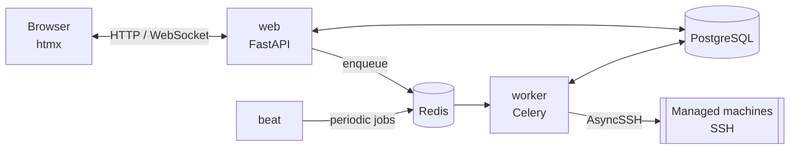

# 🏗️ Architecture

*The stack, project layout and cross-cutting security. Start at
[Home](Home.md) for the feature map.*

## 🗺️ Where to find things

| Page | Covers |
|---|---|
| [🔐 Authentication & RBAC](Authentication-RBAC.md) | Logins, sessions, roles, scoping, 2FA, API tokens, UI language, the REST API |
| [🖥️ Machine Management](Machine-Management.md) | Host keys, secrets, updates, facts, monitoring, Proxmox, Docker, checks, logs, terminal, scheduling |
| [📝 Audit Log](Audit-Log.md) | What's recorded, hash chain, retention, export, syslog |
| [🔔 Notifications](Notifications.md) | Events, conditions, recipients, templates, delivery, maintenance windows |
| [🧠 AI Assistant](AI-Assistant.md) | The assistant, its permission model, the fleet summary |
| [🔑 SSH Host Key Verification](SSH-Host-Key-Verification.md) | Why there's no trust-on-first-use |

## 🧱 Stack

| Layer | Choice | Notes |
|---|---|---|
| Language | Python 3.14.7 | |
| Web | FastAPI + Jinja2 + [htmx](https://htmx.org) 2 | server-rendered, no SPA, everything vendored |
| Database | PostgreSQL 18.6 | asyncpg + SQLAlchemy 2.0 async, Alembic |
| Broker / cache | Redis 8.10.2 | Celery broker **and** result backend, login rate limiter, Dashboard cache |
| Background work | [Celery](https://docs.celeryq.dev/) + Beat | see [below](#background-tasks-celery-and-celery-beat) |
| SSH | [AsyncSSH](https://asyncssh.readthedocs.io/) | strict host-key pinning |
| Auth | argon2-cffi, ldap3, Authlib, pyotp + qrcode, py_webauthn | |
| Cron | croniter | |
| Proxy (optional) | [Caddy](https://caddyproxy.com/) 2.11.4 | automatic HTTPS |
| Packaging | [uv](https://docs.astral.sh/uv/) | `uv.lock` committed |
| Deployment | Docker multi-stage build + Compose | |



Managed machines are reached from `worker` tasks; `web` connects directly
only for the two streaming features, the terminal and live log follow.

### Dependency version notes

- `pyproject.toml` has lower bounds; exact versions come from `uv.lock`.
- **redis-py** has no upper pin — `kombu[redis]` sets the real ceiling.
  The client version is independent of the Redis *server* version.
- **pydantic** stays on 2.12.x because `openrouter` 1.x requires
  `pydantic<2.13`; revisit when it lifts that.
- Stateful images (`postgres:18.6`, `redis:8.10.2`, `caddy:2.11.4`) and
  the Python base image are pinned to exact versions and bumped
  deliberately — see [Installation](Installation.md#updating).
- Vendored front-end libraries: htmx 2.0.11, xterm.js 6.0.0 (+ fit 0.11.0,
  webgl 0.19.0), Swagger UI 5.33.0.

### Front end: server-rendered + htmx

- Jinja2 pages, htmx for partial updates and polling; no build step, no
  CDN, one stylesheet. Colors come from `--color-*` variables so the light
  theme (`:root[data-theme="light"]`) only overrides those.
- The strict CSP forbids inline scripts and styles, so every script is a
  file under `static/js/`, htmx's injected indicator style is disabled,
  and widths use classes instead of `style=`.
- Static URLs carry a content hash (`static_url()`, `?v=…`) and are cached
  as immutable; unversioned ones revalidate. `tests/test_static_assets_exist.py`
  checks every reference.
- Navigation: day-to-day pages in the header, administration in one
  `<details>` menu; links appear only with their permission. Machine and
  group pages share a tab row (`partials/_tabnav.html`); a tab you lack
  permission for isn't shown. Settings is one route with `?tab=`.
- Phone widths (≤ 640 px) fold the header into a CSS-only menu, make tab
  rows scroll and hide `.col-optional` table columns.
- Self-polling fragments swap `innerHTML` into a stable wrapper; the live
  WebSocket "doorbell" (Machine Management → *Live updates*) triggers
  them early.

### Background tasks: Celery and Celery Beat

| Kind | Examples | Triggered by |
|---|---|---|
| Periodic sweeps | reachability, facts, packages, update checks, monitoring, conditions, endpoint checks | Beat (`timedelta`, from Settings) |
| Daily housekeeping | purges, fleet snapshot, image-update check | Beat (`crontab`) |
| One-off | connection test, refresh, update run, preview, power, onboarding | `task.delay(...)` from a route or another task |

Two Compose services: **`worker`** (scale freely) and **`beat`** (exactly
**one** replica — more would duplicate every schedule). A fan-out enqueues
one task per machine and never awaits them inline.

**Async bodies, sync wrappers.** Every job is `async def _do_thing(...)`
plus a one-line `@celery_app.task(name="...") def do_thing(...): return
asyncio.run(_do_thing(...))`. Tests call the coroutine. The periodic
read-only SSH collectors use `run_in_worker_loop(...)` instead, keeping one
event loop per worker process so `app.ssh.pool` can reuse SSH connections.
Task names are explicit and form a contract (queued messages and Beat
entries refer to them).

> [!WARNING]
> `celery.exceptions.TimeoutError` is **not** the builtin `TimeoutError`.
> Routes that wait for a result must catch the Celery one and wrap
> `AsyncResult.get()` in `asyncio.to_thread(...)` — it blocks.

#### Fork safety: the DB engine is rebuilt in every worker child

Celery forks its workers after importing the app, so a child would
otherwise share the parent's asyncpg pool (sporadic `InterfaceError`s,
wrong results). `worker_process_init` builds a fresh engine and session
factory in each child, with `poolclass=NullPool` (each task has its own
event loop; a pooled connection from an earlier loop would fail). The
inherited engine is abandoned, never `dispose()`d. Consequently, **task
code always opens sessions as `db_session.AsyncSessionLocal()` through the
module**, never via `from app.db.session import AsyncSessionLocal`. This
never shows up in tests (single-process SQLite).

## 📂 Project structure

```
app/
  audit.py      the audit-log write path (hash chain, verification)
  auth/         logins, sessions, sign-in policy, RBAC, 2FA, rate limit, API tokens
  core/         config, logging, encryption, CSRF, editable app settings
  db/           SQLAlchemy models + async session
  i18n/         locale files and lookup
  schemas/      Pydantic schemas
  scheduling/   cron actions registry and scheduler
  services/     logic shared by web, API and scheduler
  ssh/          AsyncSSH client, facts, updates, monitoring, Proxmox, logs, power
  tasks/        Celery app, Beat schedule and job bodies
  web/          routers, templates, static files
alembic/        migrations
tests/          pytest (no real Postgres/Redis/SSH)
scripts/        setup, secrets, admin bootstrap, recovery, backup, upgrade
ansible/        onboarding playbook
wiki/           this documentation
```

## 🔒 Security essentials

Feature-specific security lives on its page: logins and permissions in
[Authentication & RBAC](Authentication-RBAC.md), SSH, secrets and FIPS in
[Machine Management](Machine-Management.md), integrity in
[Audit Log](Audit-Log.md).

> [!IMPORTANT]
> The **AI assistant** is the highest-risk surface: it can propose shell
> commands from a model's reading of natural language. No mutating action
> runs without a CSRF-protected human confirmation that shows the literal
> command and every target, and each tool needs the same permission as the
> manual button. Read [AI Assistant](AI-Assistant.md) before enabling it.

- **CSRF** — a double-submit `csrftoken` cookie (`SameSite=Strict`) on
  every mutating web route, including login; a rejection is audited
  (`auth.csrf_rejected`). The REST API uses bearer tokens instead.
- **WebSockets** (terminal, log follow, live updates) authenticate by hand
  before `accept()` — session cookie, permission, machine scope — and
  refuse an `Origin` that differs from `Host` (`app.auth.websocket_origin`).
  The reverse proxy must pass `Host` through (every recipe here does).
- **Headers**, always set by the app: strict CSP (`'self'` only),
  `X-Frame-Options: DENY`, `nosniff`, `Referrer-Policy: no-referrer`,
  `Permissions-Policy`, `Cross-Origin-Opener-Policy: same-origin`, and HSTS
  when `APP_ENV=production`.
- **Redirect targets** (`?next=`, the theme toggle) go through
  `app.web.redirects.safe_local_path`, which accepts only a same-site path
  (no `//host`, backslash or control characters).
- **Startup validation** — the app refuses to start while `SECRET_KEY`,
  `ENCRYPTION_KEY` or `INFORM_TOKEN` look like placeholders. FastAPI's
  built-in docs routes are disabled; `/api` is gated (see Authentication).
- **Error pages** — a browser GET that hits 403/404 gets `error.html`;
  the API and htmx get JSON.
- **Version metadata** — `APP_VERSION` plus the git commit baked in at
  build time (`GIT_COMMIT` build arg; the image has no `.git`).

### Container hardening

Non-root runtime user, multi-stage build (no build tools in the image),
Postgres and Redis not published, and every app container (web, worker,
beat, migrate) runs with **all Linux capabilities dropped** and
`no-new-privileges`. The app port is published on all interfaces by
default and speaks plain HTTP — put a TLS proxy in front and set
`APP_BIND_ADDRESS=127.0.0.1` or firewall it.

### Deliberately out of scope

- No scheduled "power on" — a powered-off machine can't be reached.
- SSH identity rotation and LDAP/OIDC/syslog/SMTP configuration stay
  web-only (see the REST API section in Authentication).
- The AI assistant is web-only and conversations are private to their
  creator — see [AI Assistant](AI-Assistant.md#-deliberately-out-of-scope).
