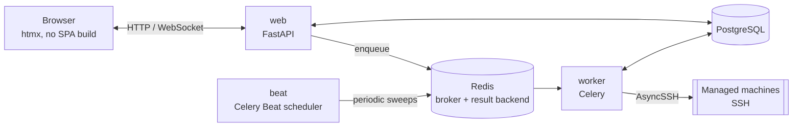

# 🏗️ Architecture

*The deep-dive reference — every "why", including the ones learned the hard way. Start at [Home](Home.md) if you just want the map.*

## 🗺️ Where to find things

This page covers the stack, project layout, and the cross-cutting
security essentials (CSRF, HTTP headers, startup validation, container
hardening). Everything feature-specific has its own page, split out here
specifically so a long single document doesn't get harder to search as
the app grows:

| Page | Covers |
|---|---|
| [🔐 Authentication & RBAC](Authentication-RBAC.md) | Logins (local/LDAP/OIDC), sessions, roles/permissions, temporary grants, machine-group scoping, TOTP/WebAuthn, per-user API tokens, per-user UI language, the REST API's own auth model |
| [🖥️ Machine Management](Machine-Management.md) | SSH host key pinning, secrets, config export/import, system updates (run/preview/rollback/check), facts/packages/services, monitoring, logs, live updates, readiness checks, tags, saved views, bulk actions, power, the interactive terminal, scheduling |
| [📝 Audit Log](Audit-Log.md) | Who/what/outcome/when, hash-chain integrity, retention, CSV/JSON export, syslog/SIEM forwarding, the Dashboard's daily trend snapshot |
| [🔔 Notifications](Notifications.md) | Rules (event/recipients/scope), user groups, templates & available placeholders, per-recipient locale, SMTP delivery |
| [🧠 AI Assistant](AI-Assistant.md) | The chat assistant, its tool/permission model, the scheduled fleet summary |
| [🔑 SSH Host Key Verification](SSH-Host-Key-Verification.md) | Why there's no "trust on first use," and how pinning/mismatch detection works |

## 🧱 Stack

| Layer | Choice | Notes |
|---|---|---|
| Language | Python 3.14.7 | |
| Web framework | FastAPI | async, OpenAPI schema for free |
| Templates / UI | Jinja2 + [htmx](https://htmx.org) (vendored locally) | no SPA build, no CDN |
| Database | PostgreSQL 18.6 | via `asyncpg` + SQLAlchemy 2.0 (async); image pinned to an exact patch |
| Migrations | Alembic | async engine |
| Task queue / broker | Redis 8.10.1 | **broker _and_ result backend** for [Celery](https://docs.celeryq.dev/); also backs the login rate limiter; image pinned to an exact patch |
| Background tasks | [Celery](https://docs.celeryq.dev/) + Celery Beat | one `worker` process pool, exactly one `beat` scheduler — see [Background tasks](#background-tasks-celery-and-celery-beat) |
| SSH client | [AsyncSSH](https://asyncssh.readthedocs.io/) | async, strict host key verification, modern algorithms (Ed25519) |
| Cron scheduling | [`croniter`](https://github.com/kiorky/croniter) | parses standard 5-field cron expressions for Scheduling |
| Auth: passwords | [`argon2-cffi`](https://github.com/hynek/argon2-cffi) | argon2id hashing for local accounts |
| Auth: LDAP | [`ldap3`](https://github.com/cannatag/ldap3) | pure Python, no system libldap headers needed |
| Auth: OIDC | [`Authlib`](https://authlib.org/) | discovery, authorization-code flow, ID token validation |
| Auth: TOTP | [`pyotp`](https://github.com/pyauth/pyotp) + [`qrcode`](https://github.com/lincolnloop/python-qrcode) | RFC 6238 two-factor codes; QR rendered as inline SVG |
| Auth: WebAuthn/passkeys | [`webauthn`](https://github.com/duo-labs/py_webauthn) (py_webauthn) | registration/authentication ceremony verification (attestation/assertion signatures) |
| Reverse proxy (optional) | [Caddy](https://caddyproxy.com/) | automatic HTTPS, TLS 1.3 only, HTTP/3 |
| Packaging / lockfile | [`uv`](https://docs.astral.sh/uv/) | `uv.lock` is committed |
| Containers | Docker (multi-stage build) + Docker Compose | |



One request/reply web tier, one Celery worker pool, one Beat scheduler —
see [Background tasks](#background-tasks-celery-and-celery-beat) for what
Beat actually schedules and why `web` never talks to a managed machine
directly (only `worker` does).


### Dependency version notes

- **`redis-py` carries no upper pin** in `pyproject.toml` — just a lower
  bound (`redis[hiredis]>=5.3.1`). The effective ceiling comes from
  `kombu[redis]` (Celery's transport layer), which declares
  `redis >=4.5.2,!=4.5.5,!=5.0.2,<6.5`; the resolver currently lands on
  **redis-py 6.4.0**.
  > [!NOTE]
  > The client library version and the Redis **server** version are
  > independent. redis-py 5.x and 6.x both talk to a Redis 8.x server —
  > do not try to "match" them.
- Versions in `pyproject.toml` are lower bounds (`>=`); exact, reproducible
  versions come from the committed `uv.lock`.
- Docker images for stateful services (`postgres:18.6`, `redis:8.10.1`,
  `caddy:2.11.4`) are pinned to an exact patch version, bumped deliberately
  — see [Installation](Installation.md#updating).

### Server-rendered + htmx, not a SPA

- Server-rendered Jinja2: no frontend build/deploy pipeline, no
  client-side API tokens, no JS framework supply chain.
- htmx only for host-key discovery and connection testing, vendored
  locally, not CDN.
- One shared stylesheet, a small utility-class set (`.button`, `.panel`,
  `.data-table`, `.badge`, `.alert`, `.form`, `.page-header`, ...).
- Collapsible mobile nav is a checkbox-driven CSS toggle, not JS — works
  under the strict CSP (no inline scripts), stays keyboard-operable
  (visually hidden via clip/absolute positioning, not `display: none`).
- Active nav link computed from `request.url.path` in `base.html`.
- `.alert`'s icon is an absolutely-positioned CSS `::before`, not a flex
  sibling, so several stacked `<p>` validation errors still work.
- A machine/group page's tabs (Overview/Monitoring/Updates/Terminal/
  Logs/Power/Settings — Terminal/Logs gated behind `action.terminal`)
  share a sub-nav row (`partials/_tabnav.html`) — plain links, no JS
  tabs. Each route builds its own `tabs`/`active_tab` context so the set
  and order stay identical everywhere; a tab a user lacks permission for
  is left out entirely, never shown disabled.
- Settings uses the same tabnav macro but stays one route
  (`GET /settings?tab=general|security|integrations|ai`) rather than one
  per tab — nine sections' worth of POST handlers all redirect back to
  *some* tab regardless of which one they belong to, so each just needs
  to know its own (`update_ldap_settings` always → `?tab=integrations`);
  an unrecognized/missing tab falls back to General.
- A few fragments a Beat sweep can change with no browser request —
  online/offline badge, Facts panel, packages summary, update
  availability — self-poll every 20-30s against a plain, SSH-free
  "current DB state" GET route. Each poll target's content lives in an
  inner partial, not the id'd wrapper itself — the wrapper keeps the id/
  `hx-trigger`, the poll response swaps in as `innerHTML` (returning the
  wrapper itself would nest a duplicate inside itself every tick). The
  update-run page's own poll predates this convention and self-replaces
  (`outerHTML`) instead, since it also needs to *stop* polling at a
  terminal state by dropping its own `hx-trigger` — only works if the
  whole polling element gets replaced.

### Background tasks: Celery and Celery Beat

All background work runs on **Celery**, with the existing Redis instance
(`REDIS_URL`) as **both** the broker and the result backend:

| Kind | Examples | Triggered by |
|---|---|---|
| **Periodic sweeps** | reachability ping, facts refresh, package refresh, update-availability check | Celery **Beat**, on `timedelta` schedules read from Settings |
| **Daily housekeeping** | audit-log purge, fleet snapshot, snapshot purge | Celery **Beat**, on `crontab()` schedules |
| **One-off, per machine** | SSH connect test, facts/packages refresh, apt update, update preview, reboot/shutdown | a route or another task calling `some_task.delay(...)` |

Two Compose services back this: **`worker`** (executes tasks; safe to
scale) and **`beat`** (publishes the schedule; **must never be scaled past
one replica** — every replica would publish the same entries, so each daily
purge would fire once per replica).

Every periodic job is a declarative entry in
`celery_app.conf.beat_schedule`; no job re-enqueues itself. Beat owns the
cadence.

#### Async bodies, sync task wrappers

Celery tasks are synchronous; this app's logic (SQLAlchemy async sessions,
`asyncssh`) is not. Every job is written twice over:

```python
async def _refresh_machine_facts(machine_id: str) -> dict[str, Any]:
    ...  # the real work

@celery_app.task(name="app.tasks.jobs.refresh_machine_facts")
def refresh_machine_facts(machine_id: str) -> dict[str, Any]:
    return asyncio.run(_refresh_machine_facts(machine_id))
```

The wrapper is exactly one line so no logic lives on the sync side; tests
call the `_`-prefixed coroutine directly.

Every task is registered with an **explicit `name=`** rather than Celery's
auto-derived dotted path. Beat entries, `.delay()` call sites, and messages
already sitting in Redis all refer to a task by name — moving or renaming a
module must not silently orphan queued messages. The names are a contract.

> [!WARNING]
> **`celery.exceptions.TimeoutError` is not the builtin `TimeoutError`** —
> it does not subclass it. A few routes enqueue a task and block on its
> result inline; every one of them must catch
> `from celery.exceptions import TimeoutError as CeleryTimeoutError`.
> Catching the builtin compiles fine and turns the timeout branch into dead
> code. Related: `AsyncResult.get()` is a **blocking, synchronous** call,
> so those routes wrap it in `asyncio.to_thread(...)` — calling it straight
> from an `async def` handler stalls the entire event loop for the full
> duration.

#### Fork safety: the DB engine is rebuilt in every worker child

> [!IMPORTANT]
> Never shows up in the test suite (in-memory SQLite, single process) —
> only a real Postgres deployment.

Celery's default worker pool is **prefork**: the parent imports the whole
app — including `app/db/session.py`'s module-level async engine — and
*then* forks, so every child would otherwise inherit the same asyncpg
pool and open TCP sockets. Symptoms: sporadic
`InterfaceError`/`InternalClientError`, results for the wrong query, a
wedged worker.

`app/tasks/celery_app.py` connects a **`worker_process_init`** signal
handler that builds a fresh engine and session factory inside each forked
child, after the fork:

```python
@worker_process_init.connect
def _init_worker_process(**kwargs):
    from app.db import session as db_session
    db_session.engine = create_async_engine(...)
    db_session.AsyncSessionLocal = async_sessionmaker(bind=db_session.engine, ...)
    register_builtin_actions()   # idempotent; each child needs its own registry
```

> [!CAUTION]
> The inherited engine is **never** `dispose()`d — that would close sockets
> the parent and every sibling are still using. It is abandoned, not closed.

For that rebind to be visible, **every job body must reach the factory
through the module** — `db_session.AsyncSessionLocal(...)`, never
`from app.db.session import AsyncSessionLocal`. A name bound at import time
keeps pointing at the parent's pool.

> [!IMPORTANT]
> That fresh per-child engine used the default `QueuePool` until v0.7.2 —
> which was its own bug, of a similar "invisible in tests, real in
> production" shape. Every task body is `asyncio.run(...)`ing its own
> coroutine (see above), so each task gets a **brand new event loop**. A
> real connection pool hands a later task, in the same forked child, a
> connection that was opened on an *earlier* task's (by then closed) loop —
> and asyncpg raises `RuntimeError("... attached to a different loop")` the
> moment it's used. `worker_process_init` now builds this engine with
> `poolclass=NullPool`: every checkout opens a fresh connection and every
> checkin closes it, so a connection can never outlive the loop that
> created it. This only applies to the Celery worker's engine — the FastAPI
> web process has one long-lived event loop for its whole life and keeps a
> real pool.

## 📂 Project structure

```
app/
  audit.py      the single audit-log write path (hash chaining, verification)
  auth/         login (local/LDAP/OIDC), sessions, RBAC permissions, TOTP,
                per-IP rate limiting, per-user API tokens — see
                Authentication-RBAC.md
  core/         config (pydantic-settings), logging, encryption, CSRF,
                editable app settings (app/core/app_settings.py)
  db/           SQLAlchemy models + async session
  schemas/      Pydantic schemas for forms
  scheduling/   cron-scheduled actions: registry, cron parsing, scheduler jobs
  services/     logic shared between manual routes and the scheduler
  ssh/          AsyncSSH client (host key pinning), facts, updates, power
  tasks/        Celery app (beat schedule, fork-safety hook) + task bodies
  web/          FastAPI routers, Jinja2 templates, static files
alembic/        DB migrations
tests/          pytest (async, isolated from real infrastructure)
scripts/        helper scripts (secret generation, first-admin bootstrap,
                console-only account recovery, one-command upgrade)
ansible/        onboarding playbook — see Ansible-Onboarding.md
wiki/           this documentation
```

## 🔒 Security essentials

See [Authentication & RBAC](Authentication-RBAC.md) for logins, sessions,
and permissions; [Machine Management](Machine-Management.md) for SSH
handling, secrets at rest, and FIPS alignment; [Audit
Log](Audit-Log.md) for integrity/retention. Below is what's left:
cross-cutting hardening that isn't specific to any one feature. See
"Deliberately out of scope" at the bottom for what's missing entirely.

> [!IMPORTANT]
> The **AI assistant** (the `/ai` page, `app/ai/` and
> `app/tasks/ai_jobs.py`) is the highest-risk surface in this application
> by a wide margin: it can propose arbitrary shell commands, derived from a
> third-party model's interpretation of natural language, against real
> machines. Its safeguards — `ai.access` gating the page while every tool
> stays gated by the same permission the equivalent manual button needs,
> the permission being re-checked three separate times, and above all the
> rule that no mutating action ever runs without a CSRF-protected human
> confirmation showing the literal command and every resolved target — are
> documented in full, including the residual prompt-injection risk they
> deliberately do **not** eliminate, in
> [AI Assistant](AI-Assistant.md). Read that page before enabling the
> feature.

### Version metadata: baked in at build time, not read from `.git`

Settings shows `APP_VERSION` (bumped by hand per release) and the exact
git commit the image was built from, linked to GitHub. The image never
contains `.git`, so the commit is baked in: a `GIT_COMMIT` build arg
becomes an `ENV`, set from the `GIT_COMMIT` shell variable —
`upgrade.sh` exports it right before building. Running locally without
Docker, it falls back to the local `.git` checkout.

### CSRF protection: a double-submit cookie, provisioned centrally

A random `csrftoken` cookie (`SameSite=Strict`, `HttpOnly`) is set on GET
requests rendering a form, echoed back as a hidden field on POST.
Doesn't depend on login — protects the login form itself against login
CSRF (tricking a victim into authenticating as the *attacker's* account).

The middleware ensures a token exists on every request, stashed on
`request.state.csrf_token`. `get_or_create_csrf_token` checks that
first before minting a second, different token, so older routes stay
consistent with whichever the middleware chose.

A rejection (missing/mismatched) is recorded in the audit log —
`verify_csrf` calls `log_event` (`auth.csrf_rejected`, `DENIED`) before
raising the 403.

### HTTP security headers

Set unconditionally by the app itself, regardless of any reverse proxy
in front: a strict CSP (no inline scripts/styles, no external origins),
`X-Frame-Options: DENY`, `X-Content-Type-Options: nosniff`,
`Referrer-Policy: no-referrer`, a restrictive `Permissions-Policy`.
`Strict-Transport-Security` added when `APP_ENV=production`. Bundled
Caddy additionally sets its own HSTS and strips `Server` at the edge.

### Configuration is validated at startup

`Settings` refuses to construct — so the app refuses to start — if
`SECRET_KEY`, `ENCRYPTION_KEY`, or `INFORM_TOKEN` still look like a
`.env.example` placeholder (starts with `change-me`, or under 16
characters). Checked once, at process startup. FastAPI's built-in
`docs_url`/`redoc_url`/`openapi_url` are disabled unconditionally
(`app/main.py`) — `/api` and `/openapi.json` are hand-written routes
instead, gated by login + `api_access_enabled` (see [Authentication &
RBAC → Interactive docs](Authentication-RBAC.md#interactive-docs-swagger-ui-at-api)).

### Container hardening

The runtime image runs as a non-root user, multi-stage Dockerfile (build
tools never ship in the final image), Postgres/Redis ports not published
by default. The app's own port *is* published on every interface, not
just loopback — still plain HTTP, still meant to sit behind a
TLS-terminating proxy. Firewall it, or bind `web.ports` to `127.0.0.1:${APP_PORT}:8080`.

### Deliberately out of scope

- **Per-schedule timezones** — cron is always UTC, permanent, not a
  stopgap. `TZ` only affects log timestamps and local-time display.
- No scheduled "power on" to pair with scheduled shutdown — no way to power on a machine that's off.
- Rotating the app's SSH identity, and LDAP/OIDC/syslog/SMTP config, stay web-UI-only.
- The **AI assistant** is web-UI-only, conversations private to their
  creator (no shared/admin view). See
  [AI Assistant → Deliberately out of scope](AI-Assistant.md#-deliberately-out-of-scope).
