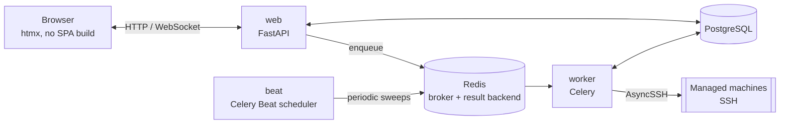

# 🏗️ Architecture

## 🧱 Stack

| Layer | Choice | Notes |
|---|---|---|
| Language | Python 3.14.7 | |
| Web framework | FastAPI | async, OpenAPI schema for free |
| Templates / UI | Jinja2 + [htmx](https://htmx.org) (vendored locally) | no SPA build, no CDN |
| Database | PostgreSQL 18.6 | via `asyncpg` + SQLAlchemy 2.0 (async); image pinned to an exact patch |
| Migrations | Alembic | async engine |
| Task queue / broker | Redis 8.10.1 | **broker _and_ result backend** for [Celery](https://docs.celeryq.dev/); also backs the login rate limiter; image pinned to an exact patch |
| Background tasks | [Celery](https://docs.celeryq.dev/) + Celery Beat | one `worker` process pool, exactly one `beat` scheduler — see [Background tasks](#background-tasks-celery-and-celery-beat) |
| SSH client | [AsyncSSH](https://asyncssh.readthedocs.io/) | async, strict host key verification, modern algorithms (Ed25519) |
| Cron scheduling | [`croniter`](https://github.com/kiorky/croniter) | parses standard 5-field cron expressions for Scheduling |
| Auth: passwords | [`argon2-cffi`](https://github.com/hynek/argon2-cffi) | argon2id hashing for local accounts |
| Auth: LDAP | [`ldap3`](https://github.com/cannatag/ldap3) | pure Python, no system libldap headers needed |
| Auth: OIDC | [`Authlib`](https://authlib.org/) | discovery, authorization-code flow, ID token validation |
| Auth: TOTP | [`pyotp`](https://github.com/pyauth/pyotp) + [`qrcode`](https://github.com/lincolnloop/python-qrcode) | RFC 6238 two-factor codes; QR rendered as inline SVG |
| Auth: WebAuthn/passkeys | [`webauthn`](https://github.com/duo-labs/py_webauthn) (py_webauthn) | registration/authentication ceremony verification (attestation/assertion signatures) |
| Reverse proxy (optional) | [Caddy](https://caddyproxy.com/) | automatic HTTPS, TLS 1.3 only, HTTP/3 |
| Packaging / lockfile | [`uv`](https://docs.astral.sh/uv/) | `uv.lock` is committed |
| Containers | Docker (multi-stage build) + Docker Compose | |



One request/reply web tier, one Celery worker pool, one Beat scheduler —
see [Background tasks](#background-tasks-celery-and-celery-beat) for what
Beat actually schedules and why `web` never talks to a managed machine
directly (only `worker` does).

**On this page:** [Stack](#-stack) · [Server-rendered UI](#server-rendered--htmx-not-a-spa)
· [Background tasks](#background-tasks-celery-and-celery-beat) ·
[Project structure](#-project-structure) ·
[Auth & RBAC](#authentication--rbac) ·
[Security model](#-security-model) (host key pinning, secrets at rest,
system updates, facts/packages/services, monitoring, logs, readiness
check, terminal, scheduling, audit log, CSRF/headers) ·
[Deliberately out of scope](#deliberately-out-of-scope)

### Dependency version notes

- **`redis-py` carries no upper pin** in `pyproject.toml` — just a lower
  bound (`redis[hiredis]>=5.3.1`). The effective ceiling comes from
  `kombu[redis]` (Celery's transport layer), which declares
  `redis >=4.5.2,!=4.5.5,!=5.0.2,<6.5`; the resolver currently lands on
  **redis-py 6.4.0**.
  > [!NOTE]
  > The client library version and the Redis **server** version are
  > independent. redis-py 5.x and 6.x both talk to a Redis 8.x server —
  > do not try to "match" them.
- Versions in `pyproject.toml` are lower bounds (`>=`); exact, reproducible
  versions come from the committed `uv.lock`.
- Docker images for stateful services (`postgres:18.6`, `redis:8.10.1`,
  `caddy:2.11.4`) are pinned to an exact patch version, bumped deliberately
  — see [Installation](Installation.md#updating).

### Server-rendered + htmx, not a SPA

- Server-rendered Jinja2 templates: no frontend build/deploy pipeline, no
  client-side API tokens, no JS framework supply chain.
- htmx is used only for discovering a host key fingerprint and testing a
  connection, and is vendored locally rather than pulled from a CDN.
- One shared stylesheet (`app/web/static/css/style.css`) over a small set of
  utility classes (`.button`, `.panel`, `.data-table`, `.badge`, `.alert`,
  `.form`, `.page-header`, ...).
- The collapsible mobile nav is a checkbox-driven CSS toggle
  (`.nav-toggle`), not JavaScript — it works under the strict CSP (no
  inline scripts) and stays keyboard-operable (visually hidden via
  clip/absolute positioning, not `display: none`).
- The active nav link is computed from `request.url.path` in `base.html`.
- `.alert`'s icon is CSS `::before` content positioned *absolutely* inside
  reserved left padding, not a flex sibling, so an alert holding several
  `<p>` tags (one per validation error) still stacks them.
- A machine's or group's own pages (Overview, Monitoring, Updates,
  Terminal, Logs, Power, Settings — Logs and Terminal are machine-only,
  gated behind `action.terminal`) share a sub-navigation row
  (`partials/_tabnav.html`) below the page header — plain links to real
  pages, no JS tabs. Each route builds its own `tabs`/`active_tab` context
  (`_machine_tabs`/`_group_tabs` in `app/web/routes/machines.py`/
  `machine_groups.py`) so the set and order is identical everywhere; a tab
  is left out entirely rather than shown disabled when the current user
  lacks the permission for it (e.g. Terminal/Logs without
  `action.terminal`).
- Settings uses the same `_tabnav.html` macro, but with one twist: there's
  only ever the single `GET /settings` route, not one per tab, since every
  POST handler on the page (nine sections' worth of forms) has to redirect
  back to *some* tab regardless of which section it belongs to — giving
  each tab its own path would mean every one of those redirects needs to
  know which page it's redirecting from. A `?tab=general|security|
  integrations|ai` query param on the one route stands in for that; each
  POST handler in `app/web/routes/settings.py` just needs to know which tab
  *it itself* belongs to (e.g. `update_ldap_settings` always redirects to
  `/settings?tab=integrations`), and an unrecognized/missing tab value
  falls back to General rather than 404ing or rendering nothing.
- A few fragments that a periodic Celery Beat sweep can change without any
  request from the browser — the online/offline badge, the Facts panel, the
  installed-packages summary, the update-availability panel — poll
  themselves every 20-30s (`hx-trigger="every ...s"`) against a plain,
  SSH-free "current state from the DB" GET route (`GET /machines/{id}/
  status-panel`/`facts-panel`/`packages-summary-panel`/
  `update-availability-panel` in `app/web/routes/machines.py`), so a
  background refresh shows up on an already-open page without a manual
  reload. Each poll target's *own* content lives in a plain inner partial
  (e.g. `partials/_packages_summary_inner.html`) rather than the id'd
  wrapper div itself — the id and `hx-trigger` stay on the wrapper (in
  detail.html, or inside the outer div for update-availability), and the
  poll response is swapped in as its `innerHTML`; returning the wrapper
  itself in the poll response would nest a duplicate copy of it inside
  itself on every tick. The update-run page's own poll
  (`partials/update_run_status.html`) predates this and uses the opposite,
  self-replacing (`outerHTML`) shape instead, because it also needs to
  *stop* polling once the run reaches a terminal state — dropping its own
  `hx-trigger` from the next response is how it does that, which only works
  if the whole polling element is what gets replaced.

### Background tasks: Celery and Celery Beat

All background work runs on **Celery**, with the existing Redis instance
(`REDIS_URL`) as **both** the broker and the result backend:

| Kind | Examples | Triggered by |
|---|---|---|
| **Periodic sweeps** | reachability ping, facts refresh, package refresh, update-availability check | Celery **Beat**, on `timedelta` schedules read from Settings |
| **Daily housekeeping** | audit-log purge, fleet snapshot, snapshot purge | Celery **Beat**, on `crontab()` schedules |
| **One-off, per machine** | SSH connect test, facts/packages refresh, apt update, update preview, reboot/shutdown | a route or another task calling `some_task.delay(...)` |

Two Compose services back this: **`worker`** (executes tasks; safe to
scale) and **`beat`** (publishes the schedule; **must never be scaled past
one replica** — every replica would publish the same entries, so each daily
purge would fire once per replica).

Every periodic job is a declarative entry in
`celery_app.conf.beat_schedule`; no job re-enqueues itself. Beat owns the
cadence.

#### Async bodies, sync task wrappers

Celery tasks are synchronous; this app's logic (SQLAlchemy async sessions,
`asyncssh`) is not. Every job is written twice over:

```python
async def _refresh_machine_facts(machine_id: str) -> dict[str, Any]:
    ...  # the real work

@celery_app.task(name="app.tasks.jobs.refresh_machine_facts")
def refresh_machine_facts(machine_id: str) -> dict[str, Any]:
    return asyncio.run(_refresh_machine_facts(machine_id))
```

The wrapper is exactly one line so no logic lives on the sync side; tests
call the `_`-prefixed coroutine directly.

Every task is registered with an **explicit `name=`** rather than Celery's
auto-derived dotted path. Beat entries, `.delay()` call sites, and messages
already sitting in Redis all refer to a task by name — moving or renaming a
module must not silently orphan queued messages. The names are a contract.

> [!WARNING]
> **`celery.exceptions.TimeoutError` is not the builtin `TimeoutError`** —
> it does not subclass it. A few routes enqueue a task and block on its
> result inline; every one of them must catch
> `from celery.exceptions import TimeoutError as CeleryTimeoutError`.
> Catching the builtin compiles fine and turns the timeout branch into dead
> code. Related: `AsyncResult.get()` is a **blocking, synchronous** call,
> so those routes wrap it in `asyncio.to_thread(...)` — calling it straight
> from an `async def` handler stalls the entire event loop for the full
> duration.

#### Fork safety: the DB engine is rebuilt in every worker child

> [!IMPORTANT]
> Never shows up in the test suite (in-memory SQLite, single process) —
> only a real Postgres deployment.

Celery's default worker pool is **prefork**: the parent imports the whole
app — including `app/db/session.py`'s module-level async engine — and
*then* forks, so every child would otherwise inherit the same asyncpg
pool and open TCP sockets. Symptoms: sporadic
`InterfaceError`/`InternalClientError`, results for the wrong query, a
wedged worker.

`app/tasks/celery_app.py` connects a **`worker_process_init`** signal
handler that builds a fresh engine and session factory inside each forked
child, after the fork:

```python
@worker_process_init.connect
def _init_worker_process(**kwargs):
    from app.db import session as db_session
    db_session.engine = create_async_engine(...)
    db_session.AsyncSessionLocal = async_sessionmaker(bind=db_session.engine, ...)
    register_builtin_actions()   # idempotent; each child needs its own registry
```

> [!CAUTION]
> The inherited engine is **never** `dispose()`d — that would close sockets
> the parent and every sibling are still using. It is abandoned, not closed.

For that rebind to be visible, **every job body must reach the factory
through the module** — `db_session.AsyncSessionLocal(...)`, never
`from app.db.session import AsyncSessionLocal`. A name bound at import time
keeps pointing at the parent's pool.

> [!IMPORTANT]
> That fresh per-child engine used the default `QueuePool` until v0.7.2 —
> which was its own bug, of a similar "invisible in tests, real in
> production" shape. Every task body is `asyncio.run(...)`ing its own
> coroutine (see above), so each task gets a **brand new event loop**. A
> real connection pool hands a later task, in the same forked child, a
> connection that was opened on an *earlier* task's (by then closed) loop —
> and asyncpg raises `RuntimeError("... attached to a different loop")` the
> moment it's used. `worker_process_init` now builds this engine with
> `poolclass=NullPool`: every checkout opens a fresh connection and every
> checkin closes it, so a connection can never outlive the loop that
> created it. This only applies to the Celery worker's engine — the FastAPI
> web process has one long-lived event loop for its whole life and keeps a
> real pool.

## 📂 Project structure

```
app/
  audit.py      the single audit-log write path (hash chaining, verification)
  auth/         login (local/LDAP/OIDC), sessions, RBAC permissions, TOTP,
                per-IP rate limiting, per-user API tokens — see
                "Authentication & RBAC" below
  core/         config (pydantic-settings), logging, encryption, CSRF,
                editable app settings (app/core/app_settings.py)
  db/           SQLAlchemy models + async session
  schemas/      Pydantic schemas for forms
  scheduling/   cron-scheduled actions: registry, cron parsing, scheduler jobs
  services/     logic shared between manual routes and the scheduler
  ssh/          AsyncSSH client (host key pinning), facts, updates, power
  tasks/        Celery app (beat schedule, fork-safety hook) + task bodies
  web/          FastAPI routers, Jinja2 templates, static files
alembic/        DB migrations
tests/          pytest (async, isolated from real infrastructure)
scripts/        helper scripts (secret generation, first-admin bootstrap,
                console-only account recovery, one-command upgrade)
ansible/        onboarding playbook — see Ansible-Onboarding.md
wiki/           this documentation
```

## Authentication & RBAC

Every page requires a valid session except `/login`, `/login/totp`,
`/login/webauthn/options` + `/login/webauthn/verify`, the
`/auth/oidc/...` endpoints, `/healthz`, and `/api/*` (which has its own
bearer-token auth) — enforced by one ASGI middleware,
`app.auth.middleware.require_auth`, registered in `app/main.py` before the
security-headers middleware so CSP etc. still land on a redirect-to-login
response.

### No accounts are ever auto-created

Every `User` row (`app/db/models/user.py`) is created inside debcontrol
first, through the **Users** page — never by LDAP or OIDC. `auth_provider`
(`local` / `ldap` / `oidc`) only decides *how* an existing account proves
who it is:

- **`local`**: a password stored here, argon2id-hashed (`app.auth.security`).
- **`ldap`**: the account's `username` is used as the LDAP username — no
  separate field. `app.auth.ldap.authenticate` does search-then-bind: a
  service account (configured in Settings) searches for the user's DN by
  username (filter-escaped with `ldap3.utils.conv.escape_filter_chars`, on
  top of `username` already being restricted to a safe character set), then
  a *second*, independent connection binds as that DN with the password
  just entered. An empty password is rejected before reaching the bind step
  — many directories treat that as a successful "unauthenticated bind".
  For `ldaps://`/StartTLS, `AppSettings.ldap_tls_verify` (on by default)
  controls certificate verification — `ldap3.Server` defaults to *no*
  verification at all unless it's given an explicit `Tls` object, so
  `app.auth.ldap` always passes one rather than relying on that default;
  turning it off is an explicit opt-out for a directory with a
  self-signed/otherwise-invalid certificate an admin already knows about.
- **`oidc`**: redirected to the provider (Authlib, authorization-code
  flow); on callback the account is matched by comparing `username` against
  a claim from the validated ID token — which claim is configurable
  (`AppSettings.oidc_username_claim`, default `email`). No account is
  created or updated from provider claims. The login page's OIDC button
  reads "Log in with OIDC" unless `AppSettings.oidc_provider_name` names
  the actual provider (e.g. "Entra ID") — purely cosmetic, set on the
  Settings → Integrations tab alongside the rest of the OIDC config.

`/login` is shared by `local` and `ldap` accounts;
`app.auth.login.check_password` looks the username up and branches
internally. An `oidc` account attempting the password form is rejected with
the same generic message as a wrong password.

**Login is two steps**, not one form: `GET /login` collects only the
username (plus the OIDC button, if enabled — see below), then `GET
/login/password?username=...` offers a passkey *or* a password for that
account — a passkey there signs straight in with no password ever
submitted, exactly like GitHub's/Google's own "next screen" login shape.
`username` travels between the two as a plain query param, the same way
`next` already does everywhere else — it isn't a secret, and nothing
trusts it for anything beyond "whose passkeys to offer"; the real
authentication (password, still checked by the unchanged `POST /login`
that screen two's password form submits to; or WebAuthn) is what
actually verifies the account. The passkey button is always shown on
step two regardless of whether the named account actually has one or
even exists — `app.web.routes.auth._resolve_webauthn_login_user`'s own
docstring covers why that's deliberate (enumeration-resistance: a
nonexistent username and a real one with no passkey get an identical
error). A passkey used this way needs no further second factor — it
already *is* one — so it goes straight to `_finish_login`, the same
function a post-password TOTP/passkey confirmation ends at.

### Sessions are server-side rows, not a signed cookie

`UserSession` (`app/db/models/user_session.py`) is a DB row per login; the
cookie carries an opaque random token and only its SHA-256 is stored
(`token_hash`), so a DB leak alone doesn't hand over a live session. Rows
are revocable immediately: disabling a user, an admin resetting someone's
password, or "log out everywhere" (own account or, for an admin, someone
else's) all mark rows revoked. Sessions slide (`SESSION_IDLE_TIMEOUT`,
12h, extended on each authenticated request) up to an absolute cap from
creation (`SESSION_ABSOLUTE_MAX`, 30 days).

The middleware runs outside FastAPI's dependency injection, so it opens a
DB session via `request.app.state.db_session_factory` — the same pattern
`app/tasks/jobs.py` uses. The factory lives on `app.state` (set in
`app.main`'s `lifespan`) so tests can point it at their own SQLite engine
(`tests/conftest.py`'s `_configure_app_for_tests`).

Two *signed but stateless* values exist, both `itsdangerous.
URLSafeTimedSerializer` keyed by `SECRET_KEY`, 5-minute expiry, neither
granting a session by itself: the pending-2FA ticket covering the few
minutes between "password/LDAP check passed" and "second factor
confirmed" (`app.auth.sessions.create_pending_totp_ticket` — despite the
name, it's read by the WebAuthn login routes too, since "this account,
mid-login, still needs a second factor" is identical whichever factor
they end up using), and the WebAuthn challenge ticket
(`create_webauthn_challenge_ticket`) carrying one ceremony's own
challenge — see the WebAuthn/passkeys section above. `SECRET_KEY` also
signs the OIDC-flow session cookie.

### RBAC: custom roles, a fixed permission set

An admin defines named `Role`s (`app/db/models/role.py`) and picks exactly
which of 12 fixed `Permission`s each grants — `machine.view`/`.manage`,
`group.view`/`.manage`, `action.updates`, `action.power`,
`scheduling.view`/`.manage`, `audit.view`, `settings.view`/`.manage`,
`user.manage` — then assigns **one role per user**. Permissions are
resource-grained, not per-object.

A `MANAGE` permission always also grants the matching `VIEW` permission
(`User.has_permission` / `role_has_permission`, `_MANAGE_IMPLIES_VIEW`) —
otherwise a role granted e.g. `machine.manage` but not `machine.view` would
403 on every machines page, since routes are gated with
`require_permission` at the *view* level for GETs and additional per-route
permissions for state-changing ones. `action.updates` and `action.power`
are their own permissions, independent of `machine.manage` and of each
other. `user.manage` covers both user and role management.

> [!IMPORTANT]
> Permissions themselves are resource-grained rather than per-object: a role
> grants `machine.view`, not "view machine X". *Which* machines and groups an
> account may use those permissions on is a separate, orthogonal, opt-in
> layer — see "Machine-group scoping" below. Nothing else is per-object:
> nothing is "private" to whoever created it, and scheduled tasks are not
> owned by their author.

### Time-limited per-user permissions: on top of the role, not instead of it

**Users → edit a user → Temporary permissions** grants one `Permission`
directly to *this account*, expiring on its own after a chosen number of
hours (`TemporaryPermissionGrant`, up to `MAX_GRANT_HOURS` — 30 days) —
"this user gets `action.terminal` for the next 2 hours," without editing
their role (which is shared, fleet-wide configuration) or creating a
disposable one-off role for it.

`User.has_permission` is the only thing that changed to support this: it
now checks the *union* of the role's own permissions and the user's
currently-active temporary grants (`active_temporary_permissions`, a
plain in-memory filter over `expires_at`/`revoked_at` — no query, no
background job). `temporary_permission_grants` is `lazy="selectin"` on
`User`, the same convention `Role.permission_grants` already uses, so
every request that resolves a session already has the data it needs to
check this live — an expired grant simply stops counting the moment
`expires_at` passes, the same way a session's own expiry needs no
separate cleanup step to take effect. `role_has_permission` (the
role-only check `app/web/routes/users.py` uses to simulate "would this
account still have `user.manage` if its role changed?") deliberately
never considers temporary grants — those are per-user, not per-role, so
there is nothing for a role-only check to see.

A grant can also be ended early (`revoked_at`) from the same page. Both
the grant and the revoke are audit-logged
(`user.temporary_permission.grant`/`.revoke`); the REST API mirrors both
at `POST`/`GET /api/v1/users/{id}/temporary-permissions` and `DELETE
.../temporary-permissions/{grant_id}`.

### Machine-group scoping: which machines an account may see

An orthogonal layer on top of the permission matrix — permissions decide
*what* an account may do, this decides *to which machines and groups*.

- **Model**: `UserMachineGroupAccess`
  (`app/db/models/user_machine_group_access.py`), a plain many-to-many join
  of `users` × `machine_groups`. One row = "this account may see this group
  and its machines".
- **Default, and the whole backward-compatibility story**: an account with
  **zero rows is unrestricted** and sees everything. One or more rows
  restricts it to exactly those groups. Machines in no group
  (`Machine.group_id IS NULL`) are never visible to a restricted account.
  The migration needs no backfill.
- **Where it's set**: the Users page (`user.manage`), as a checkbox list on
  the create/edit form — account administration, alongside
  `api_access_enabled`, not a new `Permission`. Audit-logged as
  `user.group_access.update`. An admin cannot change **their own** scope,
  mirroring the existing self-role-change guard.
- **Enforcement**: one service, `app/services/access_scope.py`, used by
  every read and write path — machines and groups (lists, detail, package
  search, bulk actions, membership, config export), scheduling, the
  Dashboard's live counts, the REST API, the SSH terminal WebSocket, and
  the AI assistant's tools. Out of scope reads as **404, never 403** (a 403
  would confirm the row exists), and bulk endpoints drop out-of-scope
  machine ids from a client-submitted selection rather than trusting them.
- **"All machines"**: narrowed to the account's own machines on the live
  page, but **refused outright as a scheduling target** for a restricted
  account (validated server-side at create/edit, not just hidden in the
  form) — a stored schedule outlives the scope that created it.
- **Not affected**: the **audit log**. `audit.view` stays a single global
  permission with no group filtering — the audit trail is a security
  control over the whole deployment, and a partial one would be worse than
  none. The daily fleet-snapshot job also stays fleet-wide (it has no
  current user); a restricted account is simply not shown the trend chart,
  since a stored fleet-wide total has nothing left to narrow. Scheduled
  tasks are scope-checked when written, never when they fire.

### Guardrails against locking everyone out

- **Self-protection**: a user can't deactivate, delete, or change the role
  of their own account (`app/web/routes/users.py`).
- **Last-admin protection**:
  `app.auth.login.count_active_users_with_permission` (with
  `excluding_user_id` or `excluding_role_id`) checks, before committing,
  whether the change would leave *nobody* holding `user.manage`. The
  **role**-level check (`app/web/routes/roles.py`, editing a role to drop
  `user.manage`) is the one that bites in practice.

### Brute-force lockout, shared by password and TOTP

`User.failed_login_attempts`/`locked_until` are incremented by both the
password/LDAP-bind step and the TOTP-code step
(`app.auth.login._register_failed_attempt`): **5 failures locks the account
for 15 minutes**, reset on any successful step.

### Generic failure messages, except for lockout

A nonexistent username, a wrong password, an inactive account, and an
`oidc` account trying the password form all render the identical "Invalid
username or password" (no username enumeration). A **locked-out** account
gets a different, specific message.

### TOTP: opt-in, self-service, with recovery codes

Available to `local`/`ldap` accounts, not `oidc`. Enrollment is
self-service — only the account's owner can scan the QR code
(`GET /account/totp/enroll`, confirmed by entering a real code before
anything is persisted). The QR is rendered as inline SVG
(`app.auth.totp.qr_code_svg`, `qrcode`'s `SvgPathImage` factory) rather
than an ``, so no `img-src` CSP exception is needed.

Eight one-time recovery codes are generated at enrollment (shown once,
hashed with the same argon2 hasher as passwords) and regenerated wholesale
whenever TOTP is disabled and re-enabled, or explicitly via "Regenerate
recovery codes" — which requires a fresh *TOTP* code, not a recovery code,
so one leaked recovery code can't relearn the whole batch.

### WebAuthn/passkeys: a second factor alongside (or instead of) TOTP

`app.auth.webauthn` is a thin relying-party wrapper around py_webauthn —
it derives the RP id (bare hostname) and origin (scheme+host+port) from
the live `Request` rather than a config value (same reasoning
`app.auth.oidc`'s redirect URI already uses: getting either wrong fails
the ceremony outright, so there's no sensible static default), and shapes
options/results around `app.db.models.webauthn_credential.WebAuthnCredential`
(one row per registered authenticator: credential id, public key,
signature counter, device type, `backed_up`). Available to `local`/`ldap`
accounts only, same restriction as TOTP.

Both the RP origin above and OIDC's redirect URI depend on
`request.url.scheme` being correct, which needs
`app.core.proxy_headers.ProxyHeadersMiddleware` (registered outermost in
`app.main`) to have corrected it from `X-Forwarded-Proto` first when the
app sits behind a TLS-terminating reverse proxy — otherwise both derive
"http" no matter what the browser actually used, and WebAuthn fails with
"Unexpected client data origin". See that module's own docstring and
`Settings.trusted_proxy_ips` for why trusting it by default is safe, and
[Installation](Installation.md#environment-variables) for the
`TRUSTED_PROXY_IPS` setting.

Both ceremonies (registration under "My account", authentication as a
login-time second factor) follow the same shape: a `GET .../options` route
generates a challenge, hands it back as browser-ready JSON
(`webauthn.helpers.options_to_json`), and stashes it in a short-lived
signed cookie (`app.auth.sessions.create_webauthn_challenge_ticket`,
5 minutes, `purpose` of `"register"` or `"authenticate"` so one can never
be replayed as the other); `app/web/static/js/webauthn.js` decodes the
base64url fields, drives `navigator.credentials.create()`/`.get()`, and
submits the browser's result as a normal form POST to a matching
`.../verify` route — no SPA/fetch round trip needed once the ceremony
itself completes, consistent with the rest of the app being server-
rendered. A signature counter that doesn't advance is the spec's own
clone-detection signal and hard-fails verification (`WebAuthnError`); two
authenticators both permanently at count 0 — common for platform passkeys
that don't implement a counter — is accepted, since py_webauthn only
flags a **decrease or non-increase from a previously nonzero count**.

A passkey now works two ways, both ending at the same `_finish_login`:
as the **primary** method, from `GET /login/password` (step two of login
— see the two-step-login note above), before any password is checked at
all; or as a **second factor**, when `POST /login` sends an account with
TOTP enabled **or** at least one registered passkey to `/login/totp`
(reusing the pending-2FA ticket — see below) instead of finishing the
login directly — that page renders the TOTP code form only if TOTP is
actually enabled, and a "use a passkey" button whenever the account has
one, so an account with only passkeys skips straight to that option.
`app.web.routes.auth._resolve_webauthn_login_user` is what tells these
two contexts apart for `GET /login/webauthn/options`/
`POST /login/webauthn/verify` (both routes are shared by both contexts,
not duplicated) — a `pending_totp` ticket present means second-factor
(the account already passed password/LDAP); its absence plus a
`username` form/query value means primary (nothing about the account
verified yet, which is fine: WebAuthn's own cryptographic proof is what
actually establishes identity either way).

### Role-enforced TOTP: real-time, not just a login-time redirect

`Role.require_totp` mandates a second factor — TOTP, or a registered
passkey, either satisfies it — for everyone holding a given role.
`app.auth.middleware` checks the *current* session's user's *current* role
and *current* `totp_enabled`/passkey state on **every request** (a cheap
in-memory pre-check, `_needs_second_factor_check`, keeps the extra
passkey-count query off the hot path for accounts that don't need it), so
toggling the flag on takes effect on the next request of every affected
user. A blocked user may reach exactly `GET`/`POST /account/totp/enroll`,
`GET /account/webauthn/register/options` + `POST .../verify`, the account
page they're linked from, and `/logout`; everything else redirects to the
TOTP enrollment page (or, for an `HX-Request`, sends `HX-Redirect` so htmx
navigates the whole page) — registering a passkey there satisfies the
block exactly like enrolling TOTP would.

By contrast `User.must_change_password` only steers `_finish_login`'s
post-login redirect (`app/web/routes/auth.py`), so an already-logged-in
user is unaffected until they log out and back in.

API tokens go through `app.auth.dependencies.get_api_token_user`, with the
same live check but a different outcome: a blocked token gets a flat 403
saying the account needs TOTP enrolled via the web UI first.
(`must_change_password` isn't API-gated today.)

OIDC accounts are unconditionally exempt from `require_totp`, since TOTP
isn't offered to them at all.

### OIDC's "session" is unrelated to the app's own

Authlib's Starlette integration stashes `state`/`nonce` across the redirect
to and from the provider in Starlette's own `SessionMiddleware`
(`app/main.py`, cookie `oidc_flow`, `SameSite=Lax` since `Strict` would
drop it on the provider's redirect back, 10-minute expiry). A completed
OIDC login then creates a real session via the same `create_session` path
local/LDAP logins use.

A fresh OIDC client is registered from current `AppSettings` on every login
attempt rather than once at startup, since issuer/client ID/secret are
editable at runtime; the cost is one extra discovery-document fetch per
login.

### Bootstrapping the first account

`scripts/create_admin.py` is the one way into a fresh deployment
(`docker compose exec web python scripts/create_admin.py --username admin`):
it creates (or reuses) an "Administrator" role with every permission and a
`local` account with a prompted password. It is a CLI script, not an
unauthenticated "first-run setup" page.

`scripts/reset_account.py` is the same idea for an account already locked
out of the web UI (forgotten password, lost TOTP device) — also
console-only, and able to bypass a locked account's second factor precisely
because it requires shell access on the server.

### Per-IP login rate limiting, alongside per-account lockout

`app.auth.rate_limit.check_rate_limit` caps **30 attempts / 5 minutes** per
source IP on both `POST /login` and `POST /login/totp`, using a Redis
`INCR`+`EXPIRE` fixed-window counter on `app.state.redis` (a plain
`redis.asyncio` pool opened once in `app.main`'s lifespan). It uses the
same Redis *server* Celery does but shares nothing else with the queue. The
limit is high by design: it blunts credential stuffing and enumeration at
scale without locking out a shared office/VPN egress IP.

### Per-user API tokens: gated by a separate account-level flag, inheriting the role live

`app.db.models.api_token.ApiToken` gives each user their own bearer tokens
(`dcpat_...`, only the SHA-256 hash stored — same scheme as session tokens)
for two things, both under `/api/` and therefore outside
`app.auth.middleware`'s session requirement:

- The REST API (`app.web.routes.api_v1*` — see
  [The REST API](#the-rest-api-read-and-write-mirroring-the-web-ui)), for
  external scripts/automation, not the web UI itself.
- `POST /api/inform`, as a per-user alternative to the shared
  `INFORM_TOKEN` (which still works) — attributable and individually
  revocable.

A token authorizes whatever its owning user's role permits *at the moment
of each request* (`app.auth.api_tokens.get_user_for_api_token` re-checks,
never a snapshot from creation), so revoking a permission or deactivating
the account takes effect immediately on every token it ever issued. Tokens
are created and revoked from "My account"; the raw value is shown exactly
once at creation.

Whether an account may have API tokens **at all** is a separate, admin-set
boolean — `User.api_access_enabled` — distinct from the role permission
matrix, and unchecked by default for new accounts. It is checked twice:

- **At creation** — `create_own_api_token` (`app/web/routes/auth.py`)
  returns 403 for an account without the flag, and the Account page hides
  the "create token" form.
- **On every use** — `get_user_for_api_token` refuses a token whose owning
  user currently has `api_access_enabled = False`, alongside where it
  already refuses one whose owner is `is_active = False`. Unchecking the
  box cuts off every token that account ever issued immediately.

Only a `user.manage` admin can set the checkbox, from the Users
"add"/"edit" forms.

### Per-user UI language (i18n)

Each account has its own UI language (**My account → Language**), self-
service, defaulting to English for every account that's never chosen one
(`User.locale` is nullable — `NULL` means "use the default," not a
specific stored code — see that column's own docstring in
`app/db/models/user.py`). `app.i18n` is deliberately not `gettext`/Babel:
a flat JSON file per locale is the lowest-friction format for a
contributor with no Python tooling to send a translation for, and this
app has no other i18n need (dates already render in `Settings.tz`, not
per-locale — see `app.web.templating.local_time`).

**Adding a language needs no code change** — drop a new
`app/i18n/locales/<code>.json` file:

```json
{
  "meta": { "code": "xx", "label": "Native name" },
  "strings": { "nav.dashboard": "...", "...": "..." }
}
```

`meta.code` must match the filename stem (checked at load — a mismatch
gets the whole file skipped, logged, rather than silently registering
under the wrong code). It doesn't need every key translated: `translate()`
falls back key-by-key to English, then to the literal key itself, so a
partial translation degrades to readable English rather than a blank
string or a crash. New locale files are picked up on the next process
restart (each web/worker/beat process parses its own copy once, at first
use, the same as `app.web.os_logos`'s icon files) — no migration, no
Settings toggle, nothing DB-side to enable one.

Wired in three places:

- `app.auth.middleware` sets `request.state.locale` on *every* request,
  public or not — the default for an anonymous page (login, TOTP
  challenge), the account's own choice once a session resolves.
- `app.web.templating`'s Jinja global `t(request, "some.key", **kwargs)`
  looks that up — `{{ t(request, "nav.dashboard") }}`. `**kwargs` are
  `str.format`-substituted into the result for a templated string like
  `"Switch to {theme} theme"`.
- `app/web/routes/auth.py`'s `POST /account/locale` (web) and
  `app/web/routes/api_v1_account.py`'s `POST /api/v1/account/locale` /
  `GET /api/v1/locales` (REST) let an account change its own choice
  either way — an unrecognized code is silently treated as "use the
  default" rather than rejected, the same fallback `get_locale` itself
  applies everywhere else.

**Coverage today** is the entire app — every template under
`app/web/templates/` either calls `t(request, "some.key")` for its
literal strings or contains none of its own (a pure macro/wrapper, e.g.
`macros/charts.html`, `partials/_tabnav.html`). Both shipped locales
(`en.json`, `cs.json`) translate every key this covers. A new
user-facing string still needs the same treatment going forward — wrap
it in `t(request, "new.key")` and add that key to every `locales/*.json`
file, per the i18n-parity rule in the top-level CLAUDE.md — see
[Development](Development.md) for the checklist. One page renders only
in English regardless of any account's chosen locale, by design rather
than oversight: `auth/totp_challenge.html` (reached before a session
resolves to an account, so `request.state.locale` is always the
middleware's anonymous-request default — the same reason `login.html`
always renders in English) — its markup is translated the same as every
other page's, it just never sees a non-default locale in practice.
`auth/totp_enroll.html`, by contrast, is reached from the already-
authenticated Account page and does render in the account's own chosen
language.

> [!WARNING]
> A translated string that itself contains literal quote marks or other
> HTML-special characters around a `{placeholder}` (e.g. `machines.
> empty.no_match`, `"No machines match \"{query}\"."`) needs `| safe` on
> the `t(...)` call, and the interpolated value pre-escaped with `| e`
> (`t(request, "...", query=q | e) | safe`) — otherwise Jinja's autoescape
> HTML-entity-escapes the *whole* translated string (turning the
> template's own literal `"` into `&#34;`), since the entire sentence now
> comes from one expression instead of the quotes being untouched
> template markup around a separately-escaped `{{ q }}`. This bit
> `machines/list.html`'s own conversion — see that template's comment for
> why pre-escaping the interpolated value (rather than skipping `| safe`
> and losing the literal quotes) is what keeps this safe against a
> free-text search term containing HTML.

### The REST API: read and write, mirroring the web UI

`/api/v1/...` covers essentially everything doable from the web UI:
machines (create/update/delete, trigger updates/checks/power, package
listings, fleet-wide package search, on-demand test-connection/discover-
host-key/trust-host-key/refresh-facts/refresh-packages/refresh-services/
run-onboarding/recheck-readiness/logs, the pending-machines review queue),
machine groups (create/update/delete, membership, group- and "All
machines"-scoped actions), the ad-hoc bulk actions from the machine list,
scheduling (full CRUD plus enable/disable/run-now), users and roles (full
CRUD), the audit log (list/filter/export), a read-only slice of
Settings, and self-service account settings (currently just UI language —
see [Per-user UI language](#per-user-ui-language-i18n)). Split across
router modules under `app/web/routes/` (`api_v1.py` for
machines/groups/bulk, `api_v1_scheduling.py`, `api_v1_users.py`,
`api_v1_roles.py`, `api_v1_audit.py`, `api_v1_settings.py`,
`api_v1_dashboard.py` for the Dashboard's trend-snapshot history and the
scheduled fleet summary's latest output,
`api_v1_account.py` for self-service account settings), all mounted under
`/api/v1` in `app.main`.

- **Same permission, every time.** Every route uses
  `require_api_permission(...)` with the exact `Permission` its web
  equivalent requires.
- **Same guardrails, reused.**
  `app.auth.login.count_active_users_with_permission` and the
  self-protection checks are called from the same functions the web routes
  use, not re-derived.
- **Same underlying service calls.** Machine/group actions call
  `app.services.machine_actions`, which enqueues the same Celery tasks — a
  scheduled task, a web click, and an API call all run the identical job.
- **Typed confirmation becomes an explicit field.** Where the web UI
  requires typing an exact name (or a phrase like `ALL MACHINES`) before a
  destructive action, the API requires the equivalent value in the JSON
  body (`confirm_name`, `confirm`, or `confirm_username` for deleting a
  user).
- **No CSRF on `/api/v1/...`** — bearer-token auth only, consistent with
  `/api/inform` and the rest of `/api/`.
- **Audit logging works the same way.** `get_api_token_user` sets
  `request.state.user` for API-token requests, so `app.audit.log_event`
  attributes an API-triggered action to the token's owning user.

Deliberately still web-UI-only: **SSH key rotation**
(`/settings/ssh-key/...`), a multi-step human-paced process designed so the
app is never locked out of every machine mid-rotation; **LDAP/OIDC
configuration** and **the AI assistant's provider credentials**, which
carry encrypted secrets; and **syslog forwarding configuration**.
`GET /api/v1/settings` exposes only version/commit info, the SSH public
key/fingerprint, background-check intervals, and audit log retention (all
read-only — changing any of them, including the retention-policy knobs
elsewhere on Settings, stays web-UI-only). Also excluded: the **interactive
SSH terminal** and the **AI assistant's chat**, both inherently interactive
features with no meaningful REST shape (see `api_v1.py`'s module
docstring); the "Fix it" onboarding flow that submits a **fresh one-time
credential** (as opposed to `POST /{id}/run-onboarding`, which reuses the
credential already on file, and *is* in the API); and **CSV bulk import**
of pending machines (a script already has `POST /machines` or
`POST /api/inform`).

#### Interactive docs: Swagger UI at `/api`

The REST API is browsable and callable from
[**Swagger UI**](https://swagger.io/tools/swagger-ui/) at `GET /api`,
generated from the app's own live route definitions (FastAPI's
`openapi()`), so docs and API can't drift apart.

> [!NOTE]
> **This requires being logged in AND `User.api_access_enabled`**, the
> same account-level flag (separate from role permissions) that gates
> actually creating an API token. `/api` and the schema it loads (`GET
> /openapi.json`, a hand-written route too — FastAPI's built-in
> `openapi_url` is disabled in `app.main` specifically so this check can
> gate it) are deliberately *not* on the public, bearer-token-only footing
> of `/api/v1/...` itself — an OpenAPI document is a complete map of every
> endpoint, parameter, and permission this app has, and an account with no
> API access can't do anything with that map anyway (there's no token to
> "Authorize" with). On the page, click **Authorize** and paste one of your
> own API tokens (see
> [Per-user API tokens](#per-user-api-tokens-gated-by-a-separate-account-level-flag-inheriting-the-role-live))
> to send requests — the same bearer-token auth the real API uses.

FastAPI's built-in docs route pulls Swagger UI from a CDN and inlines its
boot `<script>`, both incompatible with this app's CSP
(`script-src 'self'`, `style-src 'self'`). `/api` is therefore a
hand-written route (`app/web/routes/api_docs.py`): a Jinja template,
`swagger-ui-dist` vendored locally at a pinned version, and the boot logic
in `app/web/static/js/swagger-init.js`.

> [!IMPORTANT]
> Swagger UI ships its **topbar/page-chrome layout** ("StandaloneLayout")
> in a *separate* bundle — `swagger-ui-standalone-preset.js` — from the
> main `swagger-ui-bundle.js`. Both must be vendored and loaded, in that
> order, or the page renders as a bare, chrome-less widget (or nothing at
> all, with a console warning).

The generated schema tags every `/api/v1/...` operation with a `bearerAuth`
HTTP security scheme (`app/main.py`'s `_custom_openapi()`), added by
rewriting the OpenAPI document rather than adding a `Security(...)`
dependency to every endpoint, since `get_api_token_user` already reads the
`Authorization` header itself. Web-only routes are left undecorated.

## 🔒 Security model

See "Authentication & RBAC" above for logins, sessions, and permissions;
below is the rest (SSH handling, secrets at rest, audit integrity, HTTP
hardening). See "Deliberately out of scope" for what's missing.

> [!IMPORTANT]
> The **AI assistant** (the `/ai` page, `app/ai/` and
> `app/tasks/ai_jobs.py`) is the highest-risk surface in this application
> by a wide margin: it can propose arbitrary shell commands, derived from a
> third-party model's interpretation of natural language, against real
> machines. Its safeguards — `ai.access` gating the page while every tool
> stays gated by the same permission the equivalent manual button needs,
> the permission being re-checked three separate times, and above all the
> rule that no mutating action ever runs without a CSRF-protected human
> confirmation showing the literal command and every resolved target — are
> documented in full, including the residual prompt-injection risk they
> deliberately do **not** eliminate, in
> [AI Assistant](AI-Assistant.md). Read that page before enabling the
> feature.

### 🔑 SSH host key pinning

Covered in depth in
[SSH Host Key Verification](SSH-Host-Key-Verification.md). Summary: no
connection is ever made to a machine whose host key fingerprint hasn't
been explicitly confirmed by a human, and any later mismatch hard-fails
the connection instead of silently reconnecting.

### Machine/group configuration export & import: structural, not a credentials backup

`app.services.machine_config` (used by both `app/web/routes/machines.py`
and `app/web/routes/api_v1.py`) exports every machine's and group's
*structural* configuration for re-import elsewhere. It never touches
`Machine.secret_encrypted` or `Machine.host_key_fingerprint`:

- A `ssh_key`-auth machine imports cleanly.
- A `password`-auth machine can't be re-created with that method (there's
  no secret to import); it comes back as `ssh_key`, and its name is
  surfaced in the result so an operator knows to revisit its credentials.
- Every imported machine starts with no pinned host key — the normal
  "Discover key fingerprint" + outside-the-app confirmation flow applies
  before anything connects to it.

Conflict handling: an existing machine name is **skipped**, not
overwritten; an existing group name is **reused** for membership. Import
creates directly into `Machine`/`MachineGroup` — unlike CSV bulk-import
(`POST /machines/import`) and self-registration, which land in the
`PendingMachine` review queue because those inputs describe genuinely
unknown hosts.

The same config-as-code convenience — export as JSON, import elsewhere,
same "one service function, two doors" web+API pattern — extends to two
more resources, each with its own conflict policy suited to what it holds:

- **Roles** (`app.services.role_config`, `GET`/`POST
  /roles/config/{export,import}`): a full, lossless round-trip of every
  `Role` and its exact permission set — no credentials involved, unlike
  machines. An existing role name is **skipped**; a permission string this
  instance doesn't recognize (an export from a newer version) is dropped
  from the imported role and called out, rather than failing the import.
- **Scheduling** (`app.services.scheduling_config`, `GET`/`POST
  /scheduling/config/{export,import}`): every `ScheduledTask`, its
  machine/group target resolved to a **name**, not an id, so the file is
  portable to a different deployment. Import re-resolves that name against
  the destination instance and **skips** the task (never partially, never
  against the wrong same-named machine) if it isn't found there, or if the
  action key isn't registered on this instance. Unlike machines/roles, a
  task name isn't unique in the data model, so this is always create-only
  — re-importing the same file twice creates two identical schedules.
  Every imported task is also checked against the importing account's own
  machine-group scope and, for an action like `run_command` with an
  `extra_permission`, that permission too — exactly what the manual "New
  scheduled task" form already enforces, so import can't be used to plant
  a task outside what that account could create by hand.

### Secrets at rest

Machine passwords, the app's own SSH private key, TOTP secrets, and every
third-party API key stored for the [AI assistant](AI-Assistant.md) or
LDAP/OIDC login are encrypted in Postgres with **AES-256-GCM**
(`app.core.security`) — a fresh random nonce per value, keyed by the full
32 raw bytes behind `ENCRYPTION_KEY`. The encryption key lives only in
that environment variable — never in the database or the repo. This does
**not** replace user authentication; it protects these secrets from a
database-only compromise (a leaked backup, a misconfigured read replica).
See "FIPS alignment" below for why AES-256-GCM specifically, and for what
happens to a value still stored in the older Fernet/AES-128 format.

### FIPS alignment

debcontrol does not claim FIPS 140-2/140-3 **certification** — that means
running against a NIST-validated cryptographic module (a CMVP
certificate), which is a build/deployment decision (which OpenSSL build,
which base image) no amount of application code can grant on its own. The
stock `python:3.14-slim` base image, the `cryptography` package's own
vendored (Rust-built) OpenSSL, and Caddy's Go `crypto/tls` are all
**not** FIPS-validated modules as shipped.

What the app *can* control — and does — is never relying on an algorithm
FIPS wouldn't approve, so that a deployment that needs the real
certification only has to swap the underlying crypto module (a RHEL UBI
base image with a validated OpenSSL provider, or a FIPS-mode load balancer
in front of Caddy), not rewrite anything here:

- **Secrets at rest**: AES-256-GCM (see above), not Fernet's AES-128 —
  both are FIPS-approved ciphers, this is "prefer the stronger modern
  default" rather than fixing a real weakness. `decrypt_secret` still
  transparently reads a value left in the legacy Fernet format (nothing
  is forcibly migrated), and `scripts/reencrypt_secrets.py` proactively
  upgrades every remaining one in a single optional pass.
- **Signed tickets** (`app.auth.sessions`'s pending-TOTP and WebAuthn
  challenge tickets, `itsdangerous`) — explicit `digest_method=hashlib.sha256`
  rather than `itsdangerous`'s own HMAC-SHA1 default. HMAC-SHA1 is itself
  still FIPS-approved for a MAC, so again not a real weakness fixed, just
  one non-approved-*looking* default removed from an otherwise SHA-2-only
  app.
- **Session tokens and the SSH host-key fingerprint** already used
  SHA-256 from the start (`app.auth.sessions`, `app.ssh.client.
  FINGERPRINT_HASH`) — nothing to change there.
- **SSH connections to managed machines** (`app.ssh.client.open_connection`)
  restrict key exchange, encryption, and MAC algorithms to an
  approved subset — NIST-curve ECDH (P-256/384/521) or ≥2048-bit
  finite-field DH with SHA-2, AES-GCM/AES-CTR, and HMAC-SHA-2 — excluding
  AsyncSSH's own broader defaults (`curve25519`/`curve448` key exchange,
  `chacha20-poly1305`, legacy ciphers, SHA-1/MD5 MACs). Deliberately
  **not** applied to `discover_host_key_fingerprint` (the unauthenticated
  probe that exists to *learn* whatever host key type a machine has — it
  must stay unrestricted) or to the server host-key algorithm a connection
  will accept (this app pins a host key by its exact fingerprint, not its
  algorithm; narrowing that list could lock out a machine already pinned
  on an Ed25519 key, whose signature algorithm isn't FIPS-approved but
  whose key fingerprint is verified out-of-band regardless).
- **TOTP** (HMAC-SHA1 per RFC 6238) and **WebAuthn/passkeys**
  (ECDSA P-256 / RSA) already only use approved algorithms — nothing
  changed for either.

**The one deliberate exception: Argon2id for password hashing**
(`argon2-cffi`, `app.auth.security`). FIPS/SP 800-132 only approves
PBKDF2 for password-based key derivation — Argon2id isn't on that list at
all. This app keeps Argon2id anyway: it's memory-hard, meaningfully more
resistant to GPU/ASIC cracking than PBKDF2, and that resistance is exactly
what protects an account if the password hash table itself ever leaks.
Swapping it for PBKDF2 would trade a real security property for a
checkbox, so treat this as a considered trade-off, not an oversight, in
any FIPS gap assessment of this app — the goal here is to be at least as
strong as FIPS everywhere it's free to be, and stronger than FIPS where
that's a genuine improvement, not to match the letter of the standard at
a real cost.

### One shared SSH identity, not one key per machine

debcontrol generates a single ed25519 keypair for itself on first use
(`app/ssh/identity.py`, `app/db/models/ssh_identity.py`) and reuses it
everywhere "SSH key" is the chosen auth method. The private half never
touches disk in plaintext — it's decrypted in memory only for the duration
of a connection. The public half is shown on **Settings**; appending it to
a machine's `~/.ssh/authorized_keys` is a manual step (see
[Machine Requirements](Machine-Requirements.md)).
Per-machine passwords remain available as a fallback, marked in the UI as
not recommended.

Rotation (Settings → "Generate replacement key") generates a *second*
keypair into `pending_*` columns on the same singleton row rather than
replacing the active one (`app.ssh.identity.generate_pending_identity`) —
switching immediately would lock the app out of every machine at once. The
pending key needs to reach every machine's `authorized_keys` before
activating, either by hand or via **"Push pending key to all machines"**
(`app.tasks.jobs.push_pending_ssh_key`): the app connects to every
`AuthMethod.SSH_KEY` machine with a pinned host key using its *currently
active* credential and appends the pending public key, idempotently.
Password-auth machines aren't touched — they don't use this key. Once
every machine has the new line, "Activate" swaps it in
(`activate_pending_identity`). Before activating, a pending key can also be
thrown away with **"Discard pending key"** (`discard_pending_identity`) —
useful if the push didn't reach every machine and you'd rather start over
than half-activate.

### Self-registration is not the same as trust

`POST /api/inform` lets a machine announce itself (IP, hostname, basic
facts it can read locally) using a shared bearer token (`INFORM_TOKEN`) —
meant for a first-boot/cloud-init script, see
[Machine Requirements](Machine-Requirements.md). It only
ever creates a `PendingMachine` row for a human to look at; it grants no
access and establishes no trust. Turning a pending entry into a real
`Machine` still goes through the ordinary add-machine form and the
mandatory host-key discovery/confirmation flow.

`ansible/debcontrol-onboard.yml` automates everything a machine needs
*before* that POST — the account, its SSH key, the scoped sudoers files —
then makes the same call. It's a single flat playbook meant to be copied
into or `import_playbook`'d from an existing provisioning pipeline. No
secret has a default baked in (public key, URL, and bearer token are all
required vars) — see [Ansible Onboarding](Ansible-Onboarding.md).

### System updates

`apt-get update` / `dist-upgrade` or `full-upgrade` / `autoremove` /
`autoclean` (**Machines → a machine → System updates**, or scoped to a
group / "All machines") needs root on the target and can run long:

- **A dedicated long timeout.** `open_connection`'s timeout only bounds the
  SSH handshake; the apt sequence gets its own budget
  (`UPDATE_TIMEOUT_SECONDS`, default 30 minutes) via a per-task
  `@celery_app.task(..., time_limit=...)`, distinct from the 60-second
  `task_time_limit` default every other background task uses.
- **Cleanup always runs, chained by `;` not `&&`.** If the upgrade step
  fails, `autoremove`/`autoclean` still run; the upgrade step's own exit
  status still determines whether the run is recorded as succeeded or
  failed. See `app/ssh/updates.py`.
- **`sudo -n` throughout**, never a bare `apt-get`. Non-interactive, so a
  machine without passwordless sudo fails immediately with a clear error
  instead of hanging on a password prompt. See
  [Machine Requirements](Machine-Requirements.md) for the
  sudoers line this expects.
- **Every run is a row.** `MachineUpdateRun` persists
  status/output/error/timestamps in Postgres (Celery's Redis result backend
  has a TTL and isn't a domain record). A `batch_id` — a shared UUID, not a
  foreign key — links the runs from one group/"All machines" trigger; there
  is no "batch" table.
- **Fan out, don't await.** A group/"all" trigger creates every
  `MachineUpdateRun` row and enqueues every job in one request/commit, then
  returns, so one slow machine can't hold up the others.
- **Full history.** `GET /machines/{id}/updates` (the Updates tab) shows the
  trigger form and the full paginated, status-filterable run history
  together, using the same offset/limit-plus-one-extra-row pagination
  convention as `/audit`.
- **Live output.** `run_system_update` (`app/ssh/updates.py`) reads the
  remote process's stdout incrementally instead of buffering it all via
  `conn.run()`, and `_run_machine_update` (`app/tasks/jobs.py`) writes it to
  the run row every ~2s while the update is in progress — the run's own
  page already polled itself every 3s (`partials/update_run_status.html`),
  so this is what made that polling show something other than a static
  "running" spinner until the whole thing finished.

### Previewing a manual update before it runs

"Run update" links to `GET /machines/{id}/updates/preview` first, which
simulates the *exact* same command sequence `build_update_command` would
run, using apt's dry-run mode (`apt-get -s`) for both the upgrade step and
`autoremove`, and shows what would be installed/upgraded and what would be
*removed*. Only the preview page's "Confirm" button calls
`POST /machines/{id}/updates`, which is otherwise unchanged (same
permission, same pinned-fingerprint check, same audit action code
`machine.updates.run`).

- **Scoped to this one entry point.** Scheduled/cron-triggered updates
  (`app.scheduling.builtin_actions`) still run immediately, and manually
  triggered group/bulk updates (`app/web/routes/machine_groups.py`,
  `/machines/bulk/updates`) are unchanged.
- **A plain confirm button, not a typed-name confirmation.** The removals
  list is called out prominently and styled as a warning on the page.
- **A GET, not a POST.** The preview persists nothing to `Machine` (unlike
  "Check for updates now"), so no CSRF token is needed.
- **An empty plan still lets you confirm.** The page says nothing is
  pending but still shows "Confirm — run this update"; clicking it still
  runs `apt-get update`/`autoremove`/`autoclean`/flatpak/snap.
- **The API keeps a direct trigger.**
  `POST /api/v1/machines/{id}/updates` is not forced through a preview;
  `GET /api/v1/machines/{id}/updates/preview` is offered alongside it as an
  optional tool.
- **Reuses `check_updates`'s parsing conventions.** The simulate command
  uses the same `echo ===MARKER===`-delimited-sections trick as
  `_CHECK_UPDATES_COMMAND`, and `parse_apt_simulated_changes`
  (`app/ssh/updates.py`) is a pure, I/O-free sibling of
  `parse_apt_upgradable_packages`, parsing `Inst `/`Remv `-prefixed lines.

### Rolling back an update

Every real update run captures a "before" picture — `dpkg-query -W`'s
`{package: version}` output — right before the upgrade step, stored as
`MachineUpdateRun.package_snapshot` (`app.ssh.updates.
capture_package_snapshot`, called from `_run_machine_update`). A failure
to capture it (unreachable machine, timeout) is logged and never fails the
update run itself — it just means "Roll back this update" isn't offered
for that particular run, same as any run from before this feature existed.

`POST /machines/{id}/updates/{run_id}/rollback` (needs the same
`action.updates` permission running an update itself does — undoing one
isn't a higher trust level) creates a **new** `MachineUpdateRun` row with
`rollback_of_run_id` pointing at the source run, then
`app.tasks.jobs._rollback_machine_update`:

1. Captures a **fresh** snapshot of the machine's current package versions
   — not a blind replay of the old one.
2. Diffs it against the source run's stored snapshot, keeping only
   packages whose version has actually changed since. A package updated by
   something else entirely (a different run, a manual `apt` command
   outside debcontrol) between the original run and the rollback is left
   alone — the diff only ever undoes what this specific run appears to
   have changed, and running the same rollback twice is a fast no-op the
   second time.
3. If anything's left to revert, re-installs exactly those old
   `package=version` specs via `apt-get install --allow-downgrades`
   (`app.ssh.updates.build_rollback_command`) — this requires the old
   `.deb` to still be resolvable from a configured apt source (the local
   cache, an unchanged mirror, or a pinning/snapshot repo); if it isn't,
   apt fails with its own clear error, surfaced in the run's output like
   any other apt failure.

The rollback run is a first-class row in the same update-run history (with
a "rollback" badge), not an edit to the original — both stay exactly as
they happened. A rollback of a rollback is refused (`400`) to avoid
building a chain; roll back to a specific earlier state by rolling back
*that* run directly. `POST /api/v1/machines/{id}/updates/{run_id}/rollback`
mirrors the web route.

### Checking for updates without installing them

"Check for updates now" (`app/ssh/updates.check_updates`) needs root for
the apt cache refresh (`apt-get update`); the enumeration step after it
(`apt list --upgradable`) doesn't. It shares `run_system_update`'s long
timeout (same `func(..., timeout=UPDATE_TIMEOUT_SECONDS)` pattern), and its
periodic sweep `check_all_machine_updates` runs on the same
`FACTS_REFRESH_INTERVAL_SECONDS` cadence as `refresh_all_machine_facts`. A
failed check (most commonly: sudo not configured yet) resets the counts to
"unknown" rather than leaving a stale number on screen.

Reboot-required detection needs no privileges (comparing `uname -r` against
the newest installed `linux-image-*` package via `dpkg`), so it rides along
in the unprivileged facts command — see `app/ssh/facts.py`.

### Which packages, not just how many

`check_updates` returns both counts
(`upgradable_count`/`security_upgradable_count`) and the actual list — name,
current version, new version — as `PendingPackage` (a `TypedDict`,
`app/ssh/updates.py`), stored as a JSON column per source on `Machine`
(`apt_upgradable_packages`/`flatpak_upgradable_packages`/
`snap_upgradable_packages`), same pattern as `disks`. There is no history
table: this is "what a check most recently found," overwritten on every
run. A manual click, the periodic sweep, and a **user-created scheduled
task** using the `check_updates` action all write the same columns.
apt's entry gets a real version diff (`apt list --upgradable`'s
`[upgradable from: X]` suffix, parsed with a regex); flatpak/snap only
surface the available version.

### Facts gathered

All in one `FACTS_COMMAND` round trip (`app/ssh/facts.py`), using the same
`echo ===MARKER===`-per-section convention — no extra SSH connection, no
privilege requirement, and chosen for portability over a minimal image.
Besides the periodic sweep (`FACTS_REFRESH_INTERVAL_SECONDS`), Overview's
**Refresh now** button (`POST /machines/{id}/refresh-facts`, `machine.manage`)
runs the same job synchronously and waits for the result inline
(`asyncio.to_thread(async_result.get, timeout=...)`) instead of returning
immediately and relying on the next poll — the packages and services
snapshots below each have their own equivalent button:

- **CPU architecture**: `uname -m`.
- **CPU model**: `lscpu`'s own `Model name:` line, tolerant of the
  leading whitespace modern `util-linux` nests it under in its tree-style
  output. Falls back to `/proc/cpuinfo`'s `model name` field only if
  `lscpu` itself is missing — that field alone is x86-only and reads back
  empty on any ARM machine (a Raspberry Pi, an ARM cloud instance), which
  `lscpu` doesn't have that gap on.
- **Uptime**: `/proc/uptime`'s first field via `awk`, floored to whole
  seconds — no `uptime`/`procps` binary needed.
- **Process count**: `ls -d /proc/[0-9]*/ | wc -l` rather than
  `ps -e | wc -l`, since `procps` isn't in Debian's minimal base system.
- **Filesystem usage**: `df -B1 --output=target,size,used,avail,pcent`,
  excluding `tmpfs`/`devtmpfs`/`squashfs`/`overlay`; `-B1` forces byte
  units. Parsed by taking the *last four* whitespace-separated fields as
  size/used/avail/pcent and joining everything before that as the mount
  point — a mount point containing a space is an accepted, documented edge
  case that breaks this.
- **Network interfaces**: `ip -4 -o addr show scope global`, filtered to
  global-scope (not loopback/link-local) IPv4 addresses. `iproute2` is
  standard on any non-minimal Debian/Ubuntu install; missing entirely just
  yields an empty list, same graceful degradation as every other fact.

### flatpak and snap: optional, guarded, never blocking apt

System updates and the update-availability check cover apt, flatpak and
snap, but neither flatpak nor snap is assumed installed. Every
flatpak/snap step in `app/ssh/updates.py` is wrapped in
`command -v flatpak`/`command -v snap`, so a machine without one skips that
part; it is never treated as a failure.

The check-side commands are genuine, side-effect-free dry runs:

- **flatpak** has no `--dry-run` for `update`. `flatpak remote-ls --updates
  <remote>` is the read-only equivalent — run once per configured remote
  (usually just `flathub`) and de-duplicated by application id in
  `parse_flatpak_upgradable_output`, since an app tracked from two remotes
  would otherwise be double-counted.
- **snap**: `snap refresh --list`, snapd's own documented dry-run listing;
  it doesn't need root.

Applying updates is different: `flatpak update -y --noninteractive` and
`snap refresh` both run via `sudo -n`, same as apt. This is opt-in — the
sudoers example in
[Machine Requirements](Machine-Requirements.md) shows the
two extra `NOPASSWD` lines as optional — and without them only the
flatpak/snap steps fail (visible in the run's stored output); the apt part
is unaffected, since the three steps are `;`-chained.

Update counts from all three sources appear everywhere apt's count already
did — the machine list, the detail page, the dashboard's "needs updates"
tally, and the REST API — as separate fields (`flatpak_upgradable_count`,
`snap_upgradable_count`) rather than merged into `upgradable_count`, which
also carries a `security_upgradable_count` breakdown flatpak/snap have no
equivalent for.

### Installed packages: a snapshot table, not a JSON blob

**Machines → a machine → Installed packages** stores a `MachinePackage`
row per package (not a JSON column on `Machine`, the pattern `disks` uses),
so the list is filterable and countable with an ordinary SQL query.

Gathering is a single SSH round trip (`app/ssh/packages.py`, same
marker-delimited-sections trick as facts) for `dpkg-query`, then flatpak
and snap if present — none of it needs root. A refresh replaces the whole
package set in one transaction (delete-then-bulk-insert): this is a
snapshot, not a change history.

Refresh follows the same cadence as facts
(`FACTS_REFRESH_INTERVAL_SECONDS`, via `refresh_all_machine_packages`),
plus one extra trigger: `run_machine_update` enqueues both a package
refresh and a fresh update-availability check for its machine right after
finishing, success or failure.

`held` (`apt-mark showhold`) is a per-row boolean on `MachinePackage`
rather than a separate list. flatpak/snap rows are always `held=False`.

### Systemd service snapshot

**Machines → a machine → Monitoring → Show services** — `MachineService`,
one row per `systemctl list-units --type=service --all` unit
(`app/ssh/services.py`), the same snapshot/replace pattern and cadence as
`MachinePackage` above (`refresh_all_machine_services`, on
`FACTS_REFRESH_INTERVAL_SECONDS`) — a full unit listing doesn't need to be
any fresher than facts/packages do. No root needed: listing unit state is
allowed for any account under systemd's default polkit policy.

### Monitoring: five categories — CPU, Memory, Network, Disk, Availability

**Machines → a machine → Monitoring** is organized into five always-open
categories, each its own `<section>`:

- **CPU** — utilization (two `/proc/stat` reads a second apart, computed
  inside the one SSH round trip's `sleep 1` rather than as two round
  trips) and the 1/5/15-minute load average, together.
- **Memory** — RAM utilization percent, plus used/available/total.
- **Network** — a bytes/sec rate per interface, diffed from consecutive
  cumulative counters.
- **Disk** — I/O throughput per block device (same diffing as Network),
  **and** filesystem usage percent per mount, historized (see below).
- **Availability** — uptime percent and TCP connect latency, from a
  wholly different table/cadence than the other four (see its own
  subsection below).

Unlike every table earlier in this document, `MachineMonitoringSample`
genuinely is a history, not a replaced snapshot: one row appended per
machine per `MONITORING_INTERVAL_SECONDS` tick
(`app/tasks/jobs._sample_machine_monitoring`, `app/ssh/monitoring.py`),
purged per-machine by `purge_old_monitoring_samples` against
`AppSettings.monitoring_history_retention_days` (or a per-machine
override). Each sample carries CPU/load/RAM, cumulative counters for
every network interface and block device (`network_io`/`disk_io`, JSON
columns of per-name byte counters — the Monitoring tab diffs consecutive
samples to turn those into a bytes/sec rate, in
`app/services/monitoring_history.py`, auto-enumerating whichever
interfaces/devices a machine actually reports), and — since v0.35.0 —
**filesystem usage** (`filesystems`, same `df` command and JSON shape
`app.ssh.facts`'s `Machine.filesystems` snapshot already used, just
historized on this table's shorter cadence instead): the Overview Facts
panel only ever showed the single most recent reading, with no trend, so
usage-over-time moved here instead — a small addition to a round trip
that already exists, not a new connection. The Monitoring tab's graphs
downsample a time range's raw rows to a target point count in Python —
positional bucket-averaging, not time-aligned buckets, since neither
Postgres nor the SQLite test backend gets a time-series extension for
this — rendered by `macros/charts.html`'s `trend_chart` macro as an
interactive, dependency-free inline SVG: hovering or dragging
(`static/js/monitoring-chart.js`) scrubs a cursor across the chart and
shows the exact value and timestamp under the pointer, unlike the plain,
non-interactive `percent_sparkline` the Dashboard's trend charts still
use.

### Availability: historized from the existing reachability sweep, not ICMP

The per-minute reachability sweep (`app.tasks.jobs._ping_all_machines`,
`app.ssh.reachability.check_reachable`) already updated
`Machine.is_reachable`/`last_ping_at` every tick; it now *also* appends a
`MachineReachabilitySample` (`checked_at`, `reachable`, `latency_ms`) —
the exact same check, just kept instead of only ever overwriting those two
columns with the latest value. No new SSH connection, no new probe, and
still deliberately a plain TCP connect to the SSH port rather than ICMP
ping — `app.ssh.reachability`'s module docstring's original reasoning
(a host that blocks ICMP but serves SSH should still read as reachable,
and vice versa) applies just as much to a history of the check as to its
live value.

This is a genuinely separate table from `MachineMonitoringSample`, not a
column added to it, because the two have different failure semantics: a
reachability sample is written whether the check succeeded *or failed* —
the entire point of an uptime history is to capture an outage — while a
monitoring sample is never even attempted when SSH can't connect (auth
would fail before there's anything to sample). Shares
`MachineMonitoringSample`'s retention setting rather than getting its own
(`_purge_old_monitoring_samples` purges both tables per-machine, same
cutoff) — one "how long does this fleet's own history stick around"
knob, not two. `app.services.monitoring_history.build_availability_history`
turns raw samples into an uptime-percent series (the average of 100/0
per successful/failed check, bucketed the same positional way as every
other graph on this tab) and a latency series (successful checks only —
a failed check has no meaningful connect time to average in).

### Logs: no storage, gated behind `action.terminal`

**Machines → a machine → Logs** (`app/ssh/logs.py`) is a live SSH round
trip on every view — the journal (`journalctl`, with search/`--since`/
`--until`) by default, or one file under a configurable path allowlist
(`LOG_FILE_ALLOWED_PATHS`). Nothing is stored: only that a view happened
is audit-logged, never the content. Gated behind `action.terminal` rather
than the plain `machine.view` every read-only tab above uses — reading
log content is a materially different trust level than a fact, even
though it needs no root, and an admin who can already open the terminal
could read any of this directly anyway.

### Live updates: a WebSocket doorbell, not a data feed

The Overview, Monitoring, and Updates tabs' status/facts/packages/
services/update-availability panels used to be pure htmx polling —
`hx-trigger="every 20s"` (or 30s), meaning up to that long a wait after a
background job finished before an open tab showed it. Each of those panels
now also carries `live-<kind> from:body` in its `hx-trigger` (e.g.
`live-facts from:body`), and the polling interval itself was stretched to
60s, now just a fallback for a missed push:

- **`app/services/live_updates.py`** — `publish_machine_event(machine_id,
  kind)` publishes `{"kind": "..."}` to a per-machine Redis pub/sub channel
  (`debcontrol:live:machine:<id>`). Called from `app/tasks/jobs.py` right
  after the commit that makes a change visible — reachability sweeps
  (`status`), facts/package/service refreshes (`facts`/`packages`/
  `services`), and update-availability checks (`updates`). Best-effort:
  a publish failure is logged and swallowed, never allowed to fail the job
  itself — a missed push just means that panel's fallback poll catches up
  a little later.
- **`app/web/routes/live_ws.py`** — `GET /machines/{id}/live/ws` (WebSocket),
  one per machine, subscribes to that machine's channel and relays every
  message to the browser verbatim. Pure relay: no DB or SSH access happens
  in this handler at all, so a slow/unreachable machine can never block it.
  Auth follows the same hand-rolled session-cookie + permission pattern
  `terminal_ws.py` uses (`app.auth.middleware` never runs for WebSocket
  requests) — gated behind `MACHINE_VIEW`, not `MACHINE_MANAGE`, since the
  message it relays is only ever a `kind` string naming which
  already-permission-checked htmx panel to re-fetch, never machine data
  itself.
- **`app/web/static/js/live-updates.js`** — opens that socket on any page
  with a `[data-live-machine-id]` element, and turns each `{"kind": "..."}`
  message into a plain `live-<kind>` event dispatched on `document.body`,
  which is what the panels' `hx-trigger` listens for. Reconnects with
  exponential backoff (capped at 30s) on any drop.

This is deliberately a doorbell, not a data channel: the push carries no
machine data, so there's nothing for a stale/duplicate message to get
wrong, and every actual fetch still goes through the exact same
permission/scope-checked htmx endpoint its poll always used.

**Browser notifications** are a pure client-side layer on top of the same
`live-<kind>` events, added to `live-updates.js` itself rather than as new
server-side infrastructure: when this tab is backgrounded
(`document.visibilityState === "hidden"`) and the viewer has opted in (a
"🔔 Enable notifications" toggle the script injects next to the page
heading), a received event also becomes a plain [Notification API](https://developer.mozilla.org/en-US/docs/Web/API/Notification)
popup — clicking it focuses the tab. Deliberately the Notification API,
not the Push API: no service worker, no VAPID keys, no server-side
subscription storage, and nothing that would still fire once the tab (or
browser) is fully closed — it only ever surfaces something this same open
tab already received over the WebSocket above. The opt-in choice is kept
in `localStorage` (per-browser, not per-account — there's no server round
trip involved at all), and each machine page's `[data-live-machine-id]`
anchor also carries `data-live-machine-name` so the notification's title
is readable without an extra request.

### Post-onboarding readiness check

**Machines → a machine → Settings** shows a banner if
`app.ssh.readiness`'s probes (ncurses-term installed; scoped `sudo -n` for
apt/shutdown/dmidecode/flatpak+snap — everything `app.ssh.onboarding`
sets up) found something missing — re-run right after a host key is
confirmed, right after "Run initial setup" completes, on demand
("Re-check"), **and periodically** for every machine with a pinned host
key (`refresh_all_machine_readiness`, same `FACTS_REFRESH_INTERVAL_SECONDS`
cadence as facts/packages/services — see `app.tasks.celery_app`'s
`beat_schedule`). That periodic sweep is what catches a requirement that
got *un-set* after onboarding — `ncurses-term` removed by a later
`apt-get autoremove`, a sudoers grant hand-edited away — rather than only
ever detecting a gap at onboarding time. Lives on Settings rather than
Overview since it's a one-time-per-gap configuration concern, not
day-to-day operational status.

**A machine connected as `root` never has a sudo grant to be missing** —
every probe here (like every *real* privileged command — see
`app.ssh.updates`/`app.ssh.power`) tries `sudo -n` first and falls back to
running directly once `id -u` is 0, so those four requirements always read
`ok` for root. The only thing left root can be missing is `ncurses-term`
itself, and the banner's "Install now" button
(`fix_readiness_directly_endpoint` → `app.tasks.jobs.fix_root_readiness`)
installs it with the credential already on file — no fresh login, no
sudoers file, nothing to escalate.

For a **non-root** machine already on the app's own SSH-key identity (so
there's no root credential stored anymore to fix a sudo gap with), the
banner instead shows the exact sudoers line to add (same one
[Machine-Requirements.md](Machine-Requirements.md) documents, filled in
with this machine's actual username) so an operator can apply it by hand
over their own SSH session — often the only option, since password SSH to
a privileged account is commonly disabled by policy. A "Fix it" form
underneath still offers to do it for them: it collects a one-time
root/sudo login, uses it to temporarily put the machine back into the
exact shape a never-onboarded machine is in (`auth_method=PASSWORD` +
that credential), and reuses `run_machine_onboarding` unchanged — on
failure, the endpoint itself restores the machine's previous auth state
rather than leaving a real password sitting in `secret_encrypted`, since
the task's own success-path revert never runs when the script fails.

### Fleet-wide package search

**Machines → Package search** answers "which machines have *this*
installed, and what version" — a single query across `MachinePackage` with
an optional source filter, no new storage. Capped at 500 rows
(`_PACKAGE_SEARCH_LIMIT`) with a "narrow your search" notice past that.

`MachinePackage.machine` is a `viewonly=True` relationship with no
`back_populates` (`Machine` has no `packages` collection of its own, to
avoid the eager-loading cost) so the results page can show which machine
each hit belongs to without a per-row round trip.

### Machine runbook: Markdown notes, rendered server-side

**Machines → create/edit** has a **Runbook** field (a multi-line
`<textarea>`, up to 20,000 characters) separate from the existing
`description` — a short, single-line-ish note used in the machine list
and free-text search. A runbook is meant to run longer: how to deal with
this server, who owns it, an escalation contact — and it's rendered as
actual formatted HTML on the Overview tab, not shown as plain text.

`app.web.templating`'s `markdown` Jinja filter (`{{ machine.runbook |
markdown }}`) does the rendering, via [mistune](https://mistune.lepture.com/),
a small pure-Python Markdown parser with no transitive dependencies.
Built with **`escape=True` explicitly** — `mistune.create_markdown(escape=True)`,
*not* the module-level `mistune.html` convenience callable, which
defaults to `escape=False` (raw HTML in the source passed straight
through unescaped, the opposite of safe here). With `escape=True`, a
`<script>` in the Markdown source renders as inert text, not executable
markup, and mistune's own default link-safety check neutralizes
`javascript:`-scheme links. A runbook is admin-authored (only
`machine.manage` accounts can edit one) but there's no reason to trust it
with markup injection just because of that — same "don't extend trust
further than necessary" reasoning this app already applies elsewhere.

Included in machine configuration export/import and the REST API's
machine payload, same as `description` and `tags` — structural data, not
a credential. Left out of the CSV export specifically (unlike JSON):
CSV's "one flat row per machine" shape doesn't suit a multi-paragraph
field, and JSON already round-trips it in full.

### Machine tags: cross-cutting, independent of the group tree

**Machines → create/edit** has a free-form **Tags** field (comma-
separated) alongside — not instead of — the existing single-group
membership: `Machine.group_id` stays a strict one-group-or-none tree
(`MachineGroup`), while `Machine.tags` is a plain many-to-many
(`app.db.models.machine_tag.Tag` + the `machine_tags` association table)
for labels that don't fit or need a place in that tree — `prod`, `web`,
`praha-dc1`, whatever an operator finds useful — and a machine can carry
any number of them. The machine list, "All machines", and each group's own
member list all gained a **tag** filter (`?tag=...`) alongside the
existing free-text search, and the REST API's `GET /api/v1/machines`
accepts the same `?tag=` filter.

**The machine list's own free-text search also matches a tag name**
(`app.web.machine_search.machine_search_clause` includes
`Machine.tags.any(Tag.name.ilike(...))` alongside its other columns) —
typing a tag into the one search box the page already has finds machines
carrying it, without a separate picker control. The machine list used to
also show a `<select multiple>` tag picker + an AND/OR mode dropdown next
to that search box; it's gone from the UI now in favor of the plain
field doing double duty, but everything it drove still works exactly as
before by URL: a machine's own tag badges (`tag_chips` in
`machines/list.html`) still link to an exact `?tag=name`, saved views
still capture `tag`/`tag_mode`, and the REST API is unchanged — only the
dedicated picker control itself was removed. "All machines"/group pages
keep their own single-tag `<select>`, unaffected — a much shorter,
per-group tag list where a dropdown still pulls its weight.

**The machine list specifically** (not "All machines"/group pages, which
keep the single-tag filter above) can filter by *several* tags at once —
`?tag=prod&tag=web&tag_mode=and|or` (repeated `tag`, `tag_mode` defaulting
to `or`) — via `app.web.machine_search.apply_tag_filter`, shared with the
REST API's `GET /api/v1/machines`. `or` is one `.any(Tag.name.in_(...))`
clause; `and` is one independent `.any(Tag.name == ...)` clause **per
tag**, chained as separate `.where()` calls (SQLAlchemy ANDs successive
`.where()`s together) rather than combined into a single clause — each
needs its own correlated `EXISTS`, since the same machine must match each
tag separately, not just carry *some* tag from the set. Saved views
capture `tag`/`tag_mode` the same way they capture `q` — see
`app.services.saved_views.build_query_string`'s `doseq` encoding for the
repeated `tag` param (and its dropping `tag_mode` from the query string
whenever it wouldn't actually change anything: its own `or` default, or
fewer than two tags to have a mode between at all — so a plain single-tag
view's link looks exactly like it did before `tag_mode` existed). The
REST API's saved-view creation endpoint accepts `tag` as either a single
string or an array, for backward compatibility with a caller built
against the pre-multi-tag shape.

The machine list also has bulk **Add tags**/**Remove tags** buttons
(`app.services.machine_tags.add_tags_to_machines`/
`remove_tags_from_machines`, and the REST equivalents at `POST /api/v1/
machines/bulk/tags/{add,remove}`) for an ad-hoc checkbox selection —
additive/subtractive, unlike the create/edit form's `set_machine_tags`
(which *replaces* one machine's whole tag set): adding leaves a machine's
other tags untouched and creates any tag that doesn't exist yet; removing
leaves other tags untouched, is a silent no-op for a machine that never
had the tag, and still deletes a tag left with zero machines afterward,
same as `set_machine_tags`.

Cards view (see the display-modes note below) shows each visible
machine's *latest* monitoring sample as a small CPU/RAM bar — one batched
window-function query (`_get_latest_monitoring_by_machine`, `row_number()
OVER (PARTITION BY machine_id ...)`) for the whole page of machines, not
one query per machine, and skipped entirely for Table/List. Deliberately
just the latest reading, not a historical sparkline — an actual trend
line would mean fetching a whole time window's samples for up to a page's
worth of machines at once, which doesn't scale the way a single indexed
"give me each machine's newest row" query does; a real trend chart is one
click away on that machine's own Monitoring tab. The bar's fill width
avoids an inline `style` (CSP has no `'unsafe-inline'` for `style-src`) by
picking one of 11 fixed `.usage-bar-fill-N0` CSS classes (rounded to the
nearest 10) instead of setting a percentage directly.

### Machine list display modes: Table / List / Cards

A per-browser cookie (`app.web.routes.machines.MACHINES_VIEW_COOKIE_NAME`,
set via `POST /machines/view-mode` + redirect — the same pattern
`app.web.routes.theme` already uses for the light/dark toggle), not
per-account data: purely a display-density preference, not something
worth a DB column or worth syncing across devices. List is a dense
name+status row per machine; Cards is a grid with the OS logo prominent
plus the CPU/RAM indicator above. All three modes share the exact same
bulk-select checkboxes and underlying machine data — only the layout
differs.

`app.services.machine_tags` is the only place `Tag`/`machine_tags` rows
are ever written:

- **Names are normalized on the way in** (lowercased, trimmed, capped at
  64 chars, de-duplicated) — `normalize_tag_names`/
  `parse_tag_names_from_text` — the same "normalize once" choice
  `User.username` already makes, so `Tag.name` needs only a plain unique
  index, never a case-insensitive one.
- **A tag is created the first time it's used, and deleted automatically
  once no machine references it anymore** (`set_machine_tags`, called
  after every create/edit, on both the web routes and the REST API) —
  there's no separate "manage tags" page to keep in sync by hand; renaming
  is "remove the old one, add the new one" on each machine, same as any
  other field.
- **Works at the association-table row level, not through the ORM
  relationship attribute.** `Machine.tags` is mapped `lazy="selectin"`
  for reads (so it's populated for free whenever a machine loads, the
  same convention `User.role` uses with `lazy="joined"`), but touching an
  *unloaded* relationship as plain Python on an `AsyncSession`-managed
  object raises `MissingGreenlet` regardless of that default — so
  `set_machine_tags` reads/writes `machine_tags` directly via `select`/
  `insert`/`delete` against the table, then `db.refresh(machine,
  attribute_names=["tags"])` so a caller reading `machine.tags` right
  after sees the new membership, not a stale collection.

Included in machine/group configuration export and import
(`app.services.machine_config`) — structural data like `description`, not
a credential, so it needs no special exclusion.

### Saved machine-list views: a personal bookmark, not shared config

**Machines** → "Save this view", shown once `q` and/or `tag` is set —
names the current filter (`app.db.models.saved_machine_view.
SavedMachineView`) so it can be replayed later as a link, without
retyping it. Per-account, not fleet-wide: a saved view is a personal
shortcut the same way a browser bookmark is, so it needs nothing beyond
the `machine.view` permission already required to reach the machine list,
and one account can never see or delete another's (`app.services.
saved_views.delete_saved_view` scopes every lookup to `user_id`).

`query_string` is never accepted verbatim from the client — `build_query_string`
only ever encodes the fixed, known parameter set (`q`, `tag`, in that
order) a client actually submitted values for, so a saved view can't
accidentally capture an arbitrary/future querystring, and two views built
from the same filters always produce the same stored string. A `UNIQUE
(user_id, name)` constraint is the actual duplicate-name guard;
`create_saved_view` just turns the resulting `IntegrityError` into
`DuplicateViewNameError` so callers can catch it by type.

Also reachable via the REST API — `GET`/`POST /api/v1/account/saved-views`,
`DELETE /api/v1/account/saved-views/{id}` (`api_v1_account.py`) — same
self-service, no-special-permission convention as the per-user locale
endpoints next to it.

### Bulk actions from the machine list

**Machines** list checkboxes (system update, check-updates,
reboot/shutdown) call the exact same `app/services/machine_actions.py`
functions (`trigger_updates`, `trigger_check_updates`,
`send_power_to_machines`) the group and "All machines" buttons use; only
the source of the `list[Machine]` differs (`WHERE id IN (...)` over the
checkbox selection). Bulk update reuses the *group* batch-results page
(`/machine-groups/batches/{batch_id}`), since `MachineUpdateRun.batch_id`
only ever meant "triggered together."

Power still requires typing a confirmation phrase; an ad-hoc selection has
no name, so it uses the fixed phrase `SELECTED MACHINES` (mirroring "All
machines"'s `ALL MACHINES`) and carries the selected IDs forward as hidden
form fields on the confirmation page.

### Supported distributions

"Debian and its derivatives (e.g. Ubuntu), for as long as each is supported
by its own upstream" — a policy, not a hardcoded version list. Every
command debcontrol runs (`dpkg`, `apt`, `systemd`'s `shutdown`,
`/etc/os-release`, `flatpak`/`snap`) is either on a stock Debian install or
standard optional tooling; nothing inspects `/etc/os-release` to branch on
distro.

### Power actions: fire-and-forget, double-confirmed, untracked

Reboot and shutdown (`app/ssh/power.py`):

- **No persistent history**, unlike `MachineUpdateRun`. `shutdown -r/-h
  now` usually returns almost immediately, but the SSH connection can
  legitimately be torn down mid-response when the remote goes down — that's
  an expected outcome, not an error. The per-minute reachability check
  already shows the machine going offline and coming back.
- **Confirmed twice**, not with stacked JS `confirm()` dialogs: a dedicated
  page stating exactly what's about to happen to which machine/group, then
  typing that machine's or group's exact name — checked server-side
  (`power_action` / `group_power_action` / `all_power_action`), not just
  disabled-until-typed in the browser. "All machines" uses
  `ALL_MACHINES_CONFIRM_PHRASE = "ALL MACHINES"`.
- **Same eligibility rule as updates**: a group/all action silently skips
  any machine without a pinned host key fingerprint (surfaced as a
  skipped-count message), since `open_connection` would refuse those
  anyway.

### 🖥️ Interactive SSH terminal: the most powerful capability in the app

**Machines → a machine → Terminal** opens a real interactive shell in the
browser — arbitrary command execution as whatever user (and sudo rights,
if any) the machine's configured account has:

- **Its own dedicated permission**, `Permission.ACTION_TERMINAL`, not
  folded into `ACTION_UPDATES` or `MACHINE_MANAGE`; a role must be granted
  it explicitly (see "Adding a new permission" in
  [Development](Development.md)).
- **Same pinned-fingerprint requirement as every other SSH action** — no
  confirmed fingerprint, no terminal (`UnknownHostKeyError`).
- **Session start/end are audited, not keystrokes.**
  `machine.terminal.open` is logged the moment the shell starts (after the
  SSH connection succeeds); `machine.terminal.close` is logged with the
  session's duration however it ends (clean disconnect, error, or the time
  cap). What was typed or displayed is deliberately *not* recorded — a
  transcript of a potentially root-capable shell would itself be a
  sensitive artifact.
- **A WebSocket, authenticated by hand.** `app.auth.middleware.require_auth`
  is registered via `@app.middleware("http")`, and Starlette never invokes
  `http`-scoped middleware for a WebSocket — a WebSocket route gets *no*
  auth for free. `app/web/routes/terminal_ws.py` re-implements the same
  session-cookie lookup (`app.auth.sessions.get_valid_session`) and
  permission check by hand, and closes the socket (code `1008`, policy
  violation) before accepting the connection or touching SSH if either
  fails — never accept-then-fail. The page shell
  (`GET /machines/{id}/terminal`) is separately gated by the ordinary
  `require_permission`/pinned-fingerprint checks.
- **A hard 2-hour session cap** (`TERMINAL_SESSION_MAX_SECONDS` in
  `terminal_ws.py`), closed server-side regardless of activity. The SSH
  connection and remote process are torn down in a `finally` block on every
  exit path.
- **AsyncSSH's own PTY support, not a new dependency.**
  `app.ssh.client.open_shell_session` calls `open_connection`, then
  `conn.create_process(term_type=..., term_size=..., encoding=None)`;
  `change_terminal_size` handles resize. `encoding=None` keeps the byte
  stream raw, since a terminal relays arbitrary bytes (partial UTF-8, ANSI
  escapes).
- **A simple binary/text WebSocket protocol.** Binary frames carry raw
  terminal bytes in both directions; text frames carry small JSON control
  messages — a client-sent `resize` (cols/rows) and a server-sent `error`
  for a failure before there's a PTY.
- **xterm.js, vendored locally** (MIT-licensed) with its `addon-fit` and
  `addon-canvas` — `app/web/static/js/xterm.min.js` /
  `xterm-addon-fit.min.js` / `xterm-addon-canvas.min.js`,
  `app/web/static/css/xterm.css`; never a CDN.
  `app/web/static/js/terminal.js` is this app's own CSP-safe wiring script
  (external file, no inline `<script>`).
  **`addon-canvas` specifically fixes a CSP-caused bug, not just a
  performance nicety**: xterm.js's default DOM renderer draws every ANSI
  color by injecting a `<style>` element with the whole palette as CSS
  rules — `style-src 'self'` (no `unsafe-inline`) silently blocks that, so
  `ls --color`, a colored prompt, `htop`, etc. all rendered as plain
  foreground-only text, with nothing visible anywhere except a CSP
  violation in the browser console — a CSP violation is silent at the
  Python layer (route returns 200, tests pass), exactly the class of bug
  CLAUDE.md's "verify anything CSP-adjacent in a real browser, not just by
  reading the code" rule exists for. The canvas addon draws glyph
  colors straight onto a `<canvas>` (a `fillStyle` assignment, not a
  stylesheet), which CSP's `style-src` has no say over at all —
  `term.loadAddon(new CanvasAddon.CanvasAddon())` right after `term.open()`,
  wrapped in try/catch so a browser with no 2D canvas support just keeps
  the (colorless, under this CSP) DOM renderer instead of breaking the
  whole terminal.
- **CSP: `connect-src 'self'`**, spelled out explicitly (it previously fell
  back to `default-src 'self'`); a same-origin `ws`/`wss` upgrade is
  covered by `'self'`.
- **Not exposed over the REST API.**

### 🕒 Scheduling: reusing actions, not reimplementing them

**Scheduling** (`app.scheduling`) runs an existing action — system update,
update check, reboot, shut down — against a machine, a group, or "All
machines" on a cron expression.

- **An action registry, not a hardcoded list.** `app.scheduling.actions`
  defines a `ScheduledActionSpec` (key, label, description, optional
  per-action params, a `run` function) and `register_action()`.
  `app.scheduling.builtin_actions.register_builtin_actions()` registers
  every action that exists today (`system_update`, `check_updates`,
  `force_facts_refresh`, `force_monitoring_sample` — the last two force a
  fleet-wide sweep on demand instead of waiting out its own interval, for
  debugging — `reboot`, `shutdown`, `run_command`) by wrapping the same
  functions the manual buttons use; a new one needs only one more
  `register_action()` call — see this file's own action count drifting
  out of sync with the code exactly once already as the reason this list
  is spelled out rather than just "N actions." It's idempotent and called
  from `app.main`, from `app.scheduling.jobs` at import time, and again in
  each forked Celery worker child.
- **One shared implementation for "trigger this against N machines".**
  `trigger_updates` / `trigger_check_updates` / `trigger_facts_refresh` /
  `trigger_monitoring_sample` / `send_power_to_machines` live in
  `app.services.machine_actions`, which takes no `Request` and no queue
  handle — Celery tasks are importable objects, so it just calls
  `some_task.delay(...)`. A scheduled run and a human clicking "Update now"
  (or a machine's own per-tab "Refresh now") take the exact same path,
  including skip-unpinned-machines behavior.
- **A fixed one-minute tick.** Cron expressions are minute-grained, so
  `run_due_scheduled_tasks` is a plain `crontab()` Beat entry.
  (`ping_all_machines`'s reachability sweep has its own configurable
  `timedelta` schedule, `REACHABILITY_CHECK_INTERVAL_SECONDS`.) Each
  `ScheduledTask` keeps a denormalized `next_run_at` (computed via
  [`croniter`](https://github.com/kiorky/croniter) on create/edit/enable,
  advanced immediately when the tick fires it), so the tick is one indexed
  `WHERE next_run_at <= now` query. Advancing `next_run_at` *before* the
  action runs stops a slow action from being re-enqueued on the next tick.
- **No per-run history.** A firing records a short `last_run_summary`
  ("Triggered for 3 machine(s), 1 skipped.") plus `last_run_at`; the action
  itself already has its own record (`MachineUpdateRun`, the reachability
  check).
- **Always UTC, no per-schedule timezone.**
- **Reboot/shutdown are schedulable and not re-confirmed at fire time.**
  Both are flagged `destructive=True` in the registry, which the "New
  scheduled task" form surfaces with a ⚠ next to their label.
- **Target encoding: one `<select>`.**
  `app.scheduling.targets.encode_target`/`decode_target` fold target type +
  id into one string (`"all"`, `"machine:<uuid>"`, `"group:<uuid>"`) so the
  form is a single dropdown — no client-side JS.

### 📝 Audit log: who, what, outcome, when

**Audit** (`app.audit`, `app/db/models/audit_log.py`) records what
happened, its outcome, the source IP, and when — for essentially every
mutating action and every safeguard that blocked one (a typed confirmation
that didn't match, an unpinned host key, a bad self-registration token, a
rejected form, a failed or locked-out login).

- **`actor`** carries a human account's username, or a fixed label
  (`"scheduler (automatic)"`, `"retention policy (automatic)"`) for
  background jobs. It's `None` only for pre-login events (a failed login
  attempt, self-registration). `ip_address` is recorded alongside it for
  every HTTP-triggered event.
- **One write path, called after the fact, never before.**
  `app.audit.log_event()` is the only thing creating `AuditLogEntry` rows.
  It commits independently of the caller's transaction, and every call site
  invokes it *after* its own commit (or, for a rejected/failed action, once
  there's nothing else to commit), so a logging failure can never roll back
  the action it describes. A logging failure is caught and swallowed
  (logged at `ERROR`, not raised).
- **Not a foreign key.** `target_type`/`target_id` are plain strings and
  `target_label` is a snapshot of the target's name *at the time of the
  event*, since a machine or group can be renamed or deleted later
  (`MachineUpdateRun.batch_id` uses the same non-FK pattern).
- **Scheduled firings are logged with a fixed actor.**
  `app.scheduling.jobs.run_scheduled_task` has no HTTP request (so no IP);
  its entries use `actor="scheduler (automatic)"`.
- **Routine background sweeps are not logged.** `ping_all_machines` and the
  periodic facts/update-check sweeps would flood the log with heartbeats —
  only a human-or-schedule-triggered action (and the safeguard that blocked
  one) gets an entry.
- **CSRF rejections aren't logged** by `verify_csrf` itself: it runs as a
  route dependency before the route body (and its DB session) exists.
- **No pagination cursor beyond offset.**

### Audit log integrity: hash chaining, and its actual guarantee

Every `AuditLogEntry` is linked into a hash chain (`sequence`, `prev_hash`,
`entry_hash`) so altering or deleting an entry is detectable:

- **What `entry_hash` covers.** A SHA-256 over a canonical (sorted-keys)
  JSON serialization of the entry's own fields, concatenated with the
  *previous* entry's `entry_hash` (`app.audit._compute_entry_hash`). Change
  anything — summary, outcome, target, timestamp — and the hash no longer
  matches; delete an entry and the next one's `prev_hash` points at
  nothing. `app.audit.verify_chain` walks every chained entry in `sequence`
  order, recomputes each hash, and compares the newest entry's hash against
  `AuditChainState.last_hash` — that last check catches deleting the *most
  recent* entries outright. Reachable from **Settings** ("Verify chain
  integrity now"), which logs the verification as an `audit_log.verify`
  entry.
- **`created_at` is assigned in Python, not by the database.** Every other
  timestamp uses a Postgres `server_default=now()`; this one can't, because
  `log_event` needs the exact value *before* the insert — it's hashed.
- **Serialized through one locked row.** `AuditChainState` is a dedicated
  one-row table; `log_event` reads it with `SELECT ... FOR UPDATE` and
  holds that lock for the rest of its transaction, so two audit writes
  racing from different requests — or different *processes*, since the web
  app and every forked worker child write audit entries — can never both
  link to the same previous hash. On SQLite (tests) `FOR UPDATE` is
  accepted but a no-op, which is fine there.
- **What this doesn't protect against.** Direct database access (a
  superuser editing rows and recomputing the chain) is not defended
  against — there's no external anchor, only internal self-consistency. It
  catches accidental corruption and a casual in-place edit or deletion; it
  is not a substitute for restricting who can reach the database.
- **Entries from before this feature have no chain.**
  `sequence`/`prev_hash`/`entry_hash` are nullable, and `verify_chain`
  skips unchained rows rather than reporting them as broken.

### Audit log retention: the first setting editable through the UI

`AppSettings.audit_log_retention_days` (`app/db/models/app_settings.py`),
set from **Settings**, controls how many days of audit history
`app.tasks.jobs.purge_old_audit_log_entries` keeps, on a fixed daily sweep.
`None` (the default) means keep forever.

This is the first value editable at runtime through the UI rather than
fixed at deploy time via `.env` — see `app/db/models/app_settings.py` for
why that's a separate table/mechanism from `app.core.config.Settings`.
Purging only removes the *oldest* rows (`created_at < cutoff`); it never
touches `AuditChainState` or the newest entries, so it can't invalidate
`verify_chain` for what remains. The purge is logged (`audit_log.purge`,
actor `"retention policy (automatic)"`) with how many entries went.

### 📊 Dashboard trends: a daily snapshot

`FleetSnapshot` (`app/db/models/fleet_snapshot.py`) is one row per calendar
day of the fleet-wide counts the Dashboard shows live — total/online/
offline machines, machines needing (security) updates, machines needing a
reboot. The live Dashboard and the daily snapshot job
(`app.tasks.jobs.record_fleet_snapshot`, a fixed 02:00 UTC cron tick) both
go through `app.services.fleet_stats.compute_fleet_stats`, so they can't
define these counts differently. The job is idempotent per calendar day
(checked before inserting, enforced again by a unique constraint on
`snapshot_date`).

`AppSettings.dashboard_trends_retention_days` and the paired
`purge_old_fleet_snapshots` job (03:05 UTC) follow the audit-retention
pattern, except for the default: **90 days**, with `None` still available
for "keep forever".

The Dashboard renders the trend chart(s) only once at least two snapshots
exist. The chart (`app/web/templates/macros/charts.html`) is generated
server-side as inline SVG using only presentation attributes (`fill=`,
`stroke=`) — never a `style=` attribute or `<style>` block — so it needs no
`style-src` CSP exception and no charting library.
`GET /api/v1/dashboard/trends` exposes the same raw series read-only, gated
by `machine.view`.

### Audit log export and syslog forwarding

`GET /audit/export?format=csv|json` (`app/web/routes/audit.py`) respects the
same `q`/`outcome`/`target_type`+`target_id` filters as the list view and
streams every matching `AuditLogEntry` as a download — a plain `<a href>`
link, not a POST; its only side effect is an `audit_log.export` entry. Not
paginated: it fetches every matching row in one request.

`target_type`+`target_id` is an *exact* match, unlike `q`'s free-text
match on `target_label` (a point-in-time snapshot that can miss a
since-renamed target) — the "view audit history for this machine" link on
a machine's own Overview page uses it. `app.web.audit_search.
apply_audit_filters` is the one place all four filters are applied, shared
by the web routes and their REST equivalent (`api_v1_audit.py`) so list
and export, web and API, never drift apart from each other.

`app.audit_syslog.forward_to_syslog` is a live *mirror*, not an alternative
record: `log_event` calls it once per entry, right after that entry's own
commit succeeds, using whatever `AppSettings.syslog_*` is configured (UDP,
plain TCP, or TCP-over-TLS — RFC 5424 message format, RFC 6587
octet-counting framing for the TCP modes). It's best-effort and
fire-and-forget: an unreachable, slow, or misconfigured SIEM must never
block or fail the action being audited, so any delivery failure is caught,
logged, and swallowed inside its own nested `try`/`except`. All socket I/O
is blocking (`socket`/`ssl`), so it runs via `asyncio.to_thread` — the same
pattern `app.auth.ldap`'s synchronous `ldap3` calls use.

### Version metadata: baked in at build time, not read from `.git`

Settings shows `APP_VERSION` (`app/core/version.py`, bumped by hand per
release) and the exact git commit the running image was built from, linked
to GitHub. The Docker image never contains a `.git` directory (see
`.dockerignore` and the `Dockerfile`'s `COPY`s), so the commit is baked in
at build time: a `GIT_COMMIT` build arg becomes an `ENV` in the image, set
from `docker-compose.yml`'s `args:` block, which reads the `GIT_COMMIT`
shell variable — `scripts/upgrade.sh` exports
`GIT_COMMIT=$(git rev-parse HEAD)` right before building. Running locally
without Docker, `GIT_COMMIT` is unset and `get_git_commit()` falls back to
the local `.git` checkout.

### CSRF protection: a double-submit cookie, provisioned centrally

A random `csrftoken` cookie (`SameSite=Strict`, `HttpOnly`) is set on GET
requests that render a form, and the same value must be echoed back as a
hidden field on POST. It doesn't depend on login — it protects the login
form itself against login CSRF (tricking a victim's browser into
authenticating as the *attacker's* account).

`app.auth.middleware` ensures a token exists on every request and stashes
it on `request.state.csrf_token`, so pages can just read that.
`get_or_create_csrf_token` (`app/core/csrf.py`) checks
`request.state.csrf_token` before minting a *second*, different token, so
older routes stay consistent with whichever token the middleware chose.

A rejection (missing or mismatched token) is recorded in the audit log —
`verify_csrf` calls `log_event` with `action="auth.csrf_rejected"`,
`outcome=AuditOutcome.DENIED`, before raising the 403.

### HTTP security headers

Set unconditionally by the app itself (`app/main.py`), regardless of which
reverse proxy — if any — sits in front of it: a strict
Content-Security-Policy (no inline scripts/styles, no external origins),
`X-Frame-Options: DENY`, `X-Content-Type-Options: nosniff`,
`Referrer-Policy: no-referrer`, and a restrictive `Permissions-Policy`.
`Strict-Transport-Security` is added when `APP_ENV=production`. The
bundled Caddy config (see [Reverse Proxy: Caddy](Reverse-Proxy-Caddy.md))
additionally sets its own HSTS header and strips the `Server` header at
the edge.

### Configuration is validated at startup

`Settings` (`app/core/config.py`, pydantic-settings) refuses to construct —
so the app refuses to start — if `SECRET_KEY`, `ENCRYPTION_KEY`, or
`INFORM_TOKEN` still look like a placeholder from `.env.example` (starts
with `change-me`, or is under 16 characters). Checked once, at process
startup. `/docs` and `/openapi.json` are disabled outright when
`APP_ENV=production` (`app/main.py`).

### Container hardening

The runtime image runs as a non-root user, is built via a multi-stage
Dockerfile (build tools never ship in the final image), and Postgres/Redis
ports aren't published to the host at all by default. The app's own port
(`APP_PORT`, default `8080`) *is* published on every interface, not just
loopback — still plain HTTP, still meant to sit behind a TLS-terminating
reverse proxy. Either firewall that port from anything but your reverse
proxy, or bind `docker-compose.yml`'s `web.ports` entry to
`127.0.0.1:${APP_PORT}:8080`.

### Deliberately out of scope

- **Per-schedule timezones.** Cron expressions are always interpreted as
  UTC — permanent, not a stopgap. The `TZ` environment variable (see
  [Installation](Installation.md)) changes container log timestamps and
  local-time display only; it never touches how a schedule fires.
- No scheduled "power on" to pair with scheduled shutdown — the app has no
  way to power on a machine that's off (see
  [Machine Requirements](Machine-Requirements.md)).
- Rotating the app's SSH identity, and configuring LDAP/OIDC/syslog, stay
  web-UI-only over the REST API; everything else the web UI can do has an
  API equivalent.
- The **AI assistant** is web-UI-only, and its conversations are private to
  the account that created them (no shared or admin view). See
  [AI Assistant → Deliberately out of scope](AI-Assistant.md#-deliberately-out-of-scope).
