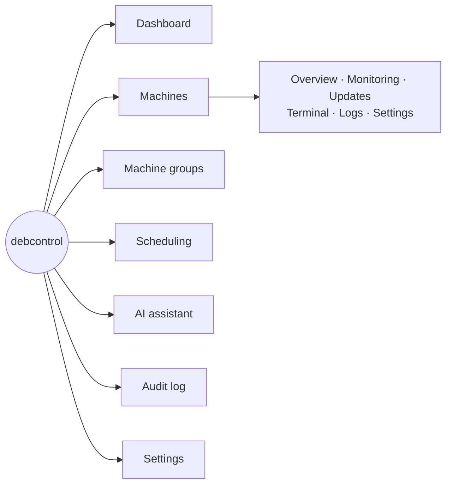

# 📚 debcontrol wiki

debcontrol is a web application for managing Debian machines over SSH —
officially, Debian and its derivatives (e.g. Ubuntu), for as long as each
is supported by its own upstream. Every page requires a login; access is
controlled by custom RBAC roles,
and accounts can be local, LDAP, or OIDC (SSO). Login is two steps —
username, then a passkey (signs straight in, no password needed) or a
password (plus TOTP and/or a passkey as a second factor, if either is
set up) — see
[Architecture](Architecture.md#authentication--rbac) for
the design and [Installation](Installation.md) for bootstrapping the first
admin account. A light/dark theme toggle is in the header next to your
account link; the choice is remembered in a cookie, dark by default.

## 📑 Pages

- **[Installation](Installation.md)** — Docker quick start, running with or
  without the bundled Caddy reverse proxy, environment variables reference.
- **[Architecture](Architecture.md)** — technology choices, project
  structure, and the security decisions made from day one.
- **[Host Requirements](Host-Requirements.md)** — sizing
  debcontrol's own host(s) for a fleet from dozens to thousands of
  machines, and the tuning knobs (worker concurrency, DB pool size,
  reachability-sweep concurrency, retention policies) that come with it.
- **[SSH Host Key Verification](SSH-Host-Key-Verification.md)** — how
  debcontrol pins SSH host keys and why it never "trusts on first use".
- **[Machine Requirements](Machine-Requirements.md)** —
  what a Debian machine needs (network, account, packages) to be added.
- **[Ansible Onboarding](Ansible-Onboarding.md)** — a playbook that does
  everything in Machine Requirements for you, then self-registers
  the machine as pending.
- **[AI Assistant](AI-Assistant.md)** — the chat assistant: the five
  supported providers, the global token limits, the permission model, and
  the confirm-before-execute rule that every proposed action goes through.
- **[Development](Development.md)** — running the app locally without
  Docker, tests, linting, and database migrations.

> [!NOTE]
> debcontrol runs as **three application processes**: the FastAPI **web**
> app, a **Celery worker** that performs every SSH/background operation, and
> a single **Celery Beat** scheduler that publishes the periodic sweeps and
> the per-minute scheduled-task tick. Redis is both Celery's broker and its
> result backend. See
> [Architecture → Background tasks](Architecture.md#background-tasks-celery-and-celery-beat).

## 🔒 Reverse proxy guides

debcontrol itself only speaks plain HTTP, on port `8080` by default
(`APP_PORT` in `.env`) — it always expects to sit behind a
TLS-terminating reverse proxy, though nothing stops direct access unless
you firewall that port off. Pick one:

- **[Caddy (bundled)](Reverse-Proxy-Caddy.md)** — the easiest path:
  `docker-compose.caddy.yml` gives you automatic HTTPS (Let's Encrypt),
  TLS 1.3 only, and HTTP/3 with no manual certificate handling.
  Also useful if you'd rather run your own separate Caddy instance.
- **[nginx](Reverse-Proxy-Nginx.md)** — if you already run nginx for other
  sites on this host.
- **[Traefik](Reverse-Proxy-Traefik.md)** — if you already run Traefik
  (e.g. alongside other Docker Compose projects).

## ✨ Feature overview

| Tab | Status |
|---|---|
| Dashboard | Post-login landing page: machine/update/reboot counts, upcoming scheduled tasks, recent audit activity — each section only shown if your role can see that area; once at least two days of history exist, dependency-free inline SVG trend chart(s) (online machines, pending updates) built from a daily background snapshot, retention configurable on Settings; an optional AI-written **fleet summary** ("what changed, what needs attention" — see [AI Assistant](AI-Assistant.md)) if an admin has turned it on |
| Machines | A machine's page is split into tabs — Overview, Monitoring, Updates, Terminal, Logs, Settings (Terminal/Logs only shown with `action.terminal`). Overview: edit/remove, pin host keys, test connectivity, reboot/shut down (double-confirmed, only shown with `action.power`), an OS logo badge next to the name, auto-discovered facts (OS, kernel, CPU architecture/cores/model, RAM (+speed where readable), disks, network interfaces, uptime, process count, reboot-required — filesystem usage moved to Monitoring, below, where it's tracked over time), installed packages (apt/flatpak/snap, with versions and held/pinned status, searchable) plus a fleet-wide package search across every machine, online/offline status, and a short mention (linking to Settings) if the post-onboarding readiness check (ncurses-term, scoped sudo for apt/shutdown/dmidecode/flatpak+snap — skipped entirely for a machine connected as root, which never needs sudo) found something missing; a Markdown-formatted **runbook** (how to deal with this server, who owns it) shown as rendered HTML once set; facts, packages, and services each have a manual **Refresh now** button that waits for the result inline instead of waiting for the next periodic sweep; status/facts/packages/services panels also update live over a WebSocket the moment a background refresh finishes, rather than waiting out their own polling interval, with an opt-in browser notification for the same event while the tab is backgrounded. Monitoring: five categories, each an interactive hover/scrub trend chart with a real time axis — CPU (utilization + load average, 1/5/15 min), Memory (utilization + available), Network (per-interface throughput), Disk (per-device I/O throughput **and** per-mount usage percent, both sampled every couple of minutes), and Availability (uptime percent + TCP connect latency, historized from the existing per-minute reachability check — not ICMP ping, same reasoning the status badge already uses); a live failed-systemd-service count and a searchable/filterable full service list in a modal; one unified **"Last checked"** timestamp at the top of the tab plus a manual **Refresh now** button (`action.manage`-gated) that forces both a fresh CPU/RAM/disk/services sample and a fresh reachability check right now rather than waiting out either sweep's own interval — both the CPU/RAM/network/disk sample interval and its retention are configurable globally and per machine. Updates: system updates (apt + flatpak + snap) with dry-run update checks that also list *which* packages are pending, a preview-and-confirm step before a manual update run that shows exactly what would be installed/upgraded/removed and streams apt's output live once it's running, a paginated/filterable full update-run history, and — for a run whose exact pre-update package snapshot was captured (every apt-based run, best-effort) — a one-click **"Roll back this update"** that re-installs just the packages whose version has since changed back to what they were, creating its own new run in the same history rather than editing the original (needs the old `.deb` still resolvable from a configured apt source). Terminal: an interactive SSH shell in the browser (256-color, clipboard copy/paste, permission-gated, audited, session-capped). Logs: the systemd journal (search, line limit, `--since`/`--until`) or one file under a configurable allowed-path list, with a **Browse...** picker to navigate into that path over SSH instead of typing an exact file name — a live SSH view every time, never stored. Settings: edit connection details, per-machine overrides of every background-check interval and the monitoring retention window, delete the machine, (for a machine still on password auth) **Run initial setup** — creates a dedicated user, installs debcontrol's own SSH key, and grants scoped sudo directly over SSH, the same steps the [Ansible playbook](Ansible-Onboarding.md) automates for someone who'd rather run that instead — and the full readiness banner: "Re-check", "Ask AI why", and either an **Install now** button (a machine connected as root — no sudo gap possible, fixed with the credential already on file) or the exact sudoers line to add by hand plus a one-time-credential "Fix it" flow (a machine already on the app's own SSH key, not root). Also: three list display modes (Table / List / Cards, remembered per browser), self-registration review, CSV bulk import (pending queue), free-text search, filtering by **tag(s)** (free-form labels independent of groups — a machine can carry any number, set from the create/edit form or the REST API, with autocomplete over every tag already in use; the machine list can filter by several tags at once, matching *any* or *all* of them), **saved views** (name the current search/tag filter to jump back to it later — per-account, also available via the REST API), bulk update/check/power/**tag add-or-remove** actions on an ad-hoc checkbox selection (Cards view also shows each machine's latest CPU/RAM reading as a small bar), machine/group configuration export (JSON or CSV) and import (JSON, tags and runbook included; CSV omits the runbook — doesn't flatten sensibly) deliberately excluding credentials and pinned host keys |
| Machine groups | Also split into tabs — Overview, Updates, Power. Organize machines into named groups; built-in "All machines" group; the group list itself is searchable, and each group's members are separately searchable; system updates, update checks, and power actions all scoped to a group |
| Scheduling | Run any existing action (system update, update check, reboot, shut down, an on-demand "force facts/packages/services/readiness refresh" or "force a monitoring sample" for debugging without waiting out that sweep's own interval, or an arbitrary custom command — that one needs `action.terminal` in addition to `scheduling.manage`, and runs as the target machine's own configured SSH user, which needs whatever permission the command itself requires) against a machine, a group, or "All machines" on a cron expression (UTC); enable/disable, run on demand, see when it last fired, and browse the full **run history** behind that — every past firing, paginated, also available via the REST API; the whole set of scheduled tasks can be **exported as JSON** (targets referenced by machine/group name, not id, so the file is portable to another deployment) and **imported** back in, each task checked against the importing account's own machine-group scope and per-action permission and skipped (not partially applied) if its target or action doesn't exist here |
| AI | A chat assistant (five configurable providers: Anthropic, OpenAI, Gemini, OpenRouter, or any OpenAI-compatible endpoint), shown as a proper back-and-forth conversation that updates live while a reply is in progress, that can look up machines/groups on its own and *propose* updates, update checks, reboots/shutdowns, or an SSH command — every one of which needs an explicit human confirmation showing the literal command and every resolved target before anything runs; gated by `ai.access` plus, per tool, the same permission the equivalent manual button needs; a searchable model picker and global rolling daily/weekly/monthly token limits on the Settings AI tab. A one-click **"Ask AI why"** button on a failed update run and on a machine's readiness banner starts a new conversation pre-filled with that failure/finding — nothing to type or copy-paste. See [AI Assistant](AI-Assistant.md) |
| Audit | Read-only log of every mutating action across the app — who (account + source IP), what happened, its outcome, and when; searchable and filterable by outcome or by an exact target (e.g. "view audit history for this machine", linked from a machine's own Overview page); **saved views** (name the current search/outcome filter to jump back to it later — per-account, also available via the REST API, same convenience the Machines list already has); hash-chained so tampering is detectable; exportable as CSV/JSON, respecting whichever filters are active; optional live syslog forwarding (e.g. to a SIEM) |
| Users | Create/edit/deactivate/delete accounts; assign a role; login method (local/LDAP/OIDC) is per-account; grant/revoke API access (a separate checkbox from role permissions); optionally restrict an account to specific machine groups (unchecked = full access); reset a local password; force sign-out; grant a **temporary permission** on top of the account's role (e.g. "`action.terminal` for 2 hours") that expires on its own, or revoke one early; bulk deactivate/activate, force sign-out, and role-assign on an ad-hoc checkbox selection from the list (the acting account's own row is always excluded) — also available via the REST API |
| Roles | Define named roles with an exact permission checkbox matrix; guardrails prevent locking everyone out of user management; a role can require two-factor (TOTP, a passkey, or both) for everyone holding it, enforced live on every request; the full role matrix can be **exported as JSON** and **imported** onto another deployment (a name that already exists is skipped, never silently overwritten) |
| My account | Change your own display name, password, and UI language (English by default; more languages installable by an admin, see [Architecture](Architecture.md#per-user-ui-language-i18n)), enroll/disable TOTP two-factor with recovery codes, register/remove WebAuthn passkeys (a hardware security key or your device's own biometrics/PIN) as a second factor alongside or instead of TOTP, log out everywhere else, create/revoke your own API tokens (if an admin has granted this account API access) for the full read/write REST API |
| API docs (`/api`) | Interactive [Swagger UI](https://swagger.io/tools/swagger-ui/) for the full REST API, generated live from the app's own routes — browse every endpoint, and use **Authorize** with one of your own API tokens to try requests directly from the page; requires being logged in like any other page (see [Architecture](Architecture.md#interactive-docs-swagger-ui-at-api)) |
| Settings | Split into tabs — General, Security, Integrations, AI. (Running version/git commit moved to the footer on every page, linking to the GitHub releases page — no longer a Settings panel.) General: the app's SSH public key, background-check intervals, rotating the SSH key (generate/activate a replacement, with an assisted "push pending key to all machines" step). Security: audit log retention policy, hash-chain verification and CSV/JSON export, Dashboard trend snapshots' retention policy, update-run history retention policy, Monitoring history retention policy. Integrations: syslog forwarding (UDP/TCP/TLS), LDAP login (including a TLS-certificate-verification toggle for `ldaps://`/StartTLS — on by default, off only for a directory with a known self-signed/invalid certificate), OIDC login (including a display name shown on the login button, e.g. "Log in with Entra ID"). AI: configures the [AI assistant](AI-Assistant.md) (per-provider API key, fetch and opt-in individual models, global rolling token limits, and the opt-in scheduled fleet summary — frequency, which model, retention) |
