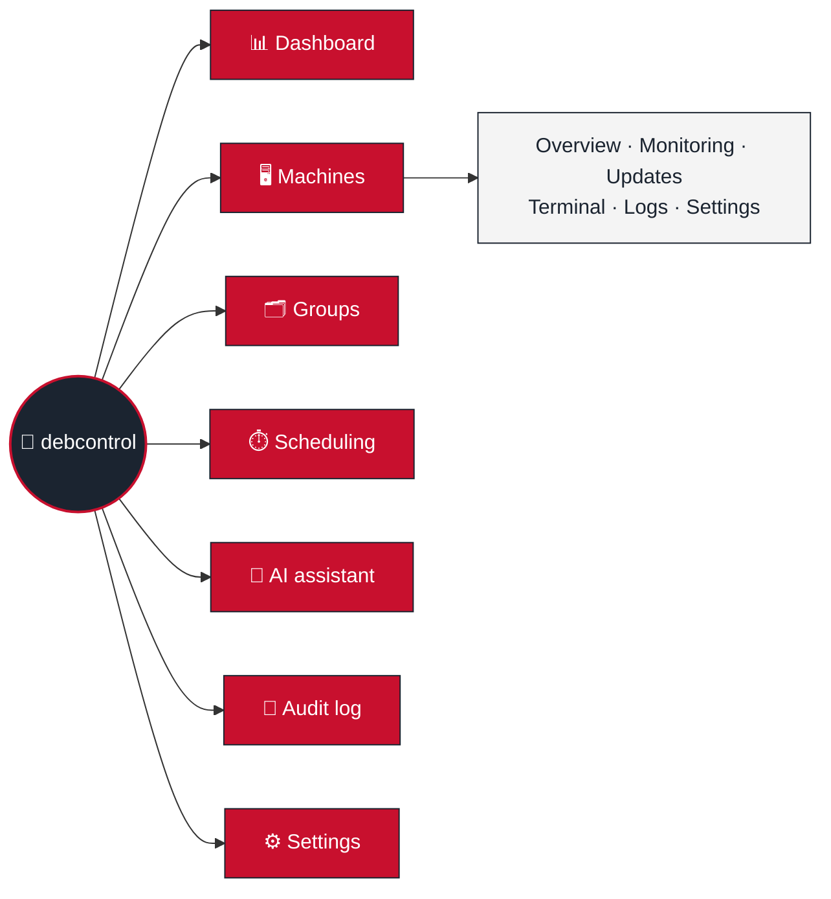

  

<h1 align="center">🐧 debcontrol</h1>

<em>A fleet of Debian boxes, herded from one browser tab — no agents, just SSH.</em>

---

Every page needs a login (local, LDAP, or OIDC — plus TOTP/passkey 2FA),
gated by RBAC roles you define. Theme toggle lives in the header, dark by
default, because that's how sysadmins like it. Full design decisions live
in [🏗️ Architecture](Architecture.md); this page is the map, not the
territory.

> [!NOTE]
> Three processes, one Redis: **web** (FastAPI), **worker** (Celery — every
> SSH call), **beat** (the one and only scheduler — never scale this past
> 1 replica, or your daily purge job will fire once per clone like some
> kind of cron-job hydra). See [Background tasks](Architecture.md#background-tasks-celery-and-celery-beat).

## 📑 Read next

| Page | For when you need to... |
|---|---|
| [🚀 Installation](Installation.md) | Stand the thing up — Docker, reverse proxy, env vars, backups |
| [🏗️ Architecture](Architecture.md) | Understand *why* it's built this way (stack, project layout, security essentials — the hub for the pages below) |
| [🔐 Authentication & RBAC](Authentication-RBAC.md) | Logins, sessions, roles/permissions, 2FA, per-user API tokens, the REST API's auth model |
| [🖥️ Machine Management](Machine-Management.md) | SSH, updates, facts/packages/monitoring, logs, the terminal, scheduling |
| [📝 Audit Log](Audit-Log.md) | Hash-chain integrity, retention, export, SIEM forwarding |
| [🔔 Notifications](Notifications.md) | Rules, role-based targeting, templates, and every placeholder you can use in one |
| [📏 Host Requirements](Host-Requirements.md) | Size your own server for 10 machines or 10,000 |
| [🔑 SSH Host Key Verification](SSH-Host-Key-Verification.md) | Understand why there's no "trust on first use" |
| [🧰 Machine Requirements](Machine-Requirements.md) | Know what a target Debian box needs before adding it |
| [🤖 Ansible Onboarding](Ansible-Onboarding.md) | Prep + self-register machines without clicking through the UI |
| [🧠 AI Assistant](AI-Assistant.md) | Wire up the chat assistant and understand its guardrails |
| [🛠️ Development](Development.md) | Run it locally, add a feature, ship a migration |

## 🔒 Sitting behind a reverse proxy

debcontrol only ever speaks plain HTTP (port `8080`) — it expects a TLS
terminator in front of it, always. Pick your fighter:

- **[Caddy](Reverse-Proxy-Caddy.md)** — bundled, zero-config HTTPS. The easy button.
- **[nginx](Reverse-Proxy-Nginx.md)** — you already run one for everything else.
- **[Traefik](Reverse-Proxy-Traefik.md)** — you're already all-in on Docker labels.

## ✨ What's in the box

| Page | Highlights |
|---|---|
| 📊 **Dashboard** | Fleet tiles linking to filtered lists, trend charts, upcoming schedules, recent activity, an optional AI fleet summary, and every machine as a card colored by its worst reading |
| 🖥️ **Machines** | Facts, packages, services, monitoring (CPU/RAM/disk/network, Docker, bare-metal sensors, GPUs, S.M.A.R.T.), updates with preview, rollback, holds, changelogs and CVEs, a browser terminal, logs, History time line, tags, filters, saved views, bulk actions, export/import |
| 🟧 **Proxmox tab** | Proxmox VE (guests with start/stop, cluster quorum, ZFS, storage, backups, failed tasks), Backup Server (datastores, jobs, backup groups) and Mail Gateway (mail stats, queue, ClamAV) |
| 🛡️ **Security** | Pending security updates fleet-wide with their CVEs; package search across the fleet |
| 🔐 **Checks** | HTTP, TLS, ping, TCP and DNS checks from the server, with history, notifications and a monthly SLA report |
| 🗂️ **Groups** | Groups for bulk updates and power actions, plus "All machines" |
| ⏱️ **Scheduling** | Cron any action per time zone — updates (reboot only if needed, one machine at a time, only in a maintenance window), power, commands — and maintenance windows |
| 🔔 **Notifications** | Event or threshold rules by email, webhook, ntfy, Gotify, Telegram, Discord or Pushover, with templates, YAML import/export, test sends and delivery history |
| 🧠 **AI assistant** | Chat with your fleet via Anthropic, OpenAI, Gemini, OpenRouter or any OpenAI-compatible endpoint — it only *proposes*; you confirm every command |
| 📝 **Audit log** | Hash-chained, exportable, optionally forwarded to a SIEM, optional GeoIP |
| 👤 **Users & Roles** | Custom roles, temporary grants, machine-group scoping, LDAP/OIDC, TOTP/passkeys, impersonation |
| 💾 **Backup & restore** | All configuration exports/imports in one place |
| 📚 **API docs** (`/api`) | Swagger UI over the read/write REST API that mirrors the web UI |
| ⚙️ **Settings** | SSH key rotation, check intervals and retention (no restart), sign-in policy, integrations with **Test** buttons, AI providers |

Details live on the pages linked above.
