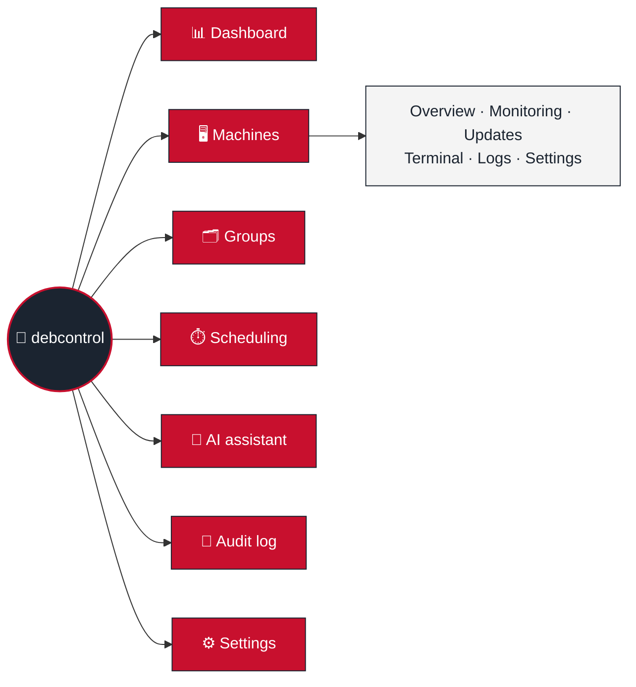

  

<h1 align="center">🐧 debcontrol</h1>

<em>A fleet of Debian boxes, herded from one browser tab — no agents, just SSH.</em>

---

Every page needs a login (local, LDAP, or OIDC — plus TOTP/passkey 2FA),
gated by RBAC roles you define. Theme toggle lives in the header, dark by
default, because that's how sysadmins like it. Full design decisions live
in [🏗️ Architecture](Architecture.md); this page is the map, not the
territory.

> [!NOTE]
> Three processes, one Redis: **web** (FastAPI), **worker** (Celery — every
> SSH call), **beat** (the one and only scheduler — never scale this past
> 1 replica, or your daily purge job will fire once per clone like some
> kind of cron-job hydra). See [Background tasks](Architecture.md#background-tasks-celery-and-celery-beat).

## 📑 Read next

| Page | For when you need to... |
|---|---|
| [🚀 Installation](Installation.md) | Stand the thing up — Docker, reverse proxy, env vars, backups |
| [🏗️ Architecture](Architecture.md) | Understand *why* it's built this way (the deep-dive reference) |
| [📏 Host Requirements](Host-Requirements.md) | Size your own server for 10 machines or 10,000 |
| [🔑 SSH Host Key Verification](SSH-Host-Key-Verification.md) | Understand why there's no "trust on first use" |
| [🧰 Machine Requirements](Machine-Requirements.md) | Know what a target Debian box needs before adding it |
| [🤖 Ansible Onboarding](Ansible-Onboarding.md) | Prep + self-register machines without clicking through the UI |
| [🧠 AI Assistant](AI-Assistant.md) | Wire up the chat assistant and understand its guardrails |
| [🛠️ Development](Development.md) | Run it locally, add a feature, ship a migration |

## 🔒 Sitting behind a reverse proxy

debcontrol only ever speaks plain HTTP (port `8080`) — it expects a TLS
terminator in front of it, always. Pick your fighter:

- **[Caddy](Reverse-Proxy-Caddy.md)** — bundled, zero-config HTTPS. The easy button.
- **[nginx](Reverse-Proxy-Nginx.md)** — you already run one for everything else.
- **[Traefik](Reverse-Proxy-Traefik.md)** — you're already all-in on Docker labels.

## ✨ What's in the box

| Tab | The highlights (not the whole story — see [Architecture](Architecture.md)) |
|---|---|
| 📊 **Dashboard** | Fleet counts, upcoming schedules, recent audit activity, trend sparklines, an optional **AI fleet summary** ("what changed, what needs your attention") |
| 🖥️ **Machines** | Facts, packages (apt/flatpak/snap), live monitoring, a browser SSH terminal, log browsing, tags & saved views, bulk actions, JSON/CSV export — and **update rollback** if a `dist-upgrade` goes sideways |
| 🗂️ **Groups** | Named groups for bulk updates/power actions; the built-in "All machines" catch-all |
| ⏱️ **Scheduling** | Cron any action against a machine/group/fleet — updates, power, custom commands, even debug "force a sweep now" buttons. Exportable/importable as JSON |
| 🧠 **AI assistant** | Chat with your fleet (5 provider choices) — it can *propose* actions, never run one without you literally confirming the command first |
| 📝 **Audit log** | Hash-chained, tamper-evident, exportable, optionally forwarded to your SIEM |
| 👤 **Users & Roles** | Full RBAC matrix, temporary permission grants, bulk actions, SSO — export/import roles too |
| 📚 **API docs** (`/api`) | Live Swagger UI over the full read/write REST API — everything the web UI can do, an API can too |
| ⚙️ **Settings** | SSH key rotation, retention policies, LDAP/OIDC/syslog integrations, AI provider config |

Want the granular, paragraph-by-paragraph feature list this table used to
be? That level of detail now lives where it belongs — next to the *why*,
in [Architecture](Architecture.md) — so this page stays something you can
actually read in one sitting. 🎉
