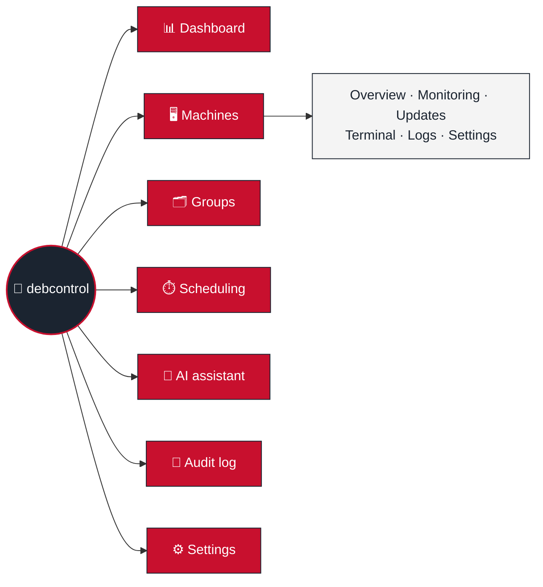

  

<h1 align="center">🐧 debcontrol</h1>

<em>A fleet of Debian boxes, herded from one browser tab — no agents, just SSH.</em>

---

Every page needs a login (local, LDAP, or OIDC — plus TOTP/passkey 2FA),
gated by RBAC roles you define. Theme toggle lives in the header, dark by
default, because that's how sysadmins like it. Full design decisions live
in [🏗️ Architecture](Architecture.md); this page is the map, not the
territory.

> [!NOTE]
> Three processes, one Redis: **web** (FastAPI), **worker** (Celery — every
> SSH call), **beat** (the one and only scheduler — never scale this past
> 1 replica, or your daily purge job will fire once per clone like some
> kind of cron-job hydra). See [Background tasks](Architecture.md#background-tasks-celery-and-celery-beat).

## 📑 Read next

| Page | For when you need to... |
|---|---|
| [🚀 Installation](Installation.md) | Stand the thing up — Docker, reverse proxy, env vars, backups |
| [🏗️ Architecture](Architecture.md) | Understand *why* it's built this way (stack, project layout, security essentials — the hub for the pages below) |
| [🔐 Authentication & RBAC](Authentication-RBAC.md) | Logins, sessions, roles/permissions, 2FA, per-user API tokens, the REST API's auth model |
| [🖥️ Machine Management](Machine-Management.md) | SSH, updates, facts/packages/monitoring, logs, the terminal, scheduling |
| [📝 Audit Log](Audit-Log.md) | Hash-chain integrity, retention, export, SIEM forwarding |
| [🔔 Notifications](Notifications.md) | Rules, role-based targeting, templates, and every placeholder you can use in one |
| [📏 Host Requirements](Host-Requirements.md) | Size your own server for 10 machines or 10,000 |
| [🔑 SSH Host Key Verification](SSH-Host-Key-Verification.md) | Understand why there's no "trust on first use" |
| [🧰 Machine Requirements](Machine-Requirements.md) | Know what a target Debian box needs before adding it |
| [🤖 Ansible Onboarding](Ansible-Onboarding.md) | Prep + self-register machines without clicking through the UI |
| [🧠 AI Assistant](AI-Assistant.md) | Wire up the chat assistant and understand its guardrails |
| [🛠️ Development](Development.md) | Run it locally, add a feature, ship a migration |

## 🔒 Sitting behind a reverse proxy

debcontrol only ever speaks plain HTTP (port `8080`) — it expects a TLS
terminator in front of it, always. Pick your fighter:

- **[Caddy](Reverse-Proxy-Caddy.md)** — bundled, zero-config HTTPS. The easy button.
- **[nginx](Reverse-Proxy-Nginx.md)** — you already run one for everything else.
- **[Traefik](Reverse-Proxy-Traefik.md)** — you're already all-in on Docker labels.

## ✨ What's in the box

| Tab | The highlights (not the whole story — see [Architecture](Architecture.md)) |
|---|---|
| 📊 **Dashboard** | Fleet counts as tiles that open the matching filtered machine list, trend charts (hover for values), upcoming schedules, recent audit activity, an optional **AI fleet summary** ("what changed, what needs your attention") and, at the bottom, every machine as one card — online/offline, CPU, RAM, fullest disk, hottest sensor, load, uptime, containers, pending updates, reboot required, disk-full forecast — colored by the worst reading, refreshing itself every minute (`GET /api/v1/fleet`) |
| 🔐 **Checks** | TLS certificate expiry, HTTP endpoint, ICMP ping, TCP port and DNS checks run from the debcontrol server — status code, "must / must not contain" text, a JSON-path assertion, a response-time limit — with down/recovered/certificate-expiring notifications, uptime/latency history, a **monthly SLA report** that includes every machine's SSH reachability (CSV too) and a "Summarize with AI" button (`/checks`, `/checks/sla`, `/api/v1/checks`) |
| 🖥️ **Machines** | Facts, packages (apt/flatpak/snap), live monitoring (CPU/RAM/disk/network, Docker containers, systemd services with per-service CPU/RAM, and on bare metal temperatures/fans/power/GPUs/S.M.A.R.T.), a browser SSH terminal, log browsing (journal unit/boot/priority filters, colors by priority, "hide debcontrol's own sessions", saved log views), tags, status/group filters & saved views, bulk actions, JSON/CSV config export and a filtered CSV inventory report — and **update rollback** if an upgrade goes sideways. Updates offer `full-upgrade`, a safe `upgrade` or security updates only, warn when a kernel/Proxmox update needs a reboot, link each package's changelog and can hold a package back (`apt-mark hold`). A **Proxmox** tab lists VMs/containers with their state, ZFS pools (health, scrub), storages including Proxmox Backup Server, backup jobs and results, and guests no backup covers; the memory chart keeps the ZFS ARC apart from used RAM. Background checks keep one SSH connection per machine open instead of logging in every time, and skip `sudo` for root, so the machine's journal stays readable. A **History** tab puts notes, detected configuration changes (kernel, OS, listening ports, admin/login accounts, disks, IPs), update runs, outages and audited actions on one time line, with an AI summary of what happened. Power actions sit in a machine's Settings tab, next to Delete |
| 🛡️ **Security** | **Security updates** — every pending apt security update fleet-wide with the CVEs it fixes (read from the package changelog) — and **Package search** — which machines have a package, and what version (`/security`) |
| 🗂️ **Groups** | Named groups for bulk updates/power actions; the built-in "All machines" catch-all |
| ⏱️ **Scheduling** | Cron any action against a machine/group/fleet in its own time zone — updates (optionally rebooting only when needed, one machine at a time with a health check, or only inside a maintenance window), power, custom commands, even debug "force a sweep now" buttons — plus **maintenance windows** that mute a machine's alerts and can pause scheduled tasks on it during planned work |
| 🧠 **AI assistant** | Chat with your fleet (Anthropic, OpenAI, Gemini, OpenRouter, or Ollama / LM Studio / any OpenAI-compatible endpoint) — it can *propose* actions, never run one without you literally confirming the command first. Shown in the header once a model is enabled |
| 📝 **Audit log** | Hash-chained, tamper-evident, exportable, optionally forwarded to your SIEM, with optional GeoIP country/city enrichment |
| 👤 **Users & Roles** | Full RBAC matrix with a plain-language description of every permission, temporary permission grants, bulk actions, SSO |
| 💾 **Backup & restore** | Every configuration export/import in one place — machines and groups (JSON/CSV), scheduled tasks, roles, notification rules (YAML) (`/backup`) |
| 🔔 **Notifications** | Rules — event and/or conditions (CPU/RAM/disk/facts thresholds, shown as a reference line on the Monitoring charts too), who (users/roles), which machines/groups — email, webhook, ntfy, Gotify, Telegram, Discord or Pushover you when something happens, configurable via form or YAML. Editable per-event or named custom templates, a "Send test" button and a delivery history log. Events include configuration drift, newly pending security updates (with CVEs), a reboot becoming necessary, a failing disk (S.M.A.R.T.), a failed systemd service, a disk about to fill up, a degraded ZFS pool and a failed Proxmox backup |
| 📚 **API docs** (`/api`) | Live Swagger UI over the full read/write REST API — everything the web UI can do, an API can too |
| ⚙️ **Settings** | SSH key rotation, check intervals and retention policies (one Save, applied without a restart), sign-in policy (session lifetime, lockout, allowed networks, accounts without 2FA), LDAP/OIDC/syslog/SMTP integrations with **Test** buttons, AI provider config |

Want the granular, paragraph-by-paragraph feature list this table used to
be? That level of detail now lives where it belongs — next to the *why*,
split across [Architecture](Architecture.md) and its
[Authentication & RBAC](Authentication-RBAC.md),
[Machine Management](Machine-Management.md),
[Audit Log](Audit-Log.md), and [Notifications](Notifications.md)
companion pages — so this page stays something you can actually read in
one sitting. 🎉
